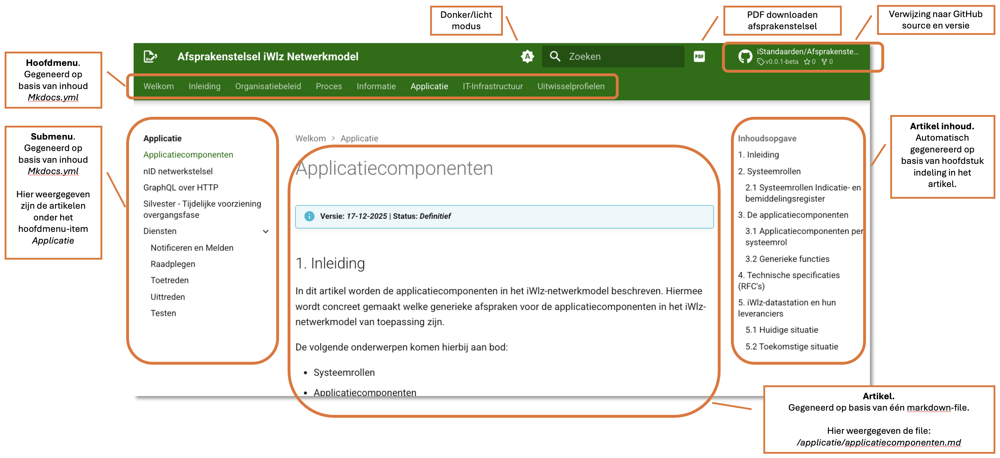

# Afsprakenstelsel iWlz

> [!NOTE]
> **Publicatie** op: https://istandaarden.github.io/Afsprakenstelsel-iWlz/  
> **Staging** (pre-publicatie) op: `https://istandaarden.github.io/Afsprakenstelsel-iWlz/staging/{branch-naam}`  
> zie [3. Publicatie proces](#3-publicatie-proces) voor de samenstelling van de juiste staging-url.

---
# Layout Afsprakenstelel
 

Voor verdere toelichting op de aanpassing hiervan zie Beheer van de publicatie.

# Beheer van de publicatie
- [Afsprakenstelsel iWlz](#afsprakenstelsel-iwlz)
- [Layout Afsprakenstelel](#layout-afsprakenstelel)
- [Beheer van de publicatie](#beheer-van-de-publicatie)
  - [1. Beheer van het menu en inhoud](#1-beheer-van-het-menu-en-inhoud)
    - [1.1 Opbouw menu](#11-opbouw-menu)
    - [1.2 Verwijzing naar de inhoud](#12-verwijzing-naar-de-inhoud)
  - [2. Beheer van de pagina's](#2-beheer-van-de-paginas)
    - [2.1 Markdown](#21-markdown)
    - [2.2 Diagrammen](#22-diagrammen)
    - [2.3 Afbeeldingen](#23-afbeeldingen)
- [3. Publicatie proces](#3-publicatie-proces)
  - [3.1 Staging](#31-staging)
  - [3.2 `main`-branch en `future`-branch](#32-main-branch-en-future-branch)
  - [4. PDF generatie](#4-pdf-generatie)
  - [5. Overige instellingen publicatie](#5-overige-instellingen-publicatie)
  - [6. Framework](#6-framework)


## 1. Beheer van het menu en inhoud

De indeling van het menu en de veerwijzing naar de inhoud per menu-item verloopt via `mkdocs.yml`. In het yaml-document [`mkdocs.yml`](./mkdocs.yml) is er de hoofdtag `nav:`. 
bijvoorbeeld (deel van de inhoud)
```yml
  - Welkom: index.md
  - Inleiding:
      - inleiding/index.md
      - Achtergrond en toelichting: inleiding/achtergrond_toelichting.md
      - Governance: inleiding/governance.md
      - Begrippenlijst: inleiding/begrippenlijst.md
  - Organisatiebeleid:
      - organisatiebeleid/index.md
      - Randvoorwaarden: organisatiebeleid/randvoorwaarden.md
  - ...
```

### 1.1 Opbouw menu

De menu-items op het hoogste niveau, staan vooraan in de 'tree'. Dit zijn in het voorbeeld: 
- *Welkom*, 
- *Inleiding* en 
- *Organisatebeleid*. 

Onderdelen van een submenu staan weer een niveau lager onder het hoofdemenu. In het voorbeeld zijn onder de 
- Inleiding: 
  - *Achtergrond en toelichting*,
  - *Governance* en 
  - *Begrippenlijst*

### 1.2 Verwijzing naar de inhoud

De verwijzing naar de inhoud van elk menu-item volgt de structuur: 
> `{Titel op het scherm}: {verwijzing naar het brondocument}`

- Een Hoofdmenu-item heeft altijd de naam `index.md`
- Een Submenu-item heeft de naam van het `menuitem.md`

Het eerder voorbeeld toont dat de bron van het **Hoofdmenu-item** *Inleiding* is te vinden in `inleiding/index.md` en dat de inhoud van het **Submenu-item** *Achtergrond en toelichting* te vinden is in `inleiding/achtergrond_toelichting.md`.


## 2. Beheer van de pagina's

### 2.1 Markdown
De publicatie van de website gaat op basis van markdown. De bestanden zijn te vinden in de directory [`docs/`](/docs/). 
De structuur onder `docs/` volgt de structuur zoals beschreven in het navigatie-deel in `mkdocs.yml`.

Op basis van de huidige publicatie (augustus 2026) ziet de inhoud onder `docs/` er als volgt uit:
```shell
    |-- docs                                            # Hoofddirectory publicatie
    |   |-- applicatie/                                 # Documenten mbt artikel APPLICATIE
    |   |   |-- applicatiecomponenten.md
    |   |   |-- diensten
    |   |   |   |-- index.md
    |   |   |   |-- notificeren-en-melden.md
    |   |   |   |-- raadplegen.md
    |   |   |   |-- testen.md
    |   |   |   |-- toetreden.md
    |   |   |   `-- uittreden.md
    |   |   |-- graphql_over_http.md
    |   |   |-- index.md
    |   |   |-- nid_netwerkstelsel.md
    |   |   `-- silvester.md
    |   |-- img/                                        # Afbeeldingen uit de diverse artikelen
    |   |   `-- welkom-lagen.png
    |   |-- informatie/                                 # Documenten mbt artikel INFORMATIE
    |   |   |-- index.md
    |   |   `-- informatiestandaard.md
    |   |-- inleiding/                                  # Documenten mbt artikel INLEIDING
    |   |   |-- achtergrond_toelichting.md
    |   |   |-- begrippenlijst.md
    |   |   |-- governance.md
    |   |   `-- index.md
    |   |-- it-infrastructuur/                          # Documenten mbt artikel IT-INFRASTRUCTUUR
    |   |   |-- identificatie_authenticatie.md
    |   |   |-- index.md
    |   |   |-- logging.md
    |   |   `-- netwerk.md
    |   |-- organisatiebeleid/                          # Documenten mbt artikel ORGANISATIEBELEID
    |   |   |-- architectuur.md
    |   |   |-- index.md
    |   |   |-- ontwerpkeuzes.md
    |   |   |-- randvoorwaarden.md
    |   |   |-- releasebeleid.md
    |   |   |-- serviceafspraken/
    |   |   |   |-- afnemersdeel.md
    |   |   |   |-- bronhoudersdeel.md
    |   |   |   |-- index.md
    |   |   |   `-- operationeel_netwerkbeheer.md
    |   |   `-- wijzigingsverzoeken.md
    |   |-- proces/                                     # Documenten mbt artikel PROCES
    |   |   |-- index.md
    |   |   |-- netwerkfuncties.md
    |   |   `-- procesmodel.md
    |   `-- uitwisselprofiel/                           # Documenten mbt artikel UITWISSELPROFIEL
    |       |-- index.md
    |       |-- uitwisselprofiel_bemiddeling.md
    |       `-- uitwisselprofiel_indicatie.md
    `-- index.md                                        # Homepage publicatie
```

### 2.2 Diagrammen

Voor diagrammen wordt zoveel als mogelijk *Mermaid* gebruikt. Daarmee borgen we direct de source-code van een diagram in het artikel zelf. Voor meer informatie zie [Github - creating diagrams](https://docs.github.com/en/get-started/writing-on-github/working-with-advanced-formatting/creating-diagrams) en [Mermaid](https://mermaid.ai/open-source/intro/).

Bij de publicatie wordt de mermaid-code omgezet naar een leesbaar diagram.

### 2.3 Afbeeldingen

Wanneer het niet mogelijk is gebruik te maken van een Mermaid-diagram, plaats je een afbeelding in: `/docs/img/` waarbij je de afbeelding begint met de naam van het artikel waarin het wordt gebruikt. Zo komt in het artikel 'Welkom' een afbeelding voor met de lagen-structuur. De naam van de afbeelding is `welkom-lagen.png`.

# 3. Publicatie proces

De toelichting onder [1. Beheer van het menu en inhoud](#1-beheer-van-het-menu-en-inhoud) en [2. Beheer van de pagina's](#2-beheer-van-de-paginas) is voldoende om de publicatie van het Afsprakenstelsel iWlz inhoudelijk te beheren.

Aanpassingen aan het menu gaat op basis van aanpassingen in `mkdocs.yml` en `/docs/` (zie 1. Beheer van het menu en inhoud). Aanpassingen in de inhoud van de artikelen gaat door middel van het aanpassen van het betreffende markdown document. 

## 3.1 Staging
Om eerst wijzigingen in een preview eerst te 'testen' kan je gebruik maken van een *Staging* publicatie. Deze publicatie verschijnt niet in de versie-dropdown. Je moet weten hoe je de staging-branch hebt genoemd om de publicatie te vinden. 

Het proces om aanpassingen in een nieuwe publicatie te verwerken is als volgt: 

```mermaid
stateDiagram
direction LR
    [*] --> Create_Staging
    Create_Staging --> Update_Staging
    Update_Staging --> Commit_Staging
    Commit_Staging --> Verify_Staging
    state VerificationS <<choice>>
    Verify_Staging --> VerificationS
    VerificationS --> Update_Staging : false
    VerificationS --> Merge_Main : correct
    state VerificationM <<choice>>
    Merge_Main --> Verify_Main
    Verify_Main --> VerificationM
    VerificationM --> Update_Staging: false
    VerificationM --> Delete_Staging: correct
    Delete_Staging --> [*]

    Create_Staging: Maak een "staging-*" branch aan
    Update_Staging: Wijzig staging
    Commit_Staging: Commit Staging
    Verify_Staging: Controleer de staging publicatie
    Merge_Main: Merge Staging naar Main
    Verify_Main: Controleer de publicatie
    Delete_Staging: Verwijder de staging-branch
```



Toelichting:
| Stap | Uitleg |
| --: | :-- |
| 1. | Maak een staging branch aan van `main` of `future`. Bijvoorbeeld `staging_260817` of `staging_remo`. Iets wat voor jou herkenbaar is. Belangrijk is dat de branch begint met "`staging_`"|
| 2. | Voer de benodigde wijzigingen door op/in de zojuist aangemaakt staging-branch
| 3. | Elke commit op de staging-branch zorgt voor een nieuwe publicatie in de staging-map. Deze is nadat de action is voltooid te vinden op https://istandaarden.github.io/Afsprakenstelsel-iWlz/staging/{branch-naam}, bijvoorbeeld: https://istandaarden.github.io/Afsprakenstelsel-iWlz/staging/staging_260817/ |
| 4. | Controleer de wijzigingen |
| 5. | Als de wijzigingen zijn zoals verwacht, merge dan de staging-branch naar `main` of `future`. Maak daarvoor een merge-request aan en vraag of iemand die wil controleren of overrule dit. |
| 6. | Controleer de wijzigingen in de uiteindelijke publicatie op: https://istandaarden.github.io/Afsprakenstelsel-iWlz/  | 
| 7. | Als alles in orde is, verwijder de aangemaakte staging-branch als deze niet meer direct nodig is. Dit zorgt er ook voor dat de staging publicatie zal worden verwijderd! Ga hiervoor naar https://github.com/iStandaarden/Afsprakenstelsel-iWlz/branches en delete de betreffende branch. |

## 3.2 `main`-branch en `future`-branch

Voor het ondersteunen van een **HUIDIGE** (ook wel Lopende) versie en een **In Ontwikkeling** versie zijn twee branches belangrijk. De `main`-branch en `future`-branch.

current-version.txt / future-version.txt. Delete script en publicatie future.

> [!CAUTION]
> LET OP! elke keer als current-version.txt / future-version.txt wijzigt geeft dat een nieuwe versie in de versie-dropdown. Wees er dus bewust van wanneer dit nodig is. 

## 4. PDF generatie
Met elke publicatie wordt er een PDF gegeneerd die beschikbaar en te downloaden is via https://istandaarden.github.io/Afsprakenstelsel-iWlz/pdf/afsprakenstelsel-iWlz.pdf

De instellingen van de PDF-generatie staan in het bestand `mkdocs.yml` onder de sectie **- plugins**:

```yml
  - with-pdf:
      enabled_if_env: ENABLED_PDF_EXPORT
      cover_title: Afsprakenstelsel iWlz
      cover_subtitle: pdf van Afsprakenstelsel iWlz https://istandaarden.github.io/Afsprakenstelsel-iWlz/
      cover_logo: docs/assets/ZinBanner.png
      copyright: "iStandaarden.nl"
      output_path: pdf/afsprakenstelsel-iWlz.pdf
      toc_title: Inhoudsopgave
      toc_level: 2
      # heading_shift: true
      # ordered_chapter_level: 2
      cover: true
      back_cover: false
``` 


## 5. Overige instellingen publicatie
Hieronder volgt een korte beschrijving van de overige onderdelen.

```bash
|-- docs/                                           # Hoofddirectory publicatie
| ..
|   |-- assets/                                     # Onderdelen voor de generieke look and feel van de publicatie
|   |-- css/                                        # Styling van de publicatie
| ..
|   |-- overrides/partials                          # Opbouw van het toplevel menu
| ..
|-- mkdocs.yml.                                     # Configuratiebestand publicatie
`-- README.md                                       # Dit bestand
```


## 6. Framework

De publicatie maakt gebruik van de volgende onderdelen: 

- GitHub Pages: https://docs.github.com/en/pages
- Materials for MkDocs: https://squidfunk.github.io/mkdocs-material/
- MkDocs: https://www.mkdocs.org


