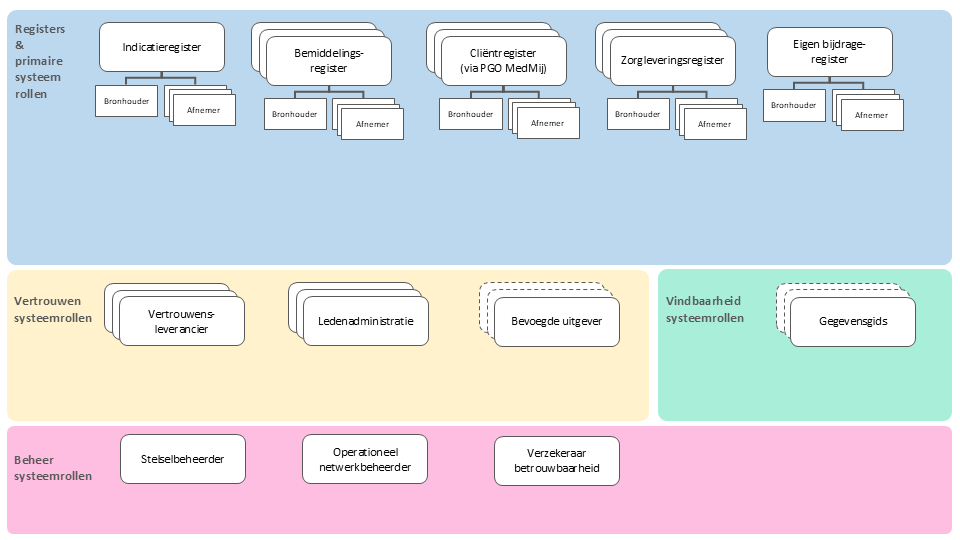
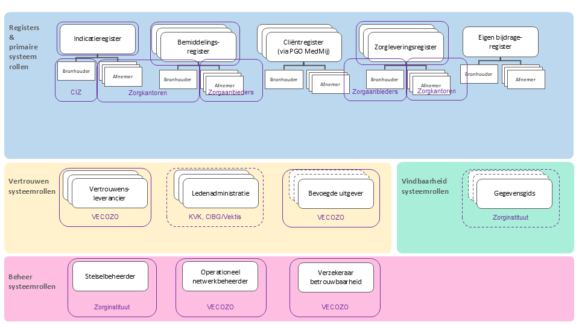
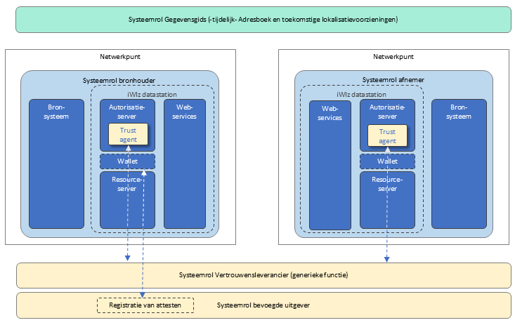
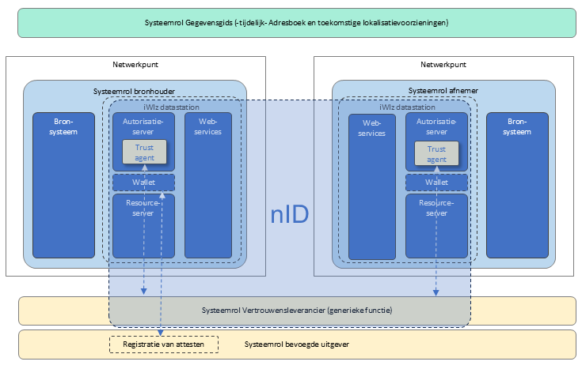
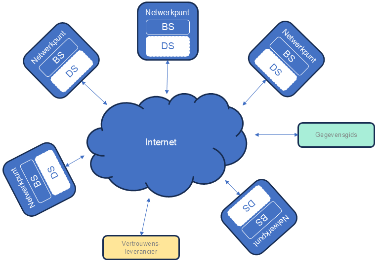
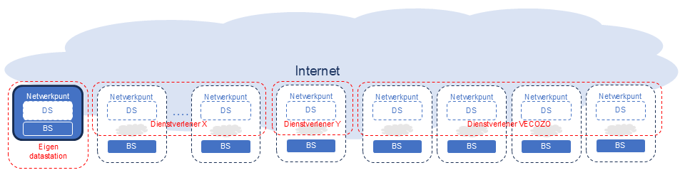
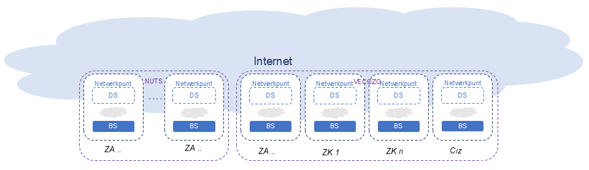

# Applicatiecomponenten

!!! info "Versie: *17-12-2025* | Status: *Definitief*"

## 1. Inleiding

In dit artikel worden de applicatiecomponenten in het iWlz-netwerkmodel beschreven. Hiermee wordt concreet gemaakt welke generieke afspraken voor de applicatiecomponenten in het iWlz-netwerkmodel van toepassing zijn.

De volgende onderwerpen komen hierbij aan bod:

- Systeemrollen
- Applicatiecomponenten
- Technische specificaties
- iWlz-datastation
- Dienstverleners

De kenmerken die specifiek zijn voor een bepaald register/uitwisselprofiel worden niet in dit artikel maar in de blauwe laag **‘Uitwisselprofielen/registers’** beschreven (zie [lagenmodel Afsprakenstelsel](../img/welkom-lagen.png)).

## 2. Systeemrollen

Het op een veilige en betrouwbare manier delen van iWlz-gegevens met behulp van registers stelt eisen aan de structuur van het iWlz-netwerkmodel. Deze eisen zijn gekoppeld aan de DIZRA-systeemrollen.

De systeemrollen zijn gegroepeerd in de volgende bouwstenen:

**Primaire systeemrollen**

- Bronhouder
- Afnemer
- Gegevensregisseur
- Gezondheidsregisseur

**Vertrouwen**

- Vertrouwensleverancier
- Ledenadministratie
- Bevoegde uitgever van verklaringen

**Vindbaarheid**

- Gegevensgids

**Beheer**

- Stelselbeheerder
- Verzekeraar betrouwbaarheid
- Operationeel netwerkbeheerder

 In het onderstaande figuur zijn de registers, bouwstenen en systeemrollen schematisch weergegeven.

<figcaption>Afbeelding: Overzicht bouwstenen en systeemrollen</figcaption>

De functionele uitwerking van deze bouwstenen en systeemrollen is opgenomen in het artikel *Architectuur*. Een gedetailleerde beschrijving van de systeemrollen is opgenomen in het artikel *Rollen en deelnemers*.

De systeemrollen geven inzicht in de verschillende verantwoordelijkheden maar beschrijven niet op welke wijze deze verantwoordelijkheden technisch worden gerealiseerd.

### 2.1 Systeemrollen Indicatie- en bemiddelingsregister

Het iWlz-netwerkmodel wordt incrementeel geïmplementeerd.

Op dit moment is:

- het Indicatieregister in productie;
- het Bemiddelingsregister in realisatie.

Een deel van de systeemrolleninformatiestelsel.

> *Afbeelding: Invulling bouwstenen en systeemrollen in implementatiestappen Indicatie- en bemiddelingsregister*

## 3. De applicatiecomponenten

Het technisch realiseren van de verantwoordelijkheden van een systeemrol vindt plaats met behulp van applicatiecomponenten.

Hieronder wordt weergegeven welke applicatiecomponenten nodig zijn. Toekomstige invullingen van functies zoals de Lokalisatievoorziening en het Adresboek worden wel genoemd maar niet nader uitgewerkt.

> *Afbeelding: Overzicht applicatiecomponenten*

### 3.1 Applicatiecomponenten per systeemrol

| Systeemrol | Applicatiecomponent | Toelichting |
|------------|--------------------|-------------|
| Bronhouder & Bevoegde uitgever | Bronsysteem | Het backofficesysteem van de bronhouder. **Capabilities:** mTLS, OpenAPI, Activity log |
| Bronhouder & Bevoegde uitgever | Resource Server | Zorgt ervoor dat gegevens uit het bronsysteem in het juiste GraphQL-formaat worden aangeboden. Eventueel wordt gebruik gemaakt van een resolver die een intern formaat omzet naar GraphQL. **Capabilities:** GraphQL, AAA Proxy, Subscriptions, OpenAPI, Activity log |
| Bronhouder & Bevoegde uitgever | Wallet | Opslag en beheer van attesten. De component bestaat zowel aan de zijde van bronhouder als afnemer. Wordt momenteel nog niet actief gebruikt omdat gebruik wordt gemaakt van VECOZO-certificaten en opslag van attesten bij VECOZO. **Capabilities:** Wallet, Verifiable Credentials, OpenAPI, Activity log |
| Bronhouder & Bevoegde uitgever | Autorisatie Server (verstrekken toegangsbewijs) | Controleert credentials en verstrekt access tokens. Op basis van VECOZO-certificaat, VECOZO-nummer en attesten wordt bepaald welke scope mag worden uitgegeven. |
| Bronhouder & Bevoegde uitgever | Autorisatie Server (verstrekken gegevens) | Valideert toegangsbewijzen, controleert scope en bepaalt of toegang tot cliëntgegevens is toegestaan. **Capabilities:** OAuth2, OPA (PEP, PRP, PDP, PIP), OpenAPI, Activity log |
| Bronhouder & Bevoegde uitgever | Trust agent | Geeft toegang tot cryptografisch materiaal en verzorgt validatie van certificaten en toekomstige attesten. **Capabilities:** Key Store, JOSE, Decentralized Identifiers, Verifiable Credentials, OpenAPI, Activity log |
| Bronhouder & Bevoegde uitgever | Web services van Register | Maakt diensten van de bronhouder benaderbaar op het endpoint van de afnemer. **Capabilities:** mTLS, OAuth Client, OpenAPI, Activity log |
| Afnemer | Web services van Afnemer | Maakt diensten van de afnemer benaderbaar. **Capabilities:** mTLS, OAuth Client, OpenAPI, Activity log |
| Afnemer | Trust agent | Toegang tot cryptografisch materiaal voor validatie van certificaten en attesten. **Capabilities:** Key Store, JOSE, Decentralized Identifiers, Verifiable Credentials, OpenAPI, Activity log |
| Afnemer | Autorisatie Server | Controleert credentials en verstrekt access tokens. Autoriseert binnenkomende gegevensverzoeken. **Capabilities:** OAuth2, OPA (PEP, PRP, PDP, PIP), OpenAPI, Activity log |
| Afnemer | Wallet | Opslag en beheer van attesten. **Capabilities:** Wallet, Verifiable Credentials, OpenAPI, Activity log |
| Afnemer | Resource Server | Zorgt ervoor dat opgehaalde gegevens in een gestandaardiseerd formaat kunnen worden opgeslagen in het doelsysteem. **Capabilities:** GraphQL, AAA Proxy, Subscriptions, OpenAPI, Activity log |
| Afnemer | Doelsysteem | Het backofficesysteem van de afnemer. **Capabilities:** mTLS, OpenAPI, Activity log |

### 3.2 Generieke functies

| Systeemrol | Generieke functie | Toelichting |
|------------|------------------|-------------|
| Gegevensgids | Lokalisatievoorziening | Voorziening waarmee voor specifieke gegevens (bijvoorbeeld BSN) kan worden opgezocht welke deelnemers bronhouder zijn. Nog niet actief in deze implementatiefase. **Capabilities:** OpenAPI, Activity log |
| Gegevensgids | Adresboek | Voorziening waarin technische adressen van diensten van deelnemers kunnen worden opgezocht. Momenteel beschikbaar als tijdelijke voorziening. **Capabilities:** OpenAPI, Activity log |
| Vertrouwensleverancier | Vertrouwensleverancier | Zorgt via uitgifte en beheer van digitale sleutelparen voor een digitale identiteit van deelnemers. **Capabilities:** PKI, Decentralized Identifiers, OpenAPI, Activity log |

In de implementatiestappen Indicatieregister en Bemiddelingsregister worden verschillende applicatiecomponenten ingevuld door VECOZO. Hiervoor heeft VECOZO **nID** ingericht.

nID handelt zowel aan de zijde van de afnemer als aan de zijde van de bronhouder af:

- Identificatie
- Authenticatie
- Autorisatie

Voor de realisatie van het Zorgleveringsregister wordt gewerkt aan interoperabiliteit tussen **NUTS** en **nID**.

> *Afbeelding: Overzicht applicatiecomponenten en nID-inrichting*

## 4. Technische specificaties (RFC's)

Om veilige en betrouwbare gegevensuitwisseling mogelijk te maken, is het belangrijk dat er eenduidigheid bestaat over de technische werking van de verschillende applicatiecomponenten.

De technische specificaties waaraan de applicatiecomponenten moeten voldoen zijn beschreven in RFC's.

Vanuit het afsprakenstelsel iWlz-netwerkmodel wordt waar relevant naar specifieke RFC's verwezen.

Het artikel **RFC's iWlz-netwerkmodel** bevat een overzicht van deze RFC's.

## 5. iWlz-datastation en hun leveranciers

De verzameling applicatiecomponenten die deelnemers aan het iWlz-netwerkmodel nodig hebben wordt het **iWlz-datastation** genoemd.

Onderdeel van een datastation zijn:

- Web services
- Resource Server
- Wallet
- Autorisatie Server
- (Toegang tot de) Trust Agent

Iedere deelnemer aan het iWlz-netwerkmodel beschikt over een datastation dat werkt conform het afsprakenstelsel.

Dit kan:

- een specifiek iWlz-datastation zijn;
- een generieke voorziening zijn voor meerdere afsprakenstelsels;
- geleverd worden door een softwareleverancier.

Deelnemers kunnen voor de invulling van hun datastation gebruikmaken van één of meerdere dienstverleners.

De deelnemers wisselen via hun datastations gegevens met elkaar uit. De datastations communiceren veilig en betrouwbaar via internet.

> *Afbeelding: Samenwerking tussen iWlz-datastations*

Een dienst voor de invulling van een datastation wordt ook wel:

- **DaaS (Datastation-as-a-Service)** genoemd;
- geleverd door een **DaaS-leverancier**.

De koppeling tussen een iWlz-datastation en het bron- of doelsysteem valt buiten de standaardisatie van het afsprakenstelsel en kan tussen deelnemer en leverancier worden afgestemd.

> *Afbeelding: Verschillende dienstverleners voor iWlz-datastations*

### 5.1 Huidige situatie

Voor de implementatiestappen van het Indicatieregister en Bemiddelingsregister zijn slechts enkele datastations nodig:

- Datastation CIZ
- Datastations Zorgkantoren

Deze worden gerealiseerd door **VECOZO**.

De Resource Server wordt door verschillende deelnemers zelf geleverd. De overige applicatiecomponenten worden via **nID** ingevuld.

### 5.2 Toekomstige situatie

Wanneer zorgaanbieders en het CAK aansluiten op het netwerk, hebben zij in eerste instantie alleen de functionaliteit nodig die vereist is voor de rol van afnemer.

Bij de realisatie van het Zorgleveringsregister hebben zorgaanbieders de volledige functionaliteit van een datastation nodig.

De verwachte situatie gaat ervan uit dat een deel van de zorgaanbieders via **NUTS** en hun **ECD-leverancier** aansluit.

> *Afbeelding: Verwachte situatie met dienstverleners*