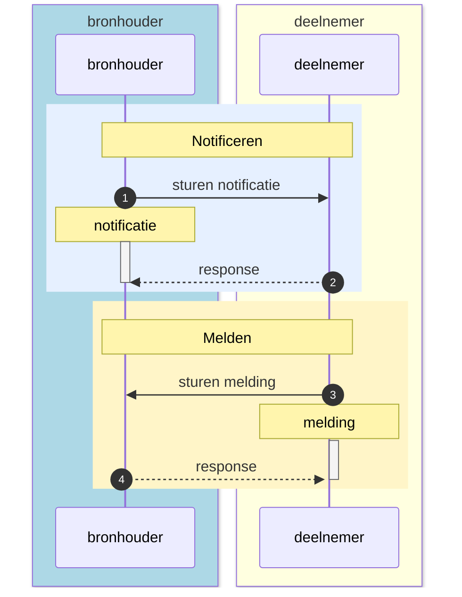
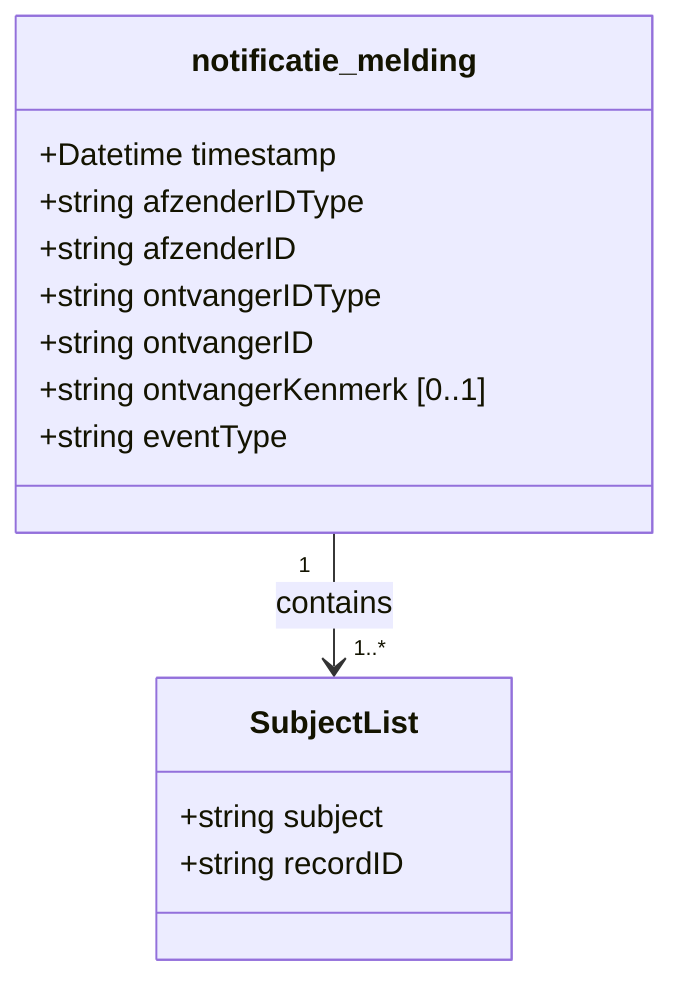
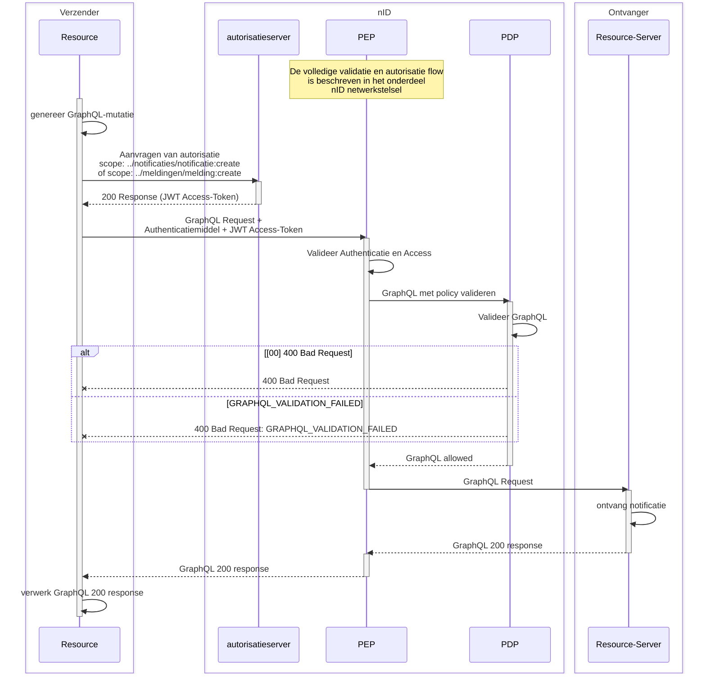
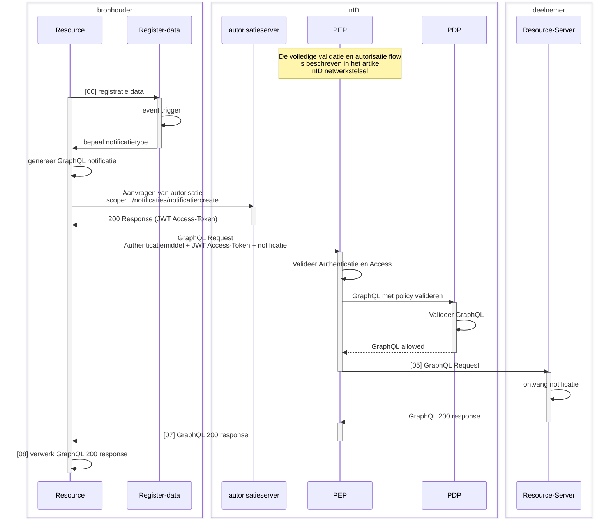
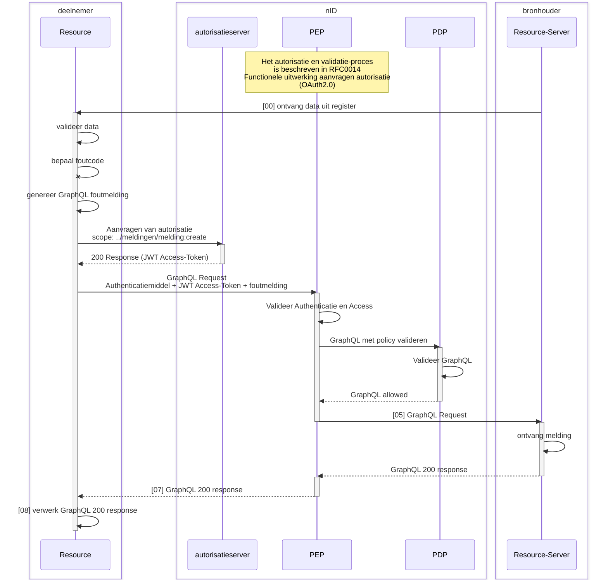

## 1. Inleiding

Binnen het iWlz-netwerkmodel werken we met generieke technische oplossingen en contracten om minimaal afhankelijk te zijn van gezamenlijke releases. Daarom werken we bijvoorbeeld met GraphQL, zodat het uitleveren van extra gegevens via een register geen impact heeft op de overige deelnemers aan het netwerk.

Het netwerkmodel moet in zijn geheel ondersteuning bieden aan het gehele iWlz ketenproces. Daarvoor is het in bepaalde situaties nodig om als ketenpartij op de hoogte gebracht te worden van relevante informatie om de voortgang in het proces van zorglevering aan een cliënt te waarborgen.

De dienst ***Notificeren*** is er om een deelnemer op de hoogte te brengen dat er relevante informatie beschikbaar is voor die deelnemer.

Andersom kan een deelnemer ook de bronhouder voorzien van (nieuwe) informatie. In dat geval spreken we over ***Melden***.

Dit artikel beschrijft de werking van notificeren en melden in het iWlz-netwerkmodel.

## 2. Generieke basis Notificeren en Melden

De basis voor een **notificatie** of een **melding** is gelijk. Alleen op inhoud zijn er verschillen om duidelijk te maken met welke soort bericht er sprake is.

### 2.1 Notificeren en melden, wat is het verschil?



|  | Van | Naar | Omschrijving |
| :-- | :-- | :-- | :-- |
| Notificeren | Bronhouder | Deelnemer | Op de hoogte stellen van een deelnemer dat er nieuwe (of gewijzigde) informatie in een bron beschikbaar is die directe of afgeleide betrekking heeft op die deelnemer. |
| Melden | Deelnemer | Bronhouder | Verzoek tot muteren of het beschikbaar stellen van nieuwe informatie naar aanleiding van een gebeurtenis van een deelnemer richting een bron. |

### 2.2 Structuur notificatie of melding

Op basis van de inhoud van een notificatie moet de ontvanger van de notificatie onder andere kunnen bepalen:

* wat is de reden van de notificatie, wat is de trigger;
* van welke bronhouder is de notificatie afkomstig;
* wanneer is de notificatie verzonden;
* op welke informatie de notificatie betrekking heeft;
* informatie om een gerichte raadpleging te kunnen doen;
  

De inhoud van een melding geeft onder andere richting aan:

* wat is de reden van de foutmelding, wat is de fout;
* welke raadpleger de foutmelding heeft geconstateerd;
* wie de afzender is die de foutmelding heeft verstuurd;
* wanneer is de foutmelding verzonden;
* op welke informatie de foutmelding betrekking heeft;
  

Daarnaast moet de autorisatievoorziening voldoende informatie hebben om te kunnen bepalen dat de notificatie (type) door verzender mag worden verstuurd. Bijvoorbeeld: Notificatietype mag verzonden worden door verzender en stuurt naar juiste type ontvanger.

De structuur voor een notificatie of melding is uit de volgende elementen opgebouwd:




| Element | Algemene beschrijving | V/O* | Type | Specifiek voor notificatie | Specifiek voor melding |
| :-- | :-- | :-- | :-- | :-- | :-- |
| timestamp | Tijdstip waarop de notificatie is aangemaakt | V | Datetime*2 |  |  |
| afzenderIDType | Kenmerk van het type ID van de verzendende partij | V | Enum |  |  |
| afzenderID | Identificatie van de verzender van het bericht | V | String |  |  |
| ontvangerIDType | Kenmerk van het type ID van de ontvangende partij | V | Enum |  |  |
| ontvangerID | Identificatie van de ontvanger van het bericht | V | String |  |  |
| ontvangerKenmerk | Kenmerk van de ontvanger | O | String | Bij iWlz-vrijwillige notificatie gevuld met abonnementsID.Anders leeg | Identificatie van de melder, wanneer dit niet de afzender zelf is. Format: <Afzendercode>: ID.Anders leeg |
| eventType | Onderwerp van het bericht; wat is de reden van het bericht | V | String | Identificatie van het type notificatie: NotificatieObjectIDzie: https://www.istandaarden.nl/info-model/wlz-network/notificaties | Identificatie van het type melding. (nu alleen iWlzFoutmelding) |
| subjectList | Lijst met onderwerpen van het bericht | V | Array |  |  |
| ../subject | Onderwerp van het bericht | V | String | Identificatie van het parent-object waarover de autorisatie loopt. | Identificatie van het parent-object waarover de autorisatie loopt. |
| ../recordID | Identificatie van het record waar het bericht betrekking op heeft | V | String | Identificatie van het record waar de notificatie betrekking op heeft. | Identificatie van het record waar de melding betrekking op heeft. |

\* V = verplicht / O = Optioneel

\*2 Datetime volgens ISO-8601 zie [ISO 8601](https://en.wikipedia.org/wiki/ISO_8601) en [DateTime — GraphQL Custom Scalar](https://scalars.graphql.org/andimarek/date-time). Formaat is bijvoorbeeld: *2016-07-20T17:30:15Z* of *2016-07-20T17:30:15+05:30* of *2016-07-20T17:30:15.234890+05:30.*

#### 2.2.1 Code afzenderIDType of ontvangerIDType

Voor het vullen van de afzenderIDType of ontvangerIDType zijn de volgende codes toegestaan:

| Code | Omschrijving | Referentie | Toepassing |
| :-- | :-- | :-- | :-- |
| AGB | AGB-code | AGB-register | identificatie Zorgaanbieder |
| KVK | Kamer van Koophandel | KVK-register | identificatie Ondernemer ( voor CIZ*) |
| OIN | Organisatie Identificatienummer | OIN-register | identificatie CIZ (toekomstig*) |
| UZOVI | Unieke ZorgVerzekeraarsIdentificatie | UZOVI-register | identificatie Zorgkantoren |

\* Op dit moment registreert VECOZO geen OIN bij overheidsorganisaties waardoor er geen claim kan worden afgegeven op basis van OIN. Bij de eerste implementatie van notificaties zal voor de identificatie van het CIZ het KVK-nummer (62253778) worden gebruikt.

### 2.3 GraphQL

Binnen het iWlz Netwerk verlopen raadplegingen via GraphQL en zijn registers gedefinieerd door middel van GraphQL schema’s. Om uniformiteit binnen het netwerk te versterken is er daarom voor gekozen om voor notificeren of melden ook gebruik te maken van GraphQL.

Een notificatie of melding is technisch vormgegeven met de GraphQL-operatie “`mutation`”. De definitie van het GraphQL-schema is te vinden in GitHub: [GitHub - iStandaarden/iWlz-generiek: Koppelvlak specificaties met netwerk brede functionaliteit](https://github.com/iStandaarden/iWlz-generiek/).

In de onderdelen **Notificaties** en **Melden** is de toepassing van respectievelijk de GraphQL-operaties `zendMelding` en `zendNotificatie`.

### 2.4 Specifieke autorisatiemeldingen

Het autorisatiemechanisme binnen nID is ontworpen om meldingen en notificaties op een consistente en betrouwbare manier te verzenden naar geautoriseerde partijen binnen de iWlz-keten. Dit proces wordt ondersteund door de GraphQL-operaties `zendMelding` en `zendNotificatie`, die verantwoordelijk zijn voor het initiëren van respectievelijk meldingen en notificaties.

De responses van deze GraphQL-operaties bieden een gestandaardiseerde manier om de uitkomst van het verzoek te communiceren. Ze bevatten zowel statusinformatie als foutmeldingen, die essentieel zijn voor het begrijpen en diagnosticeren van het notificatieproces. Dit maakt het mogelijk om problemen in de keten snel te identificeren en te verhelpen.

De response codes zijn gebaseerd op gestandaardiseerde HTTP-statuscodes, uitgebreid met specifieke foutberichten en contextuele informatie om de aard van de uitkomst of fout te verduidelijken. Zowel technische als functionele foutscenario's worden behandeld, zodat ontwikkelaars en beheerders een volledig inzicht krijgen in de verwerking van notificaties.

Hieronder wordt een tabel weergegeven met de mogelijke response codes, foutberichten en oorzaken die kunnen optreden bij de uitvoering van de GraphQL-verzoeken `zendMelding` en `zendNotificatie`. Deze tabel dient als leidraad voor een correcte interpretatie van de responses en het oplossen van eventuele problemen.

De hieronder beschreven foutcodes ontstaan bij het valideren van de ingezonden GraphQL in nID, onderdeel PDP (zie artikel [nID netwerkstelsel](../nid_netwerkstelsel)).




| Response | Oorzaak |
| :-- | :-- |
| 400 Bad Request | Het notificatieverzoek bevatte ongeldige of ontbrekende parameters. |
| 400 Bad Request GRAPHQL_VALIDATION_FAILED instantie_type claim not found | De JWT token bevat geen instantie_type claim |
| 400 Bad Request GRAPHQL_VALIDATION_FAILED afzender_type is not valid | De afzenderIDType komt niet overeen met de instantie_type claim of is niet toegestaan |
| 400 Bad Request GRAPHQL_VALIDATION_FAILED event_type is not valid | Het opgegeven event type komt niet voor in de lijst met toegestane types |
| 400 Bad Request GRAPHQL_VALIDATION_FAILED ontvanger is not valid | De combinatie van ontvangerIDType en eventType is niet toegestaan |

## 3. Notificaties

### 3.1 Doel notificatie

Het doel van een notificatie is het op de hoogte stellen van een deelnemer door een bron over nieuwe (of gewijzigde) informatie die directe of afgeleide betrekking heeft op die deelnemer en daarmee de deelnemer in staat stellen op basis van die notificatie de nieuwe informatie te raadplegen. Een notificatie verloopt altijd van bronhouder naar deelnemer.

De reden voor notificatie is altijd de registratie of wijziging van gegevens in een bronregister. Dit is de *notificatie-trigger* en beschrijft welk event op een register leidt tot een notificatie.

### 3.2 Uitgangspunten notificaties

* Notificaties worden gestuurd op basis van wettelijke en vrijwillige abonnementen. Vrijwillige abonnementen worden in deze release nog niet geïmplementeerd.
* Een notificatie stelt de ontvanger in staat te bepalen welke informatie opgevraagd kan worden.
* Notificaties die randvoorwaardelijk zijn om een wettelijke taak uit te kunnen voeren worden door de bronhouder verstuurd zonder dat daar een apart abonnement per deelnemer voor nodig is.
* Er is een lijst beschikbaar met notificatie end-points. Dit is het tijdelijk adresboek wat later wordt vervangen door de generieke functie Adresboek zodra deze beschikbaar komt. Zie: [GitHub - iStandaarden/iWlz-adresboek-public: Tijdelijk alternatief voor ZorgAB aansluiting](https://github.com/iStandaarden/iWlz-adresboek-public)
  

### 3.3 Typen notificatie

Er zijn twee typen notificaties gedefinieerd, waarbij het onderscheid zit in de vrijwilligheid van het ontvangen van de notificatie door een deelnemer of het noodzakelijk ontvangen van de notificatie door de deelnemer. Wanneer het voor de afgesproken werking van de iWlz noodzakelijk is een deelnemer van een event in een register op de hoogte te stellen is er sprake van een **verplichte** notificatie. Een bronhouder moet deze notificatie versturen en een deelnemer hoeft zich voor de deze notificatie niet te abonneren. Is voor een goede werking van de iWlz gewenst dat een deelnemer op de hoogte wordt gesteld van een event, maar niet noodzakelijk, dan hoeft een bronhouder een notificatie alleen te versturen wanneer de deelnemer zich heeft geabonneerd op deze notificatie (vrijwillige notificatie).

Een voorbeeld van een verplichte notificatie is de registratie van een nieuw indicatiebesluit. Het zorgkantoor dat verantwoordelijk is voor de regio waarin de cliënt van het indicatiebesluit volgens het BRP woont, moet op de hoogte gesteld worden. Het CIZ **moet** daarom een dergelijke notificatie verzenden aan het zorgkantoor en het zorgkantoor **moet** de notificatie volgens iWlz-afspraken afhandelen. Het zorgkantoor hoeft zich niet apart op deze notificatie *"nieuwe indicatie voor zorgkantoor"* te abonneren.

De twee typen iWlz notificaties zijn daarom:

| Type notificatie | Verzenden notificatie | Opmerking |
| :-- | :-- | :-- |
| Verplicht | Altijd, geen keuze deelnemer. De bronhouder is verplicht om de notificatie te verzenden. | Voor twee registers zijn verplichte notificaties gespecificeerd. Deze zijn beschikbaar op GitHub en per register via de volgende links te raadplegen:IndicatieregisterBemiddelingsregister |
| Vrijwillig | Alleen aan abonnees, keuze voor het ontvangen ligt bij deelnemer. | In de eerste implementatie zal er alleen sprake zijn van iWlz-verplichte notificaties. Er zal geen functionaliteit worden ondersteund voor de iWlz-vrijwillige notificatie en er zal verder in dit artikel niet worden besproken. |

### 3.4 Scopes voor notificeren

Binnen het iWlz-netwerkmodel zijn er specifieke scopes gedefinieerd voor de dienst Notificeren. Deze scopes bepalen de rechten en acties die gebruikers mogen uitvoeren binnen het systeem. Elke scope is gekoppeld aan een specifieke resource en beschrijft welke acties geautoriseerd zijn.

| Doel | Scope | Omschrijving |
| :-- | :-- | :-- |
| Zorgkantoor | organisaties/zorgkantoor/notificaties/notificatie:create | Geeft recht om een notificatie te sturen aan het zorgkantoor. |
| Zorgaanbieder | organisaties/zorgaanbieder/notificaties/notificatie:create | Geeft recht om een notificatie te sturen aan een zorgaanbieder. |

### 3.5 Sequentiediagram notificeren

De flow beschrijft alleen het notificeren zelf. Voor het notificeren is autorisatie nodig. Het aanvragen van autorisatie en de daar bijhorende flow is beschreven in artikel [nID netwerkstelsel](../nid_netwerkstelsel).



| # | Beschrijving | Toelichting |
| :-- | :-- | :-- |
| registratie data | De bronhouder registreert data in het register |  |
| event trigger | Door de registratie of wijziging van data gaat er een notificatie trigger af |  |
| bepaal notificatietype | Bronhouder bepaalt het bijbehorende notificatie objectID |  |
| genereer GraphQL notificatie | Bepaal de ontvanger en vul de overige verplichte parameters voor zendNotificatie |  |
| zend GraphQL notificatie | De bronhouder stuurt de notificatie via nID aan het notificatie-endpoint van de deelnemer |  |
| verwerk notificatie | De deelnemer ontvangt en verwerkt notificatie en kan met de informatie de bijbehorende proces handelingen starten bijvoorbeeld raadpleging |  |
| GraphQL 200 response | Deelnemer stuurt ontvangst bevestiging |  |
| Verwerk GraphQL 200 response | Bronhouder ontvangt en verwerkt de ontvangstbevestiging |  |

### 3.6 Voorbeeld van notificatie

**Scenario**: De registratie van een Wlz Indicatie leidt tot het moeten versturen van een notificatie.

| # | Beschrijving | Scenario |
| :-- | :-- | :-- |
| registratie data | Het CIZ registreert een nieuwe Wlz Indicatie in het Indicatieregister. |  |
| event trigger | De registratie van een nieuwe Indicatie leidt tot een (verplichte) notificatie |  |
| bepaal notificatietype | Het notificatietype is NIEUWE_INDICATIE_ZORKANTOOR dat verzonden moet worden aan het initieel verantwoordelijke zorgkantoor. |  |
| genereer GraphQL notificatie | Onder andere het notificatietype NIEUWE_INDICATIE_ZORKANTOOR, de uzovicode van het initieel verantwoordelijke zorgkantoor en het wlzIndicatieID van de zojuist geregistreerde Wlz Indicatie zijn onderdeel van de notificatie |  |

#### 3.6.1 Voorbeeld van GraphQL mutation: `zendNotificatie`

Gebruik voor de notificatie de GraphQL mutation `zendNotificatie`uit het schema:

```gql
mutation zendNotificatie(
  $afzenderID: String!
  $afzenderIDType: IDTypeEnum!
  $eventType: String!
  $ontvangerID: String!
  $ontvangerIDType: IDTypeEnum!
  $timestamp: DateTime!
  $subjectList: [SubjectEntity!]!
) {
  zendNotificatie(
    notificatieInput: {
      afzenderID: $afzenderID
      afzenderIDType: $afzenderIDType
      eventType: $eventType
      ontvangerID: $ontvangerID
      ontvangerIDType: $ontvangerIDType
      timestamp: $timestamp
      subjectList: $subjectList
    }
  ) {
    notificatieID
  }
}
```

#### 3.6.2 Voorbeeld input parameters

Op basis van het scenario ziet het json-object met de input parameters er als volgt uit:

```json
{
  "afzenderID": "62253778",
  "afzenderIDType": "KVK",
  "eventType": "NIEUWE_INDICATIE_ZORGKANTOOR",
  "ontvangerID": "5151",
  "ontvangerIDType": "UZOVI",
  "timestamp": "2024-07-02T00:00:00Z",
  "subjectList": [
    {
      "recordID": "WlzIndicatie/ef88ce35-58fa-4e6d-ac7a-6e298dd211d6",
      "subject": "WlzIndicatie/ef88ce35-58fa-4e6d-ac7a-6e298dd211d6"
    }
  ]
}
}
```

Toelichting:

| Element | Algemene beschrijving |
| :-- | :-- |
| afzenderID | KvK nummer van het CIZ |
| afzenderIDType | CIZ identificeert zich met KvK nummer |
| eventType | NIEUWE_INDICATIE_ZORKANTOOR is het bijbehorende notificatie objectID |
| ontvangerID | UZOVI code van het initieel verantwoordelijk zorgkantoor |
| ontvangerIDType | Zorgkantoren worden geïdentificeerd met de UZOVI code |
| timestamp | Tijdstip waarop de notificatie is aangemaakt |
| subjectList | Lijst met onderwerpen van het bericht |
| ../subject | verwijzing naar het parent recordID |
| ../recordID | verwijzing naar het specifieke recordID |

In dit voorbeeld zijn `subject` en `recordID` gelijk. Dit hoeft niet altijd zo te zijn. Bijvoorbeeld voor de notificatie `NIEUWE_BEMIDDELINGSPECIFICATIE_ZORGAANBIEDER` is dit niet het geval.

```json
{
  "afzenderID": "5050",
  "afzenderIDType": "UZOVI",
  "eventType": "NIEUWE_BEMIDDELINGSPECIFICATIE_ZORGAANBIEDER",
  "ontvangerID": "12345678",
  "ontvangerIDType": "AGBCODE",
  "timestamp": "2024-07-02T00:00:00Z",
  "subjectList": [
    {
      "subject": "Bemiddeling/ef88ce35-58fa-4e6d-ac7a-6e298dd211d6",
      "recordID": "Bemiddelingspecificatie/ef88ce35-58fa-4e6d-ac7a-6e298dd211d6"
    }
  ]
}
```

Ga voor meer over de specificaties van de notificaties naar de paragraaf over “Typen notificatie” en kies daar een register.

#### 3.6.3 Voorbeeld response

Voorbeeld succesvolle aflevering van de notificatie (non-normative):

```http
HTTP/1.1 200 
  {
    "data": {
      "zendNotificatie": {
        "notificatieID": "e2d8c3c2-7453-4948-95c8-de86688461e5"
      }
    }
  }
```

Voorbeeld onsuccesvolle aflevering notificatie (non-normative):

```http
HTTP/1.1 400 Bad Request 
  {
    "errors": [
      {
        "message": "ZendNotificatie mutation: afzenderIDType is not valid",
        "extensions": { "code": "GRAPHQL_VALIDATION_FAILED" }
      }
    ]
  }

```

## 4. Meldingen

### 4.1 Doel melding

Door middel van een melding kan een raadpleger van een bron de bronhouder voorzien van nieuwe informatie die direct betrekking heeft op data in die bron. Een melding loopt altijd van deelnemer (raadpleger) naar een bronhouder.

### 4.2 Uitgangspunten meldingen

* Deze request for comments beschrijft het proces van meldingen en verschillende vormen. In de eerste implementatie zal alleen de foutmelding worden geïmplementeerd.
* Er is een lijst beschikbaar met end-points voor meldingen. Dit is het tijdelijk adresboek wat later wordt vervangen door de generieke functie Adresboek zodra deze beschikbaar komt. Zie: [GitHub - iStandaarden/iWlz-adresboek-public: Tijdelijk alternatief voor ZorgAB aansluiting](https://github.com/iStandaarden/iWlz-adresboek-public)
  

### 4.3 Typen melding

Er zijn drie typen van meldingen gedefinieerd aan de hand van de gestructureerdheid van de informatie in de melding en of die informatie direct betrekking heeft op gegevens in het register.

| Type melding | Toelichting |
| :-- | :-- |
| Foutmelding | Voor het melden van overtreding van regels beschreven in de iStandaard iWlz. Foutmelding is direct te relateren aan de data in een bron en volgens een vaste afspraak (gegevensregels). |
| Terugmelding | Voor het aandragen van een voorstel voor verbetering of wijziging; bijvoorbeeld wijziging van de coördinator zorg thuis. |
| Aanvraagmelding | Voor het indienen van nieuwe gegevens, die (nog) geen directe relatie hebben met gegevens in de bron. |

De huidige uitwerking van **Meldingen** bevat alleen de implementatie van de **Foutmelding** voor gebruik binnen de **iStandaard iWlz.** In de uitwerking daarvan is rekening gehouden met gebruik van de Foutmeldingen binnen de andere iStandaarden en de implementatie van de overige twee type meldingen.

### 4.4 Scopes voor melden

Binnen het iWlz-netwerkmodel zijn er specifieke scopes gedefinieerd voor de dienst Melden. Deze scopes bepalen de rechten en acties die gebruikers mogen uitvoeren binnen het systeem. Elke scope is gekoppeld aan een specifieke resource en beschrijft welke acties geautoriseerd zijn.

| Doel | Scope | Omschrijving |
| :-- | :-- | :-- |
| CIZ | organisaties/indicatieorgaan/meldingen/melding:create | Geeft recht om een melding te sturen aan een indicatieorgaan. Binnen de iWlz is dat het CIZ. |
| Zorgkantoor | organisaties/zorgkantoor/meldingen/melding:create | Geeft recht om een melding te sturen aan het zorgkantoor |
| Zorgaanbieder | organisaties/zorgaanbieder/meldingen/melding:create | Geeft recht om een melding te sturen aan een zorgaanbieder |

### 4.5 Sequentiediagram melden

De hier beschreven flow beschrijft alleen het melden. Voor het melden is autorisatie nodig. Het aanvragen van autorisatie en de bijbehorende flow is beschreven in artikel [nID netwerkstelsel](../nid_netwerkstelsel)).




| # | Beschrijving | Toelichting |
| :-- | :-- | :-- |
| 01 | Ontvang gegevens | Na raadpleging ontvangt de deelnemer gegevens van de bron |
| 02 | Valideer data | Deelnemer valideert de ontvangen data aan de iWlz |
| 03 | Bepaal foutcode | Als er sprake is van een iWlz-fout neem de foutcode daarvan |
| 04 | Genereer GraphQL foutmelding | Bepaal de ontvanger en vul de overige verplichte parameters voor zendMelding |
| 05 | Stuur het complete GraphQL-request naar de bron | De raadpleger stuurt de melding via nID aan het melding-endpoint van de bronhouder |
| 06 | Ontvang foutmelding | De bronhouder ontvangt en verwerkt de foutmelding |
| 07 | GraphQL 200 response | De bronhouder stuurt de ontvangstbevestiging aan deelnemer (via autorisatievoorziening) |
| 08 | Verwerk response | Deelnemer verwerkt response |

### 4.6 Implementatie foutmelding binnen het iWlz netwerkmodel

Voor het gebruik van de foutmelding binnen het iWlz-netwerkmodel is afgesproken dat de inhoud van het subject gevuld wordt met de foutcode van de regel die is overtreden. Binnen het iWlz-netwerkmodel zijn er twee typen regels die kunnen leiden tot foutmeldingen:

* Gegevensregels
* Restricties
  

Voor elk register zijn de regels te vinden in het [informatiemodel iStandaarden](https://informatiemodel.istandaarden.nl/ "https://informatiemodel.istandaarden.nl/"), onder het kopje Regels bij de betreffende registers.

Elke Gegevensregel en Restrictie wordt voorafgegaan door een code. Bijvoorbeeld:

> * *GGR0001*: BSN vullen met een nummer dat voldoet aan de 11-proef;
> * *RS038*: vullen met UUID versie 4;
> * *IRG0012*: DiagnoseSubcodelijst vullen conform opgegeven DiagnoseCodelijst.
>   

Op basis van de voorbeelden betekent dit dat bij foutmelding het subject GGR0001, RS038 of IRG0012 bevat.

Naast deze twee typen regels zijn er ook *Uitgangspunten, Bedrijfsregels, Invulinstructies en Autorisatieregels*. Deze leiden niet tot een iWlz foutmelding.

### 4.7 Voorbeeld iWlz foutmelding

**Situatie**: In een door het zorgkantoor geraadpleegde Wlz indicatie voldoet in de klasse `Stoornis` de waarde van element `DiagnoseSubcodelijst` niet en overlappen periodes voor `GeindiceerdeZorgzwaartepakketten`.

| # | Beschrijving | Scenario |
| :-- | :-- | :-- |
| ontvang data | Het zorgkantoor ontvangt data uit het Indicatieregister |  |
| valideer data | Het zorgkantoor valideert de ontvangen data volgens de iWlz en constateert dateen waarde in DiagnoseSubcodelijst niet voldoet.er overlap is in de perioden van GeindiceerdeZorgzwaartepakket. |  |
| bepaal foutcode(s) | Regel IRG0012 luidt: “DiagnoseSubcodelijst vullen conform opgegeven DiagnoseCodelijst". De iWlz Foutcode daarvan is “IRG0012”.Regel IRG0028 luidt: “Wanneer WlzIndicatie meer GeindiceerdeZorgzwaartepakketten bevat, dan mogen de geldigheidsduren van deze GeindiceerdeZorgzwaartepakketten elkaar niet overlappen”. De iWlz Foutcode daarvan is “IRG0028”. |  |
| genereer GraphQL melding | Omdat het element niet afzonderlijk is te duiden, bevat het recordID de verwijzing naar het record in de klasse Stoornis, waar het element DiagnoseSubcodelijst onderdeel van is.Omdat niet duidelijk is welke van de aanwezig GeindiceerdeZorgzwaartepakketten foutief is, bevat het recordID de verwijzing naar het record van de parent-klasse Wlzindicatie. |  |

#### 4.7.1 Voorbeeld van GraphQL mutation: `zendMelding`

Gebruik voor de melding de GraphQL mutation `zendMelding` uit het schema.

```gql
mutation zendMelding(
  $timestamp: DateTime!
  $afzenderIDType: String!
  $afzenderID: String!
  $ontvangerIDType: String!
  $ontvangerID: String!
  $ontvangerKenmerk: String
  $eventType: String!
  $subjectList: [SubjectEntity!]!
) {
  zendMelding(
    meldingInput: {
      timestamp: $timestamp
      afzenderIDType: $afzenderIDType
      afzenderID: $afzenderID
      ontvangerIDType: $ontvangerIDType
      ontvangerID: $ontvangerID
      ontvangerKenmerk: $ontvangerKenmerk
      eventType: $eventType
      subjectList: $subjectList
    }
  ) {
    meldingID
  }
}
```

#### 4.7.2 Voorbeeld Input variabelen afzender is de (fout-)melder zelf:

Op basis van het scenario ziet het json-object met de input parameters er als volgt uit:

```json
{
  "timestamp": "2024-07-02T00:00:00Z",
  "afzenderIDType": "UZOVI",
  "afzenderID": "5151",
  "ontvangerIDType": "KVK",
  "ontvangerID": "12345678",
  "eventType": "IWLZFOUTMELDING",
  "subjectList": [
    {
      "subject": "IRG0012",
      "recordID": "wlzindicatie/Stoornis/da8ebd42-d29b-4508-8604-ae7d2c6bbddd"
    },
    {
      "subject": "IRG0028",
      "recordID": "wlzindicatie/5850ad49-7cf4-4711-8215-e160715900e7"
    }
  ]
}
```

Toelichting:

| Element | Algemene beschrijving |
| :-- | :-- |
| timestamp | Tijdstip waarop de melding is aangemaakt |
| afzenderIDType | Zorgkantoren worden geïdentificeerd met de UZOVI code |
| afzenderID | UZOVI code van het zorgkantoor |
| ontvangerIDType | CIZ identificeert zich met KvK nummer |
| ontvangerID | KvK nummer van het CIZ |
| eventType | IWLZFOUTMELDING om duidelijk te maken wat de context is. |
| subjectList | Lijst met onderwerpen van het bericht |
| ../subject | verwijzing naar de foutcode |
| ../recordID | verwijzing naar het specifieke recordID waarop de fout is geconstateerd |

#### 4.7.3 Voorbeeld response:

Voorbeeld succesvolle aflevering van de melding (non-normative)

```http
HTTP/1.1 200
{
  "data": {
    "zendMelding": {
      "meldingID": "86978bf6-f1b6-4c5c-aeac-f0b436fa3d3e"
    }
  }
}
```

Voorbeeld onsuccesvolle aflevering van de melding (non-normative):

```http
HTTP/1.1 400 Bad Request
{
  "errors": [
    {
      "message": "ZendNotificatie mutation: afzenderIDType is not valid",
      "extensions": {
        "code": "GRAPHQL_VALIDATION_FAILED"
      }
    }
  ]
}
```