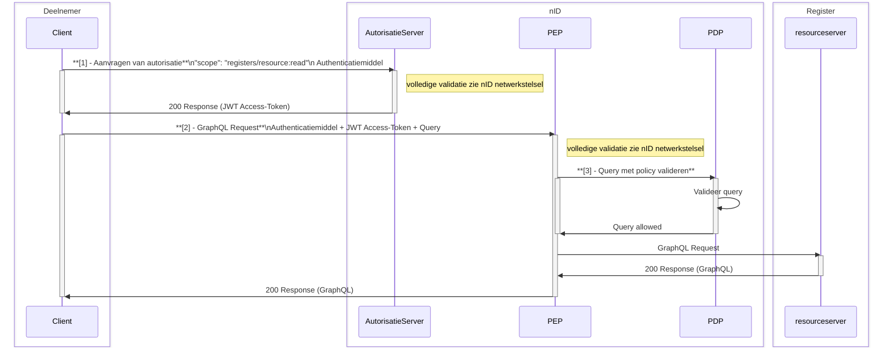

# Raadplegen

!!! info "Versie: *17-12-2025* | Status: *Definitief*"

**Inhoudsopgave:**


## 1. Inleiding

Dit artikel beschrijft de dienst Raadplegen. Deze dienst wordt door bronhouders aangeboden aan (toekomstige) afnemers.

De volledige validatie flow voor het raadplegen van een register is beschreven in het artikel [nID netwerkstelsel](https://wlz.atlassian.net/wiki/spaces/IWLZAS/pages/229441537)Voorvertoning en verloopt in de basis op dezelfde wijze als [Notificeren en Melden](https://wlz.atlassian.net/wiki/spaces/IWLZAS/pages/23071204)Voorvertoning .

Het gaat bij het raadplegen van een register om:

1. Valideren autorisatie verzoek door de autorisatieserver
2. Valideren autorisatie door de PEP
3. Valideren ingediende GraphQL-query door de [**PDP**](https://wlz.atlassian.net/wiki/spaces/IWLZAS/pages/23069870 "https://wlz.atlassian.net/wiki/spaces/IWLZAS/pages/23069870")




Dit artikel gaat over wat er nodig is voor de succesvolle validatie van een raadpleging door de **PDP.**

## 2. Policy’s en PDP

In de *stap 3 - Query met policy valideren* door de PDP, toetst de PDP of de ingediende GraphQL-query is toegestaan voor de indiener en of de query juist is opgesteld.

Het Informatiemodel iWlz dat te vinden is via de website: [Informatiemodel](https://informatiemodel.istandaarden.nl/) beschrijft voor elke register de toegangsregels voor een deelnemer op dat register. Per register zijn er voor de huidige deelnemers van het netwerk autorisatieregels en bijbehorende autorisatiematrix opgesteld die beschrijven welke informatie mag worden geraadpleegd.

De combinatie van deze autorisatieregels en autorisatiematrix zijn voor automatische toetsing vertaald naar policy’s. De policy’s zijn de machine-leesbare vertalingen van autorisatieregels en autorisatiematrix. Met de policy’s kan de PDP beoordelen of een ingediende GraphQL query voldoet.

De samenhang tussen de policy en de ingediende GraphQL-query luistert zeer nauw daarom zijn er query-templates beschikbaar gesteld.

## 3. Raadpleeg use-cases en GraphQL query-templates

De GraphQL query-templates beschrijven het template hoe een raadpleger vanuit zijn rol informatie kan raadplegen die is toegestaan voor die raadpleger. Deze templates volgen altijd het GraphQL-schema maar moeten op bepaalde momenten aan vaste patronen voldoen vanwege de geldende autorisatie voor die raadpleger op dat moment. Gaat een raadpleger buiten dit patroon dan zal de query worden afgekeurd en krijgt de raadpleger geen inzicht in de data.

Om een raadpleger te helpen bij het op de juiste wijze en volgorde van uitvoeren van de raadplegingen zijn er per register *Raadpleeg use-cases* opgesteld. Ga hiervoor naar de [Uitwisselprofielen](https://wlz.atlassian.net/wiki/spaces/IWLZAS/pages/23071549)Voorvertoning. De use-case bevat de koppeling met een of meer query-templates.

### 3.1 Voorbeeld raadplegen Indicatieregister

> **Benodigde scope: registers/wlzindicatieregister/indicaties:read**

Deze scope staat toe om een indicatie op te vragen uit het Indicatieregister. De autorisatieserver heeft bij het aanvragen van de autorisatie-token gecontroleerd of de deelnemer hiertoe is gemachtigd. Daarna mag de deelnemer een GrapqhQL query opsturen. 

Wat en hoe de raadpleger met een GraphQL query mag raadplegen wordt bepaald door bijbehorende policy.

**Voorbeeld:** Opvragen indicatie door het initieel verantwoordelijke zorgkantoor. 

De raadpleeg use-case hierbij is: [UCIR-0001-raadplegen: Wlz Indicatie raadplegen door Initieel verantwoordelijk zorgkantoor](https://github.com/iStandaarden/iWlz-indicatie/blob/Indicatieregister-2/raadplegen/ "https://github.com/iStandaarden/iWlz-indicatie/blob/Indicatieregister-2/raadplegen/").

Het zorgkantoor moet hierbij verplicht zowel de eigen uzovi-code als het ID van de te raadplegen Wlz-indicatie meesturen. Als een van deze ontbreekt, wordt de query niet uitgevoerd. het PDP controleert of beide aanwezig zijn en beoordeelt ook welke gegevens worden opgevraagd. Alleen als er een gegeven wordt aangevraagd waarvoor het zorgkantoor geen toegang heeft (meer dan is toegestaan volgens de query-template), zal het PDP de query afkeuren.

```graphql
# QIR-0001-ZKi.graphql
# Query voor initieel Verantwoordelijk Zorgkantoor op Indicatieregister
# Verplichte input:
#   - wlzIndicatieID = te raadplegen WlzIndicatie
#   - uzovicode zorgkantoor = eigen uzovicode raadpleger
# versie 1.0.0 - 2024-10-04

query WlzIndicatie(
    $wlzIndicatieID: UUID!
    $initieelVerantwoordelijkZorgkantoor: String!
) {
    wlzIndicatie(
      where: {
        wlzindicatieID: {eq: $wlzIndicatieID}
        initieelVerantwoordelijkZorgkantoor: {eq: $initieelVerantwoordelijkZorgkantoor}
        }
    ) {
        wlzindicatieID
        bsn
        besluitnummer
        soortWlzindicatie
        afgiftedatum
        ingangsdatum
        ...
        grondslag {
            grondslagID
            grondslag
            volgorde
        }
        geindiceerdZorgzwaartepakket {
            geindiceerdZorgzwaartepakketID
            zzpCode
            ingangsdatum
            ...
        }
   ...
}
```

*(De volledige query-template is te vinden op:*  
[GitHub - iStandaarden/iWlz-indicatie: Koppelvlak specificatie Indicatieregister](https://github.com/iStandaarden/iWlz-indicatie/tree/Indicatieregister-2) *)*

**Let op**: Of het raadplegende zorgkantoor uiteindelijk gegevens ontvangt, hangt er ook van af of de combinatie van *initieelVerantwoordelijkZorgkantoor* en *wlzIndicatieID* daadwerkelijk in het register voorkomt.

### 3.2 Response

De response vanuit de *Resource-server* is beschreven in het artikel: [GraphQL over HTTP](../diensten/index.md)

* * *