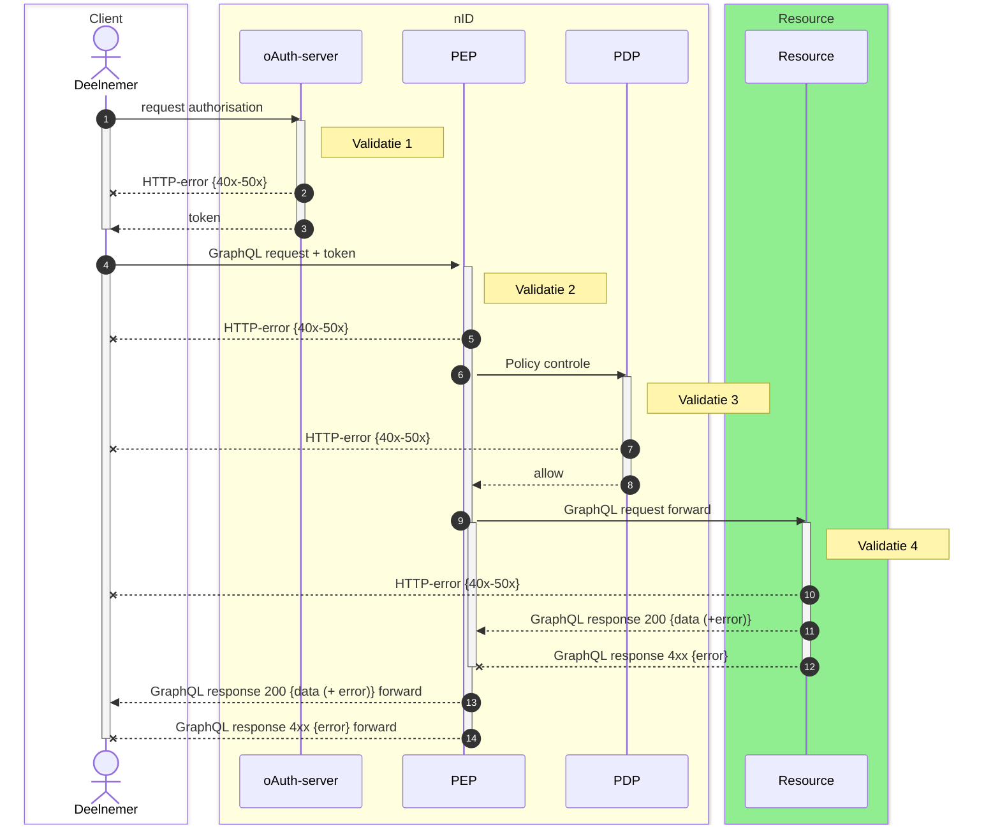

# Graphql over http


## 1. Inleiding

De uitwisseling van gegevens binnen het iWlz netwerk is gebaseerd op [GraphQL](https://graphql.org/). GraphQL is een querytaal voor API's en een runtime-applicatie. Daarmee kunnen datastructuren worden beschreven en kunnen query’s worden uitgevoerd om deze data te raadplegen.

De GraphQL beschrijvingen van deze datastructuren zijn de zogenaamde GraphQL koppelvlak specificaties. Onderdeel van deze koppelvlakspecificaties zijn onder andere de GraphQL schema specificatie en zijn er GraphQL query-templates beschikbaar die beschrijven hoe een raadpleger gebruik kan maken van dat schema om data te raadplegen én te voldoen aan de gestelde autorisatie. Deze beschrijvingen zijn er per register en te vinden in het artikel over de [uitwisselprofielen](https://wlz.atlassian.net/wiki/spaces/IWLZAS/pages/23071549) van elk register.

In het iWlz netwerk wordt GraphQL over HTTP toegepast. De GraphQL specificatie geeft in een ‘[Best Practice](https://graphql.org/learn/serving-over-http/)’ aan hoe er met een HTTP server gereageerd moet worden op GraphQL verzoek. In datzelfde artikel word er verwezen naar een RFC aangaande [GraphQL over HTTP](https://graphql.github.io/graphql-over-http/) waarin de doorontwikkeling wordt beschreven. De RFC is nog niet definitief maar wordt wel aanbevolen.

Dit artikel beschrijft de wijze waarop binnen het iWlz-netwerkmodel wordt gereageerd op GraphQL-verzoeken via GraphQL over HTTP.

### 1.1 Uitgangspunten

1. De indeling van HTTP-statuscodes volgt de internet standaard met betrekking tot HTTP-semantiek beschreven in [RFC9110](https://www.rfc-editor.org/rfc/rfc9110)

### 1.2 Scope artikel: GraphQL over HTTP

Er zijn drie soorten GraphQL verkeer binnen het iWlz netwerk

1. GraphQL request voor het [_**raadplegen**_](https://wlz.atlassian.net/wiki/spaces/IWLZAS/pages/23071274) van informatie bij een register.
2. GraphQL request voor het [_**notificeren**_](https://wlz.atlassian.net/wiki/spaces/IWLZAS/pages/23071204/Notificeren+en+Melden#3.-Notificaties) van een deelnemer door een bronhouder.
3. GraphQL request voor het [_**(fout)melden**_](https://wlz.atlassian.net/wiki/spaces/IWLZAS/pages/23071204/Notificeren+en+Melden#4.-Meldingen) door een deelnemer aan een bronhouder.

Voor al het verkeer in het iWlz netwerk vormt het [nID netwerkstelsel](https://wlz.atlassian.net/wiki/spaces/IWLZAS/pages/229441537) de centrale voorziening voor het controleren van de toegang tot iWlz registers. Daarin komen vier validatiemomenten voor:




| **Validatiemoment** | **Doel** | **GraphQL controle** | **GraphQL Verwerking** |
| --- | --- | --- | --- |
| Validatiemoment 1: Autorisatieserver | Doel: Uitgeven van autorisatie token voor het mogen uitvoeren van een GraphQL request. | Nee | Nee |
| Validatiemoment 2: PEP | Doel: controleren toegang tot (GraphQL-) Resource-server | Nee | Nee |
| Validatiemoment 3: PDP | Doel: controleren of GraphQL-request is toegestaan voor deelnemer. | Ja, op toegang | Nee |
| **Validatiemoment 4: (GraphQL) Resource-server** | Doel: Afhandelen van het GraphQL-request | Ja, op schema | **Ja** |


!!! info
    Deze specificatie gaat over:
      - alle GraphQL verkeer binnen de iWlz
      - validatiemoment 4: GraphQL Resource-server

## 2. GraphQL response

### 2.1 Response-header

#### 2.1.1 Media-type `application/graphql-response+json`

Het standaard media-type dat een GraphQL-server in het iWlz netwerk in de response-header terugstuurt is `application/graphql-response+json`. Dit media-type staat meer differentiatie toe waardoor gerichtere foutafhandeling mogelijk is. (zie ook: [GraphQL Over HTTP - application/graphql-response+json](https://graphql.github.io/graphql-over-http/draft/#sec-application-graphql-response-json) )

#### 2.1.2 Accept-header

Een accept-header dient om aan te geven welke media-types een client accepteert als antwoord. In de [GraphQL Over HTTP](https://graphql.github.io/graphql-over-http/draft/#sec-Media-Types) beschrijving staat dat een client de keuze heeft om `application/json` mee te geven in de accept-header.

In het iWlz netwerkmodel zal het mediatype `application/json` **niet** worden ondersteund en wanneer er geen response gegenereerd kan worden reageert de server met:

```http
HTTP/1.1 406 Not Acceptable
```

De accept-header binnen het iWlz netwerkmodel moet daarom het media-type `application/graphql-response+json` bevatten.

### 2.2 Response-body

Een GraphQL-response body heeft standaard twee hoofdvelden:

- **data**: Bevat de gevraagde gegevens als de query (gedeeltelijk) succesvol is.
- **errors**: Bevat een array van foutmeldingen die extra details kunnen bevatten, zoals foutlocaties en foutcodes. Bestaande uit
  - **message** (vereist): Beschrijft de fout in begrijpelijke taal.
  - **locations** (optioneel): Geeft de locaties in de GraphQL-query aan waar de fout is opgetreden.
  - **path** (optioneel): Specificeert het pad naar het veld in de respons waar de fout betrekking op heeft.
  - **extensions** (optioneel): Bevat extra metadata over de fout, zoals een foutcode en details voor debugging.

Voorbeeld

```json
{
  "data": {
    "userID": "123"
  },
  "errors": [
    {
      "message": "some message",
      "locations": [
        { "line": 2, "column": 3 }
      ],
      "path": ["path/to/"],
      "extensions": {
        "code": "CUSTOM_EXTENSIONCODE",
        "timestamp": "2024-11-18T10:15:00Z"
      }
    }
  ]
}
```

### 2.3 Voorbeelden

1. Voorbeeld volledig resultaat
2. Voorbeeld gedeeltelijk resultaat
3. Voorbeeld volledig fout

#### 2.3.1 Voorbeeld verwacht resultaat

HTTP Header:

```http
Content-Type: application/graphql-response+json 
Status: 200 OK
```

Body:

```json
{
  "data": {
    "user": {
      "id": "123",
      "name": "Alice"
    }
  }
}
```

#### 2.3.2 Voorbeeld gedeeltelijk resultaat

HTTP Header:

```http
Content-Type: application/graphql-response+json
Status: 200 OK
```


Voorbeeld Body (non-normative):

```json
{
  "data": {
    "user": {
      "id": "123",
      "name": "Alice"
    },
    "posts": null
  },
  "errors": [
    {
      "message": "You do not have permission to access the 'posts' field.",
      "locations": [
        {
          "line": 3,
          "column": 5
        }
      ],
      "path": ["posts"]
    }
  ]
}
```

**Uitleg van het voorbeeld**

1. `HTTP-statuscode 200 OK`**:**
   - De server geeft aan dat de query is uitgevoerd, maar mogelijk met fouten.
   - Dit is een geldige 2xx-respons, omdat er een niet-null `data`-sleutel aanwezig is.
2. `data`**:**
   - Bevat gegevens die succesvol zijn opgehaald (`user`-object).
   - Het `posts`-veld is echter `null`, wat aangeeft dat er een fout is opgetreden bij het ophalen van dat veld.
3. `errors`**:**
   - De foutdetails worden vermeld in de `errors`-sleutel:
   - `message`**:** Beschrijft het probleem ("geen toestemming voor 'posts'").
   - `locations`**:** Specificeert waar in de query het probleem zich bevindt (regel 3, kolom 5).
   - `path`**:** Geeft het exacte veld (`posts`) aan waar de fout is opgetreden.

#### 2.3.3 Voorbeeld bij een volledige fout

Als de gehele query faalt en er geen `data` kan worden geretourneerd, wordt een andere HTTP-statuscode gebruikt, zoals **400 Bad Request**:

HTTP Header:

```http
Content-Type: application/graphql-response+json
Status: 400 Bad Request
```

Voorbeeld Body (non-normative):

```json
{
  "errors": [
    {
      "message": "Syntax Error: Unexpected <EOF>.",
      "locations": [
        {
          "line": 1,
          "column": 7
        }
      ]
    }
  ]
}
```

## 3. GraphQL request

> ⚠️
> De `Content-Type` header van het **GraphQL verzoek** moet (vrijwel) altijd `application/json` zijn.

- Een verzoek moet worden verstuurd als HTTP-Post en een server moet deze accepteren.

De verdere invulling staat per register op GitHub, inclusief de Graphql-query templates en toelichting per partij. Zie links in onderstaande tabel.

| **Register** | **Link** |
| --- | --- |
| Indicatieregister | [iStandaarden/iWlz-indicatie: Koppelvlak specificatie Indicatieregister](https://github.com/iStandaarden/iWlz-indicatie) |
| Bemiddelingsregister | [iStandaarden/iWlz-bemiddeling: Koppelvlak specificatie Bemiddelingsregister](https://github.com/iStandaarden/iWlz-bemiddeling) |


