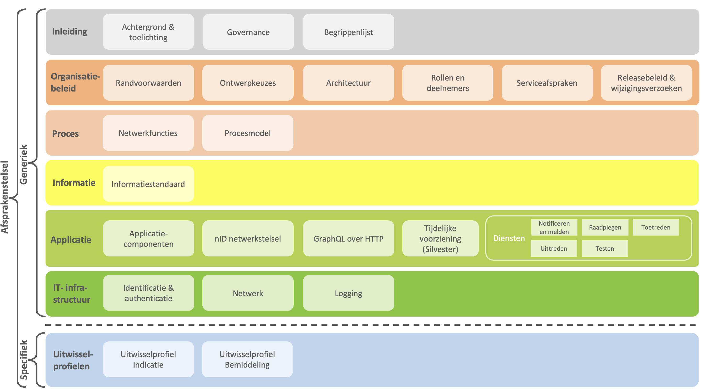

# Afsprakenstelsel iWlz-netwerkmodel 

!!! info "Versie: *17-12-2025* | Status: *Definitief*"

??? note "Toelichting" 

    Dit is de introductiepagina van het Afsprakenstelsel iWlz-netwerkmodel. 

    Het iWlz-netwerkmodel biedt zorgaanbieders, zorgkantoren en andere partijen die actief zijn in de langdurige zorg de mogelijkheid om zorgadministratieve gegevens direct bij de bron te raadplegen. Deze gegevens worden opgeslagen bij de bronhouder en zijn beschikbaar voor aangesloten partijen (afnemers). Met de invoering van het iWlz netwerkmodel beogen partijen in de langdurige zorg de administratieve lasten te verminderen, de informatiepositie van cliënten te verbeteren en de kwaliteit van de dienstverlening te verhogen. 

    Het afsprakenstelsel heeft als doel deelnemers aan het iWlz-netwerkmodel op een uniforme en eenduidige wijze te informeren over de geldende afspraken, procedures en regels. Het vormt daarmee de basis voor samenwerking en gegevensuitwisseling binnen het iWlz-netwerkmodel. 

??? warning "Incrementele implementatie" 

    Het iWlz-netwerkmodel wordt incrementeel geïmplementeerd aan de hand van het Afsprakenstelsel iWlz-netwerkmodel. Het eerste deel dat is geïmplementeerd is het Indicatieregister. Het tweede deel is het Bemiddelingsregister, wat naar verwachting per april 2026 operationeel wordt. 

    De implementatie van het iWlz-netwerkmodel vindt incrementeel plaats aan de hand van het afsprakenstelsel. Het eerste onderdeel dat in gebruik is genomen, betreft het Indicatieregister. Het tweede onderdeel, het Bemiddelingsregister, wordt naar verwachting in april 2026 operationeel. Deze versie van het Afsprakenstelsel iWlz-netwerkmodel is geactualiseerd ten behoeve van de implementatie van het Bemiddelingsregister. 

    Per artikel wordt indien relevant aangegeven welke onderdelen nog niet van toepassing zijn. Bij iedere volgende implementatiestap wordt het afsprakenstelsel geactualiseerd zodat duidelijk is welke onderdelen worden toegevoegd. 

## 1. Leeswijzer

Het Afsprakenstelsel iWlz-netwerkmodel is opgebouwd uit verschillende lagen die de afspraken beschrijven die nodig zijn voor de totstandkoming, het uitvoeren en het beheer van het iWlz-netwerkmodel. Het [Nictiz interoperabiliteitsmodel](https://nictiz.nl/wat-we-doen/zorginformatiestelsel/interoperabiliteit/ "https://nictiz.nl/wat-we-doen/zorginformatiestelsel/interoperabiliteit/") is als basis voor deze structuur gekozen. Van boven naar onder worden de onderwerpen steeds specifieker. Het afsprakenstelsel bestaat uit de volgende lagen:

* **Inleiding:** In deze laag wordt een beschrijving gegeven van de achtergrond en context van het iWlz-netwerkmodel. Ook worden de aanvullende afspraken op het convenant besproken en de begrippenlijst weergegeven.
* **Organisatiebeleid:** Deze laag beschrijft de randvoorwaarden en ontwerpkeuzes die bij het opstellen van het Afsprakenstelsel iWlz-netwerkmodel zijn gehanteerd en geeft inzicht in de hieruit voortvloeiende architectuur. Daarnaast bevat deze laag informatie over de rollen van deelnemers aan het iWlz-netwerkmodel en beschrijft de laag afspraken over de ontwikkeling en het beheer van het iWlz-netwerkmodel in de vorm van serviceafspraken.
* **Proces:** Deze laag beschrijft het iWlz zorgadministratieve proces aan de hand van de netwerkfuncties en het procesmodel.
* **Informatie:** Deze laag beschrijft de in het iWlz-netwerkmodel gehanteerde informatiestandaarden.
* **Applicatie:** Deze laag beschrijft de applicaties, diensten en technische afspraken die nodig zijn voor de implementatie van het iWlz-netwerkmodel.
* **IT-infrastructuur:** In deze laag wordt ingegaan op de technische infrastructuur.
* **Uitwisselprofielen:** Deze laag beschrijft de specifieke afspraken die gelden per register. Deze afspraken zijn aanvullend aan de generieke afspraken op de overige lagen.
  

De structuur van het Afsprakenstelsel iWlz-netwerkmodel is hieronder schematisch weergegeven:

Structuur afsprakenstelsel iWlz-netwerkmodel

## 2. Voor wie?

Het Afsprakenstelsel iWlz-netwerkmodel is primair opgesteld voor de volgende doelgroepen:

* Deelnemers - partijen die een rol hebben in het iWlz-netwerkmodel:
  * Centraal administratiekantoor (CAK), Centrum Indicatiestelling Zorg (CIZ), zorgkantoren, zorgaanbieders, Zorginstituut Nederland
* ICT-dienstverleners van deelnemers, zoals:
  * VECOZO
  * Leveranciers van netwerkcomponenten en bronsystemen (o.a. EPD leveranciers)
    

> **N.B.:** Cliënten zijn deelnemers aan het iWlz-netwerkmodel maar het Afsprakenstelsel iWlz-netwerkmodel is niet primair voor deze doelgroep opgesteld.

## 3. Status implementatie iWlz-netwerkmodel

Het iWlz-netwerkmodel wordt incrementeel geïmplementeerd aan de hand van het Afsprakenstelsel iWlz-netwerkmodel. Het eerste deel dat is geïmplementeerd is het Indicatieregister. Vanaf 16-01-2025 is Indicatieregister 2 van toepassing. Voor deze tussenstap is het Afsprakenstelsel iWlz-netwerkmodel bijgewerkt in januari 2025 vanwege een aantal elementaire aanpassingen in de werking van de basisinfrastructuur.

Het Bemiddelingsregister wordt toegevoegd per april 2026. Met de december 2025 release wordt hierop voorgesorteerd. Hiervoor zijn alle artikelen doorgenomen en waar nodig bijgewerkt. Hierbij zijn de volgende vastgestelde RFC’s verwerkt: [RFC0018 - Melden van fouten in gegevens volgens iStandaard iWlz](https://github.com/iStandaarden/iWlz-RequestForComment/blob/main/RFC/RFC0018%20-%20Melden%20van%20fouten%20in%20gegevens%20volgens%20iStandaard%20iWlz.md "https://github.com/iStandaarden/iWlz-RequestForComment/blob/main/RFC/RFC0018%20-%20Melden%20van%20fouten%20in%20gegevens%20volgens%20iStandaard%20iWlz.md"), [RFC0022a - Tracelogging - TraceID en SpanID](https://github.com/iStandaarden/iWlz-RequestForComment/blob/main/RFC/RFC0022a%20-%20Tracelogging%20-%20TraceID%20en%20SpanID.md "https://github.com/iStandaarden/iWlz-RequestForComment/blob/main/RFC/RFC0022a%20-%20Tracelogging%20-%20TraceID%20en%20SpanID.md") en [RFC0040 - GraphQL gebruik HTTP-statuscodes](https://github.com/iStandaarden/iWlz-RequestForComment/blob/main/RFC/RFC0040%20-%20GraphQL%20http-statuscodes.md "https://github.com/iStandaarden/iWlz-RequestForComment/blob/main/RFC/RFC0040%20-%20GraphQL%20http-statuscodes.md"). Deze zijn respectievelijk verwerkt in de artikelen: [Notificeren en Melden](https://wlz.atlassian.net/wiki/spaces/IWLZAS/pages/23071204)Voorvertoning , [Logging](https://wlz.atlassian.net/wiki/spaces/IWLZAS/pages/690651198)Voorvertoning en [GraphQL over HTTP](https://wlz.atlassian.net/wiki/spaces/IWLZAS/pages/690552899)Voorvertoning . Daarnaast is het [Uitwisselprofiel Bemiddeling](https://wlz.atlassian.net/wiki/spaces/IWLZAS/pages/690618376)Voorvertoning toegevoegd.

In de [release notes](https://wlz.atlassian.net/wiki/spaces/IWLZAS/overview#5.-Release-notes "https://wlz.atlassian.net/wiki/spaces/IWLZAS/overview#5.-Release-notes") is per artikel aangegeven wat deze wijzigingen zijn. Hierin is ook aangegeven welke artikelen zijn komen te vervallen.

## 4. Navigatietips

* **Inhoudsopgave**  
  Aan de linkerkant van het scherm staat de inhoudsopgave. Door op de pijltjes te klikken worden onderliggende artikelen zichtbaar. Door op de naam van een artikel te klikken wordt het desbetreffende artikel geopend. Het is ook mogelijk om de inhoudsopgave tijdelijk te verbergen door **CTRL + \[** in te toetsen, hiermee kan de inhoudsopgave ook weer worden teruggehaald.
* **Versie en status artikel**  
  Links bovenaan ieder artikel staat het versienummer en de status van het artikel.
* **Afbeeldingen**  
  Veel artikelen bevatten afbeeldingen. Deze zijn te vergroten door op de afbeelding te klikken. Om vervolgens weer terug naar de tekst van het artikel te gaan raden wij aan om op de X rechts bovenaan de afbeelding te klikken (in plaats van de pijltjes in uw internetbrowser te gebruiken).
* **Links openen**  
  Wanneer je een link in een nieuw tabblad wilt openen, houd dan de CTRL-toets (Windows) of Command-toets (macOS) ingedrukt terwijl je op de link klikt.
  

## 5. Release notes

### Release notes 17-12-2025

| Laag | Status | Wijzigingen t.o.v. release 09-04-2025 |
| :-- | :-- | :-- |
| Inleiding | Definitief | Achtergrond & toelichting: tekst geactualiseerd toegevoegd paragraaf Samenhang met relevante ontwikkelingen.Governance: toegevoegd paragraaf Samenhang afsprakenstelsel en Twiin LVS.Begrippenlijst: geactualiseerd. |
| Organisatiebeleid | Definitief | Randvoorwaarden: R05 AVG geactualiseerd, R12 Archiefwet toegevoegd. Overige teksten waar nodig geactualiseerd.Ontwerpkeuzes: apart artikel van gemaakt (was eerst artikel Randvoorwaarden & Ontwerpkeuzes). O10 tekst over generieke functies toegevoegd. Overige teksten waar nodig geactualiseerd.Architectuur: Tekst aangepast op nieuwe inzichten (zoals aansluiting op Twiin als LVS) en in lijn gebracht met de generieke functies.Rollen en deelnemers: Tekst consistent gemaakt met o.a. de artikelen Architectuur en nID netwerkstelsel.Serviceafspraken: structuur aangepast, teksten geactualiseerd en diverse aanscherpingen doorgevoerd.Operationeel netwerkbeheerder serviceafspraken: teksten geactualiseerd en diverse aanscherpingen doorgevoerd.Bronhoudersdeel serviceafspraken: structuur aangepast, teksten geactualiseerd en diverse aanscherpingen doorgevoerd. Algemene delen verplaatst naar hoofdartikel Serviceafspraken.Afnemersdeel serviceafspraken: structuur aangepast, teksten geactualiseerd en diverse aanscherpingen doorgevoerd. Algemene delen verplaatst naar hoofdartikel Serviceafspraken.Releasebeleid: tekst wijzigingsverzoeken verplaatst naar apart artikel. Paragraaf Releasebeleid iWlz-netwerkmodel herschreven. Paragraaf Afsprakenstelsel iWlz-netwerkmodel herschreven.Wijzigingsverzoeken: nieuw artikel. |
| Proces | Definitief | Netwerkfuncties: dit artikel is tijdelijk verwijderd. Begin 2026 wordt een update van dit artikel opgeleverd.Procesmodel: figuren verduidelijkt en teksten aangescherpt. |
| Informatie | Definitief | Informatiestandaard: paragraaf Specificaties iStandaarden toegevoegd. Bestaande tekst aangescherpt. |
| Applicatie | Definitief | Applicatiecomponenten: tekst aangescherpt.nID netwerkstelsel: diverse tekstuele verbeteringen doorgevoerd.GraphQL over HTTP: nieuw artikel op basis van RFC0040 - GraphQL gebruik HTTP-statuscodes.Tijdelijke voorziening overgangsfase (Silvester): nieuw artikel.Diensten:Notificeren en Melden: par. 4. Meldingen toegevoegd op basis van RFC0018 - Melden van fouten in gegevens volgens iStandaard iWlz. Overige teksten waar nodig geactualiseerd.Raadplegen: diverse aanscherpingen waardoor tekst in lijn is gebracht met o.a. artikel nID netwerkstelsel.Toetreden: herschreven op basis laatste informatie van VECOZO over proces van toetreden.Uittreden: nieuw artikel (was eerst artikel Toetreden en Uittreden).Testen: nieuw artikel. |
| IT-infrastructuur | Definitief | Identificatie & authenticatie: geactualiseerd op basis artikelen Architectuur, Rollen en deelnemers en nID netwerkstelsel.Netwerk: nieuw artikel.Logging: nieuw artikel op basis van RFC0022a - Tracelogging - TraceID en SpanID. |
| Uitwisselprofielen | Definitief | Uitwisselprofiel Indicatie: qua structuur in lijn gebracht met Uitwisselprofiel Bemiddeling.Uitwisselprofiel Bemiddeling: nieuw artikel. |

### Release notes 09-04-2025

| Laag | Status | Wijzigingen t.o.v. release 17-01-2025 |
| :-- | :-- | :-- |
| Organisatiebeleid | Definitief | Randvoorwaarden & ontwerpkeuzes: Verwijzingen geactualiseerd naar het informatiemodel. |
| Applicatie | Definitief | Notificeren: Verwijzingen geactualiseerd naar het informatiemodel. |
| Uitwisselprofielen | Definitief | Uitwisselprofiel Indicatie: Verwijzingen geactualiseerd (van informatiemodel naar GitHub). |

### Release notes 17-01-2025

| Laag | Status | Wijzigingen t.o.v. release 25-05-2023 |
| :-- | :-- | :-- |
| Landingspagina | Definitief | Geactualiseerd, met name par. 3 en 5. |
| Inleiding | Definitief | Begrippenlijst: aanscherpingen en nieuwe begrippen toegevoegd. |
| Organisatiebeleid | Definitief | Architectuur: link naar tijdelijk Adresboek toegevoegd.Rollen en deelnemers: kleine correcties. |
| Proces | Definitief | Geen wijziging |
| Informatie | Definitief | Geen wijziging |
| Applicatie | ​Definitief | nID netwerkstelsel: dit artikel is toegevoegd. De inhoud van dit artikel is gebaseerd op RFC0014 Functionele uitwerking aanvragen van autorisatie.Notificeren: geactualiseerd op basis van RFC0008 - Functionele uitwerking notificaties.Raadplegen: geactualiseerd op basis van RFC0008 en RFC0014.De volgende artikelen zijn komen te vervallen, omdat deze niet meer actueel waren en de inhoud hiervan verwerkt is in de bovenstaande artikelen:AutoriserenAbonnerenDatastructuren:Access token requestAccess tokenDatastructuur databevraging GraphQLDatastructuur datarespons GraphQLNotificatie |
| IT-infrastructuur | ​Definitief | Geen wijziging |
| Uitwisselprofielen | Definitief | Uitwisselprofiel Indicatie: update n.a.v. Indicatie 2. |

## 6. Colofon

| Titel | Afsprakenstelsel iWlz-netwerkmodel |
| :-- | :-- |
| Publicatiedatum | 17 december 2025 (grote publicatie: update vanwege toevoeging Bemiddelingsregister)4 april 2025 (technische publicatie: update vanwege aanpassen externe links)17 januari 2025 (beperkte publicatie: update vanwege een aantal elementaire aanpassingen in de werking van de basisinfrastructuur)25 mei 2023 (grote publicatie: oorspronkelijke publicatiedatum) |
| Auteurs | Het Afsprakenstelsel iWlz-netwerkmodel is opgesteld door het Actieprogramma iWlz in samenwerking met technisch en inhoudelijk experts, beleidsmedewerkers en juristen van betrokken partijen. |
| Contact | Zorginstituut Nederland Postbus 320 1110 AH Diemen​ |

