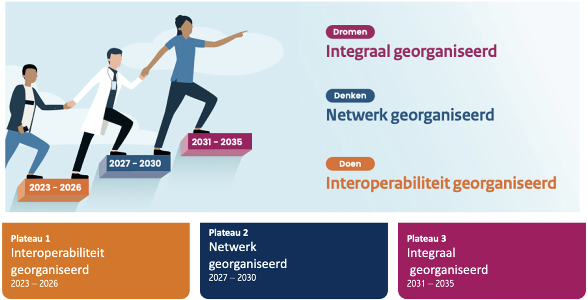
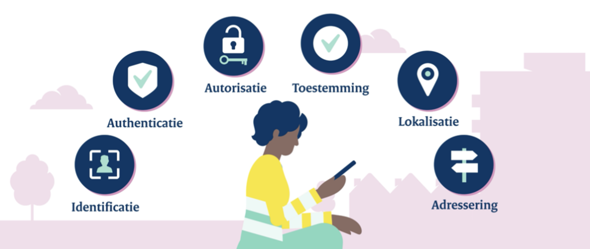
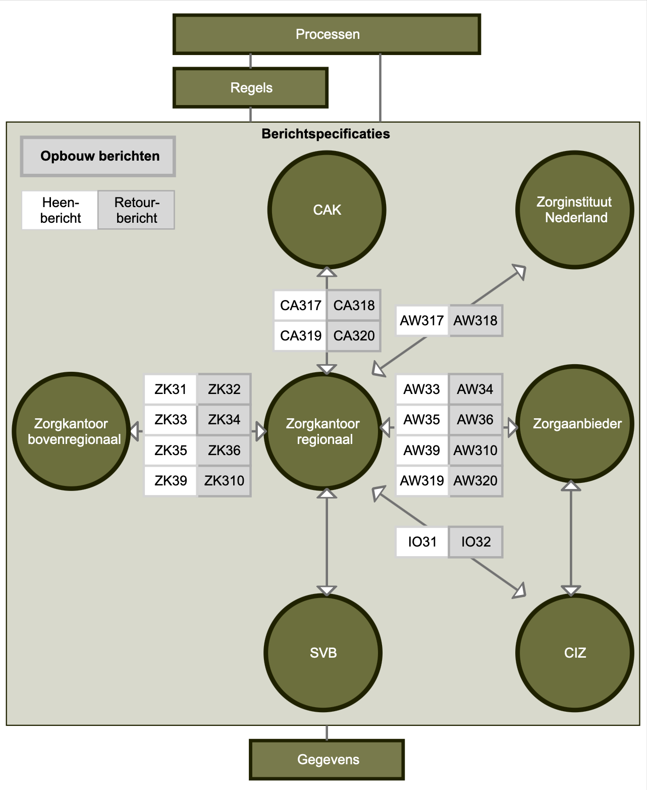
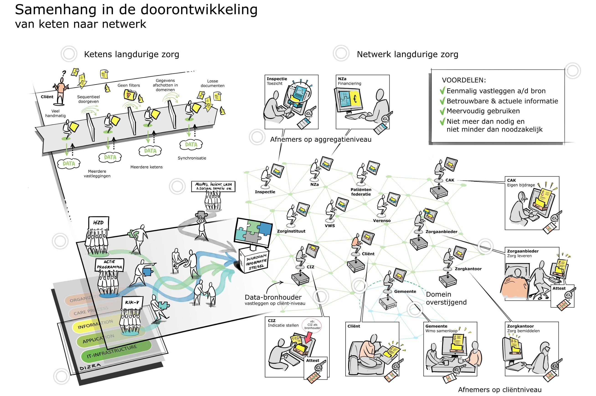

## 1. Aanleiding

Zorginstituut Nederland is in 2017 gestart met een nieuw ontwerp voor de gegevensuitwisseling binnen de Wet langdurige zorg (Wlz) op verzoek van het ministerie van VWS. Dit nieuwe ontwerp is bedoeld om de administratieve lasten voor alle partijen in de zorg te verminderen, de kwaliteit van de zorg te verbeteren en de financiële houdbaarheid van het stelsel te versterken. Dit wordt gedaan door de regie op de gegevens zoveel mogelijk bij de cliënt te leggen. Deze voornemens zijn door het Informatieberaad Zorg uitgedrukt in de [outcomedoelen](https://www.informatieberaadzorg.nl/over-het-informatieberaad/outcomedoelen-en-targets) ‘patiënt centraal’, ‘gestandaardiseerde gegevensuitwisseling' en ‘eenmalig vastleggen en hergebruik gegevens’.

Om dit te bewerkstelligen is het Actieprogramma iWlz opgericht. Het doel van het Actieprogramma iWlz is om de informatiepositie van de cliënt over zijn zorg te versterken, met minimale administratieve lasten en tijdige, volledige en betrouwbare informatie over Wlz-zorg voor professionals in de zorg en voor de cliënt.

In 2017 werd samen met veel ketenpartners een simulatieomgeving gebouwd. Vervolgens kwam het Actieprogramma iWlz tot de conclusie dat een netwerkmodel het best aansluit bij de outcomedoelen die door het Informatieberaad Zorg zijn geformuleerd. Deze conclusie is bevestigd door het Architectuurboard van het Informatieberaad Zorg wat positief heeft [geadviseerd](https://www.informatieberaadzorg.nl/publicaties/vergaderstukken/2021/04/19/oplegnotitie-bestuurlijke-samenvatting-doelarchitectuur) om dit netwerkperspectief als leidend paradigma over te nemen. En sluit hiermee aan op de actuele zorgbrede afspraken over infrastructuur en interoperabiliteit.

In de jaren daarna heeft VWS de Nationale Visie en Strategie (NVS) uitgewerkt. Het Actieprogramma iWlz sluit daar bij aan, door zich onder andere te conformeren aan de [generieke functies](./achtergrond_toelichting#32-generieke-functies), zodra die gereed zijn voor gebruik in het kader van plateau 2 van deze visie. Ook sluit het programma aan bij de ontwikkelingen van het landelijk vertrouwensstelsel (Twiin-LVS) zoals hieronder verder toegelicht.

Zorginstituut Nederland voert het Actieprogramma iWlz uit vanuit haar wettelijke taak en wordt hierbij gefaciliteerd door het ministerie van VWS. Zorginstituut Nederland is opdrachtgever.

## 2. Outcomedoelen Informatieberaad Zorg

De outcomedoelen van het Informatieberaad Zorg zijn vooral geïnspireerd op het voornemen van de overheid om de cliënt centraal te stellen en de administratieve lasten voor alle partijen te verminderen. Het netwerkmodel levert op 3 punten een belangrijke bijdrage aan deze doelen:

> ✅
> 1. **Patiënt centraal**
>
> Het netwerkmodel geeft cliënten een sterkere informatiepositie, waardoor zij geïnformeerde keuzes kunnen maken over hun zorgproces. Cliënten krijgen bijvoorbeeld via hun persoonlijke gezondheidsomgeving inzicht in de status van hun zorgproces, de geleverde zorg en hun eigen bijdrage. Bovendien is de cliënt in dit model, samen met zijn netwerk, eigenaar van zijn eigen gegevens en houdt hij/zij daarop zelf de regie.

> ✅
> 2. **Gestandaardiseerde gegevensuitwisseling**
>
> Bij de zorg voor een cliënt zijn vaak meerdere zorgverleners of zelfs verschillende zorgdomeinen betrokken. Om ervoor te zorgen dat gegevens soepel tussen deze partijen kunnen worden uitgewisseld, is het belangrijk dat de gebruikte standaarden goed op elkaar aansluiten.
>
> Zodra duidelijk is welke informatie nodig is voor goede zorg en behandeling, kan deze via het netwerkmodel digitaal, gestandaardiseerd en veilig worden gedeeld. Als het nodig is, gebeurt dit met toestemming van de cliënt. De gegevens hoeven dan niet telkens opnieuw te worden aangeleverd en zijn altijd actueel beschikbaar. Dit verkleint de kans op fouten en dubbele registraties.

> ✅
> 3. **Eenmalig vastleggen en hergebruik gegevens**
>
> In het netwerkmodel zijn gegevens over indicaties, bemiddelde zorg en geleverde zorg beschikbaar bij de bron waar ze zijn geregistreerd (bronhouder). Alle partijen kunnen de bron raadplegen op het moment dat de gegevens nodig zijn. Zij kunnen dan de meest actuele gegevens raadplegen. Deze gegevens hoeven de ketenpartijen niet meer zelf op te slaan.

## 3. Samenhang met relevante ontwikkelingen

### 3.1 Nationale Visie en Strategie (NVS)

De overgang naar een netwerkmodel, maakt onderdeel uit van een veel grotere beweging. Vanuit VWS is al jaren geleden de overgang naar een duurzaam informatiestelsel in de zorg ingezet. Daarvoor is de Nationale Visie en Strategie op het gezondheidsinformatiestelsel gepubliceerd. Daarin worden drie plateau’s onderkend.

Plateau 1 richt zich op interoperabiliteit. In plateau 2 wordt er gesproken over het organiseren van netwerken. Initiatieven die bijdragen aan plateau 2 krijgen vanaf 2027 prioriteit van VWS. Het Actieprogramma iWlz valt ook onder de initiatieven die bijdragen aan plateau 2.

figuur 1. NVS plateauplanning

De NVS spreekt over grote veranderingen die nodig zijn, om de uitdagingen in de zorg aan te kunnen. De inzet op preventie is daar een voorbeeld van. De focus verschuift van zorg bieden naar gezond blijven; het voorkomen van het belasten van de zorg door het bieden van preventie en de focus op gezond blijven. Dit noemen we de beweging van zorg naar gezondheid om te voorkomen dat er een zorgvraag ontstaat (blz. 9, NVS).

De NVS strekt zich daarom uit over het domein van gezondheid en zorg, het sociaal domein, curatieve en langdurige zorg. De domeinen hebben eigen kenmerken en ook verschillende eisen en randvoorwaarden per domein. Daarmee moet in de strategie rekening worden gehouden. Juist vanwege de beweging van zorg naar preventie en gezondheid is het van belang met een breed perspectief naar het gezondheidsinformatiestelsel te kijken (blz. 11, NVS).

De spelers – de zorgverlener, de leveranciers – en de wijze waarop digitalisering is aangepakt, verschillen per domein. Bij de realisatie van de strategie moet hier aandacht voor zijn (blz. 33, NVS).

In het Actieprogramma iWlz is het belangrijk om de scope en focus te behouden. Tegelijk moet de realisatie van het netwerkmodel worden gezien in samenhang met de bredere transformatie van het gezondheidsinformatiestelsel. Dit vraagt om goede afstemming met andere programma’s en projecten die werken aan de overgang van zorg naar gezondheid. Het is daarbij nadrukkelijk niet de bedoeling om deze bredere ontwikkelingen binnen de scope van het netwerkmodel te brengen.

### 3.2 Generieke functies

Hierboven noemden we al de Nationale Visie en Strategie (NVS). Binnen de NVS wordt gewerkt aan een landelijk dekkend netwerk (LDN), een landelijk vertrouwensstelsel (LVS) en de implementatie generieke functies (IGF).

Deze drie ontwikkelingen samen moeten ervoor zorgen dat partijen op basis van dezelfde generieke functies en standaarden met elkaar kunnen communiceren. De ontwikkelingen bevinden zich nu nog in plateau 1 van de NVS. Waarbij er focus ligt op een aantal uitwisselingen die relevant zijn voor de invulling van de Wet Gegevensuitwisseling in de zorg (Wegiz). Vanaf Plateau 2 wordt ook op andere uitwisselingen en bijvoorbeeld het sociaal domein de focus gelegd.

Om de juiste (gezondheids)gegevens op het juiste moment op de juiste plek te krijgen, zijn afspraken, standaarden en voorzieningen nodig: de generieke functies. Om gegevens opvraagbaar en uitwisselbaar te maken, moet bijvoorbeeld duidelijk zijn: wie logt er in? Wie mag de gegevens inzien? En is de patiënt/cliënt ermee akkoord dat de gegevens worden ingezien of gedeeld?

Het programma Implementatie generieke functies van VWS werkt daarom samen met het zorg- en ICT-veld aan zes generieke functies. Dat zijn sets van afspraken, standaarden en voorzieningen om vast te stellen:

figuur 2. Generieke functies

| **Item** | **Generieke functie** |
| :--- | :--- |
| Wie logt er in? | identificatie |
| Ben je wie je zeg dat je bent? | authenticatie |
| Is de patiënt akkoord met het delen van medische gegevens? | toestemming |
| Welke gegevens mag jij inzien? | autorisatie |
| Waar staan de gezochte gegevens? | lokalisatie |
| Wat is het digitale adres waar de gegevens staan en waar ze heen moeten? | adressering |

Voor een overgang naar het netwerkmodel zijn de generieke functies cruciaal. Om die reden werken we nauw samen met het Ministerie van VWS om aan te sluiten op de generieke functies. De generieke functies worden in fases ontwikkeld. De huidige versie van de generieke functies richt zich nog op plateau 1 van de NVS. In Plateau 2 worden de functies ook geschikt gemaakt voor uitwisselingen die bij dat plateau horen. Dat geldt dus ook voor de uitwisselingen in het kader van het Actieprogramma Wlz.

### 3.3 Twiin LVS-afsprakenstelsel

VWS werkt samen met het zorgveld aan een landelijk vertrouwensstelsel (LVS). Zo wordt er toegewerkt naar landelijk geharmoniseerde en geüniformeerde vertrouwensafspraken. Deze afspraken gaan over het kunnen vertrouwen van infrastructuur, generieke functies (eenheid van techniek) en kwaliteit van data (eenheid van taal). Om gegevensuitwisseling en databeschikbaarheid mogelijk te maken, is het namelijk nodig om de verschillende afspraken over deze generieke onderwerpen met elkaar in lijn te brengen. Het centraal vastleggen van vertrouwensafspraken ontlast het zorgveld en gaat versnippering van deze afspraken tegen. Burgers, zorgaanbieders en leveranciers hebben hierdoor duidelijkheid en zekerheid over de voorwaarden waaronder gegevensuitwisseling en databeschikbaarheid (infrastructuuronafhankelijk) plaats kan vinden. Het Twiin Afsprakenstelsel is door VWS aangewezen als centrale plek voor het vastleggen van de landelijke vertrouwensafspraken.

**Relevantie voor netwerkmodel**
We sluiten aan bij de gesprekken die nu worden gevoerd over de totstandkoming van een landelijk afsprakenstelsel. Het afsprakenstelsel iWlz-netwerkmodel conformeert zich aan het Twiin- afsprakenstelsel. In overeenstemming met VWS (Directie Informatiebeleid / DICIO) en betrokken partijen kan afgeweken worden op specifieke onderwerpen.

### 3.4 KIK-V

Parallel aan het Actieprogramma iWlz werkt het Zorginstituut aan het programma KIK-V. In het programma KIK-V werken ketenpartijen in de verpleeghuiszorg samen. Het doel van het programma is het stroomlijnen van de uitwisseling van verantwoordingsgegevens tussen informatie vragende partijen en zorgaanbieders rond de kwaliteit van de verpleeghuiszorg en de bedrijfsvoering. Door gegevens van zorgaanbieders die geregistreerd worden efficiënter te ontsluiten en te (her)gebruiken leidt dit tot minder administratieve lasten en betere informatie.

**Relevantie voor netwerkmodel**
Veel partijen werken met zowel KIK-V als met het netwerkmodel dat nu binnen de Wlz wordt ontwikkeld. Daarom is goede afstemming met het programma KIK-V belangrijk. Dit geldt vooral voor de generieke functies, maar ook voor de informatiestandaarden en de afspraken daarover. Op termijn worden de NVS Generieke functies leidend voor de hele zorgsector. Vanuit het iWlz-Actieprogramma nemen wij deel aan verschillende overleggen om dit samen verder uit te werken.

### 3.5 CumuluZ Zorgdata

Cumuluz Zorgdata is een stichting die zich inzet voor het verbeteren van de zorg door het creëren van een veilige en betrouwbare omgeving voor het delen en hergebruiken van zorgdata. Met een focus op privacy en security faciliteert Cumuluz samenwerking tussen verschillende partijen in de zorg, zoals ziekenhuizen en onderzoeksinstituten, om data uit diverse bronnen te ontsluiten. Het doel is om innovatie, onderzoek, gepersonaliseerde zorg en kosteneffectiviteit te bevorderen, mede door een open source benadering van tools en platformen voor data-uitwisseling.

**Relevantie voor netwerkmodel**
Mogelijk wordt CumuluZ door VWS aangewezen als implementatieprogramma voor diverse uitwisselingen. Vanuit het Actieprogramma iWlz voeren we het gesprek met CumuluZ over hoe we kunnen aanhaken bij de beweging die zij maken en waar we elkaar kunnen versterken. Het is niet de bedoeling dat de overgang naar een netwerkmodel onder de governance van CumuluZ gaat vallen. Maar het lijkt zeker mogelijk dat de trajecten elkaar versterken. Een eerste oriënterend gesprek daarover heeft al plaatsgevonden.

### 3.6 Zorg-AB/LRZA

Het Zorg-AB staat voor het ZorgAdresboek en het LRZA voor het Landelijk Register Zorgaanbieders. Het LRZA bevat informatie over zorgaanbieders. Het betreft een voorziening die door CIBG wordt beheerd. Zorgaanbieders zijn verplicht hun gegevens aan te leveren aan het LRZA. Omdat deze gegevens niet gedetailleerd genoeg zijn, bevat het LRZA ook het adres van het adresboek waarin de zorgaanbieder detailgegevens publiceert om adressering in een digitaal netwerk mogelijk te maken. Het Zorg-AB is zo’n adresboek. Vanuit VWS wordt het Zorg-AB gepositioneerd als potentiële gedeelde voorziening voor de adressering. VZVZ beheert de voorziening Zorg-AB.

**Relevantie voor netwerkmodel**
De Generieke functie _Adressering_ moet eerst worden vastgesteld door VWS. VZVZ heeft aangegeven het Zorg-AB in te richten volgens deze Generieke functie. Er is nog geen datum bekend voor de vaststelling; tot die tijd maken wij gebruik van het tijdelijke adresboek in GitHub.

Wij hebben bij VWS benadrukt dat het Zorg-AB beschikbaar moet zijn op het moment dat het Leveringsregister wordt geïmplementeerd.

### 3.7 Mitz

Mitz is een online toestemmingsvoorziening. Een voorziening die burgers in staat stelt regie te voeren op hun toestemmingskeuzes. In Mitz leggen burgers toestemmingskeuzes vast voor zorgaanbieders. Met een toestemming kunnen zorgaanbieders het medisch dossier van de burger beschikbaar stellen aan andere zorgaanbieders van die burger.

**Relevantie voor netwerkmodel**
Vanuit de uitrol van het netwerkmodel stellen we voor om conform de besluitvorming van VWS, Mitz ook te gebruiken in het geval er toestemming nodig is voor een uitwisseling.

### 3.8 MedMij

MedMij is een stichting die regels opstelt voor het veilig uitwisselen van medische gegevens. Met een Persoonlijke gezondheidsomgeving (PGO) kunnen burgers toegang krijgen tot gegevens van zorgverleners en zelf gegevens met hen delen op een veilige manier.

**Relevantie voor netwerkmodel**
In 2021 heeft het Actieprogramma iWlz al een Proof of Concept gedaan om het Indicatieregister aan te sluiten op een PGO. Daarmee is aangetoond dat beide stelsels op elkaar kunnen worden aangesloten. Het blijft het opportuun om PGO’s aan te gaan sluiten, juist om op die manier ook de burger een betere informatiepositie te geven.

### 3.9 Zibs

Zorginformatiebouwstenen (zibs) worden gebruikt om inhoudelijke c.q. functionele – niet technische – afspraken vast te leggen voor het standaardiseren van de informatie die wordt gebruikt in het zorgproces. De focus ligt op klinisch relevante concepten die in verschillende zorgsituaties (use cases) en daardoor verschillende informatiestandaarden herbruikbaar zijn. Denk bijvoorbeeld aan NAW-gegevens, medicatie of bloeddruk.

**Relevantie voor netwerkmodel**
De zibs zijn relevant voor de  overgang naar een netwerkmodel omdat ze informatie bevatten die relevant zijn voor de processen die we ondersteunen met het netwerkmodel. Door de zibs beschikbaar te maken voor die processen wordt aan zowel de leverende kant, als de ontvangende kant administratieve last verminderd omdat nu veel van deze gegevens nog handmatig in bijv. portalen of formulieren moeten worden aangeleverd. Door ze direct beschikbaar te maken, kan deze administratieve last verminderd worden.

### 3.10 Nuts

Nuts ontwikkelt en beheert een nutsvoorziening die het delen van zorg-gerelateerde informatie over het Internet mogelijk maakt op een vertrouwelijke, veilige en toegankelijke manier. Met als doel om digitale samenwerking in de gehele zorg te faciliteren - en zo de zorg te verbeteren.

Nuts is georganiseerd in een community en een stichting. Nuts wordt ondersteund en gedreven door een veelzijdige groep vooruitstrevende mensen en organisaties die samen, in het algemeen belang, een positieve impact willen maken op het (digitale) zorglandschap.

**Relevantie voor netwerkmodel**
Vooral partijen in de VVT sector maken gebruik van Nuts. In het kader van hergebruik is het daarom belangrijk dat er interoperabiliteit ontstaat tussen het netwerkmodel en Nuts. Hiervoor is een groeipad ontwikkeld wat in de komende jaren wordt uitgevoerd. Op deze manier kunnen partijen in beide netwerken met elkaar communiceren. Vanuit de overgang naar het netwerkmodel nemen we deel aan werkgroepbijeenkomsten van de Nuts community om zo samen op te trekken naar het programma inrichting generieke functies. Diverse gebruikte standaarden die nu binnen Nuts en het netwerkmodel worden gebruikt, zijn nog niet geadopteerd door het programma inrichting generieke functies. Dat is vanuit interoperabiliteit wel noodzakelijk.

### 3.11 Brede overgang

Vanuit het iWlz-netwerkmodel wordt ook gewerkt aan een brede overgang naar een netwerkmodel voor de uitwisseling van informatie binnen de langdurige zorg (Wlz), de Wet maatschappelijke ondersteuning (Wmo) en de Jeugdwet (Jw). Vooralsnog beperkt het Actieprogramma zich nog tot het iWlz domein, maar in het kader van de verbreding is het goed om ook stil te staan bij andere relevante ontwikkelingen. Het doel is om de (informatie)positie van de cliënt te verbeteren door betere afstemming van zorg, minder administratieve lasten en meer inzicht in het eigen zorgproces. En in het kader van de verbrediging om domeinoverstijgende processen te stroomlijnen, zodat de administratieve lasten voor zowel zorgverleners, zorgkantoren, gemeenten en andere betrokken partijen verminderen. Deze verbreding bouwt voort op eerdere initiatieven zoals het Actieprogramma iWlz en het programma Vernieuwing informatievoorziening Sociaal Domein (ViSD), die beiden al de noodzaak van een netwerkmodel benadrukken, maar tot nu toe beperkt van scope bleken.

Hieronder zijn de relevante ontwikkelingen benoemd die te maken hebben met deze brede overgang.

### 3.12 Federatief Datastelsel (FDS)

Het Federatief Datasetstelsel (FDS) is een initiatief binnen de Nederlandse overheid dat tot doel heeft om gegevensuitwisseling tussen organisaties op een veilige, betrouwbare en uniforme manier te organiseren. Binnen het FDS wordt gewerkt aan overheidsbrede standaarden en afspraken voor het federatief ontsluiten, beheren en hergebruiken van data. Deze afspraken hebben betrekking op onder meer gegevensbeschrijving, interoperabiliteit, en toegangsverlening (meer informatie zie: [https://realisatieibds.nl/groups/view/0056c9ef-5c2e-44f9-a998-e735f1e9ccaa/federatief-datastelsel/wiki/view/89eea995-7c1c-412e-93c1-0319d9ee5baa/afsprakenstelsel-fds](https://realisatieibds.nl/groups/view/0056c9ef-5c2e-44f9-a998-e735f1e9ccaa/federatief-datastelsel/wiki/view/89eea995-7c1c-412e-93c1-0319d9ee5baa/afsprakenstelsel-fds)).

Het uitgangspunt van het FDS is dat gegevens blijven waar ze horen - bij de bron - maar via gestandaardiseerde afspraken en technieken beschikbaar kunnen worden gesteld voor verantwoord hergebruik. Daarmee sluit het FDS aan bij de bredere beweging naar federatieve samenwerking binnen de overheid, zoals ook uitgewerkt in de Nederlandse Digitaliseringsstrategie (NDS).

**Relevantie voor netwerkmodel**

Vanuit het iWlz-netwerkmodel volgen wij de ontwikkelingen rond het Federatief Datasetstelsel actief en onderhouden wij hierover contact met de verantwoordelijke programma’s binnen de overheid. Het iWlz-netwerkmodel legt een brug tussen het publieke domein van de overheid en het private zorgdomein, waarin veel gegevensuitwisseling plaatsvindt tussen zorgaanbieders en andere zorgpartijen.

Omdat het zorgdomein deels privaat georganiseerd is, vraagt aansluiting op overheidsbrede federatieve standaarden om afstemming en harmonisatie. Wij brengen daarom de ervaringen uit het zorgdomein - onder meer vanuit Twiin als LVS - in bij de ontwikkeling van het Federatief Datasetstelsel en visa versa. Zo werken we toe naar een samenhangend geheel waarin publieke en private datanetwerken op een uniforme manier kunnen samenwerken.

**Samenhang met Federatieve Toegangsverlening (FTV)**

Federatieve Toegangsverlening (FTV) biedt een toekomstbestendige aanpak. Toegangsregels staan niet meer in applicaties, maar worden op een centrale plek vastgelegd en beheerd. Zo zijn techniek en beleid gescheiden en kunnen organisaties toegang regelen los van systemen of leveranciers. Zo ontstaat er grip op toegang, ook in complexe samenwerkingen. Het Actieprogramma maakt gebruik van dezelfde standaarden als bij FTV worden voorgesteld. En het Actieprogramma brengt deze standaarden in bij de ontwikkeling van de generieke voorzieningen van VWS.

### 3.13 Gemeentelijk gegevensmodel (GGM)

Het GGM is een informatiemodel waarin de gegevens en definities van alle taakvelden van Nederlandse gemeenten zijn opgenomen. Het model vormt de generieke gegevensarchitectuur voor gemeenten: zij voeren immers grotendeels dezelfde taken uit en gebruiken daarvoor dezelfde onderliggende gegevens.

Het GGM is als open source gepubliceerd via GitHub, waar verbeteringen en uitbreidingen aan het model publiek beschikbaar worden gemaakt. Daarnaast zijn verschillende samenwerkingsinitiatieven met gemeenten opgezet om het proces van informatiegestuurd werken (IGW) te versnellen.

**Relevantie voor netwerkmodel**

Omdat in het GGM ook de iStandaarden iWmo en iJw zijn opgenomen, is een goede afstemming tussen het GGM en het iWlz-netwerkmodel essentieel. Er wordt momenteel gewerkt aan een overkoepelend informatiemodel dat deze domeinen verbindt. Dit nieuwe model wordt onderdeel van het GGM en vervangt het huidige model dat nu binnen het GGM wordt gebruikt voor de Wmo en Jeugd.

In het kader van de domeinonafhankelijke inrichting van registers bij een brede overgang naar het netwerkmodel is GGM al bereid gevonden om actief mee te denken en mee te werken aan deze ontwikkeling.

### 3.14 Jeugd, zorg en veiligheid – CORV2.0

Binnen het Ministerie van Justitie en Veiligheid wordt gewerkt aan een vervanging van de huidige Collectieve Opdracht Routeer Voorziening (CORV) ook wel CORV 2.0 genoemd. Met de huidige voorziening is berichtenverkeer mogelijk tussen het gemeentelijk en justitiedomein. De beoogde transitie gaat juist uit van vastlegging in bronregisters in een netwerk. De gekozen architectuur sluit conceptueel aan bij die van het netwerkmodel, gebaseerd op notificaties en raadplegingen.

**Relevantie voor netwerkmodel**

De realisatie van CORV 2.0 valt niet onder de governance van de brede overgang. Wel mag verwacht worden dat er nauwe afstemming plaatsvindt over te maken (technische) keuzes, omdat ook gemeenten met deze keten te maken hebben. Die afstemming vindt nu ook al zeer regelmatig plaats tussen het Zorginstituut, het ketenbureau en het ministerie van J en V.

### 3.15 Dienst Justitiële Inrichtingen

Dienst Justitiële Inrichtingen (DJI) is onderdeel van het Ministerie van Justitie en Veiligheid. Ze is belast met o.a. gevangeniswezen en vreemdelingenbewaring, vervoer en forensische zorg. De forensische zorg wordt geleverd door circa 150 gecontracteerde zorgaanbieders en 6 rijksklinieken van de dienst zelf. Wat betreft de gecontracteerde zorgaanbieders zit er een erg groot overlap tussen DJI-zorgaanbieders en Wlz/Wmo-zorgaanbieders. DJI is beheerder van de standaarden die gebruikt worden in de informatie-uitwisseling in de justitiële keten

**Relevantie voor netwerkmodel**

Zorgaanbieders en softwareleveranciers vragen in de ontwikkeling van domeinonafhankelijke registers aandacht voor de uitwisseling van de gegevens zoals DJI ze voorschrijft in haar standaarden. Door DJI ook mee te nemen, wordt uniformiteit bevorderd en gaan administratieve lasten omlaag. DJI kijkt om zich heen rond hergebruik van standaarden. Zo zijn de iWlz-berichten gebruikt als basis voor de DJI-standaarden en gebruikt DJI de declaratiestandandaarden AW319 en GDS801 van de Wlz/Zvw 1 op 1. Ook het netwerkmodel trekt aandacht en DJI onderzoekt mogelijkheden om aan te sluiten.

## 4. Samenhang met andere domeinen

Zoals hierboven aangegeven, wordt niet alleen binnen het domein van de langdurige zorg gewerkt aan een netwerkmodel. Ook buiten de Wlz ontstaan vergelijkbare ontwikkelingen. Zo kunnen partijen als MedMij en eOverdracht aansluiten op het netwerk. Binnen het i-Sociaal Domein leeft de _Common Ground_-gedachte, waarbij wordt onderzocht in hoeverre beide netwerkconcepten – dat van de Wlz en dat van het sociaal domein – met elkaar kunnen worden verbonden.
Een mogelijke toepassing hiervan is dat gemeenten beter inzicht krijgen in de samenloop tussen de Wmo en de Wlz. Door middel van een zogenoemd _Wlz-signaal_ kan samenloop vroegtijdig worden herkend, waardoor tijdiger kan worden afgestemd over passende ondersteuning.

Een belangrijk initiatief binnen dit kader is het programma Data Value. Dit programma heeft als doel gemeenten en zorgaanbieders te ondersteunen bij het gebruik van data uit het berichtenverkeer van de Wmo en Jeugdwet, zodat zij hun uitvoeringspraktijk kunnen verbeteren en beter kunnen sturen op resultaten.

## 5. iWLZ - de iStandaard om cliënten in alle fasen van de Wlz-keten te volgen

iWlz is een standaard die te maken heeft met het volgen van cliënten die vallen onder de Wet langdurige zorg (Wlz). iWlz kan iemand in alle fasen van de Wlz-keten volgen: van de indicatie via zorgtoewijzing en -levering tot de vaststelling van de eigen bijdrage en declaratie.

De Wlz-ketenpartijen wisselen alle informatie in gestandaardiseerde vorm uit. Elke partij heeft een eigen taak in het proces: het Centrum indicatiestelling zorg (CIZ) indiceert, het zorgkantoor bemiddelt naar passende zorg, de zorgaanbieder levert vervolgens die zorg en het Centraal Administratie Kantoor (CAK) stelt tot slot de eigen bijdrage vast.

## 6. Estafettemodel

De uitwisseling in de iWlz vindt al jaren plaats via berichten die conform een vast protocol volgtijdelijk worden uitgewisseld. De partijen geven via deze berichten de informatie door die zij zelf hebben ontvangen van andere partijen eerder in het proces en vullen dit aan met de informatie die zij zelf op grond van hun rol in het proces hebben toegevoegd.

In het estafettemodel worden de processen van indiceren, bemiddelen, zorg leveren en regelen van de eigen bijdrage binnen het domein van de langdurige zorg ondersteund. Elke partij in de keten houdt een registratie bij in een eigen systeem. Uitwisseling tussen ketenpartijen, zoals zorgkantoren en zorgaanbieders, gaat via berichten in een vaste volgorde omdat het een ketenproces is. Iedere ketenpartij kan gegevens ontvangen, aanvullen, opslaan en doorsturen.

Uitwisselen van berichten is gebaseerd op de iStandaarden voor de gegevens en de manier van verzenden en ontvangen.

figuur 3. Schematische weergave berichtenverkeer iWlz volgens de iStandaarden
N.B. De berichten AW319 en AW320 zijn niet in scope van het iWlz-netwerkmodel.

## 7. Van estafette- naar netwerkmodel

Om invulling te kunnen geven aan de outcomedoelen van het Informatieberaad Zorg is ervoor gekozen om de informatievoorziening in het kader van de Wet langdurige zorg door te ontwikkelen van een estafettemodel naar een netwerkmodel.

In het netwerkmodel worden de processen van indiceren, bemiddelen, zorg leveren en regelen van de eigen bijdrage binnen het domein van de langdurige zorg ondersteund. Elke deelnemer aan het netwerk houdt een registratie bij in een eigen register. Uitwisseling van gegevens tussen de deelnemers in het netwerk gaat, anders dan in het estafettemodel, door middel van inzage in elkaars registers op basis van toegekende rechten. Deelnemers kunnen op deze manier de voor hen relevante gegevens raadplegen. Een voorbeeld van een register is het indicatieregister waarin het CIZ indicaties registreert. Een zorgkantoor dat de geïndiceerde zorg wil gaan toewijzen, kan de indicatiegegevens uit het indicatieregister raadplegen op basis van toegekende rechten.

Op deze manier wordt gegevensuitwisseling tussen partijen efficiënter en krijgt de cliënt meer mogelijkheden gegevens in te zien en te delen. In [dit filmpje](https://www.istandaarden.nl/algemeen/video-hoe-werkt-het-netwerkmodel) en in onderstaande figuur wordt dit gevisualiseerd. Een voice-over bij de figuur is [hier](https://infoizo.nl/netwerkperspectief) beschikbaar.

figuur 4. Samenhang in de doorontwikkeling van estafettemodel naar netwerkmodel

> ℹ️
> **Samenwerkende partners**
>
> In het Actieprogramma iWlz zijn de volgende partijen verenigd:
>
> - ActiZ
> - CAK
> - CIZ
> - De Nederlandse ggz
> - NZa
> - Valente
> - VGN
> - Zorginstituut Nederland
> - Zorgkantoren
> - Zorgthuisnl
> - Zorgverzekeraars Nederland
>
> OIZ en VECOZO maken formeel geen deel uit van het Actieprogramma iWlz. OIZ is betrokken vanuit haar rol als belangenbehartiger van leveranciers van ICT-oplossingen voor de zorg en levert vanuit die positie expertise en input bij de ontwikkeling en doorontwikkeling van het iWlz-netwerkmodel.
> Daarnaast vervult VECOZO een aantal voor het iWlz-netwerkmodel essentiële rollen. VECOZO is onder meer verantwoordelijk voor voorzieningen op het gebied van vertrouwen, vindbaarheid, het beheer van het netwerk en treedt op als dienstverlener voor individuele deelnemers aan het netwerk.

