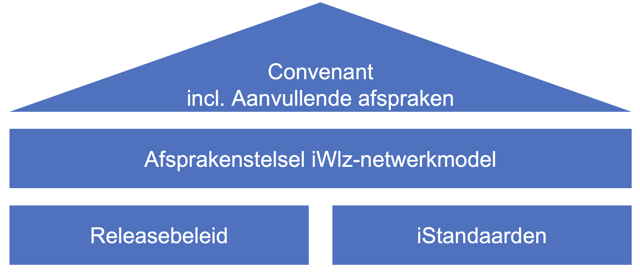
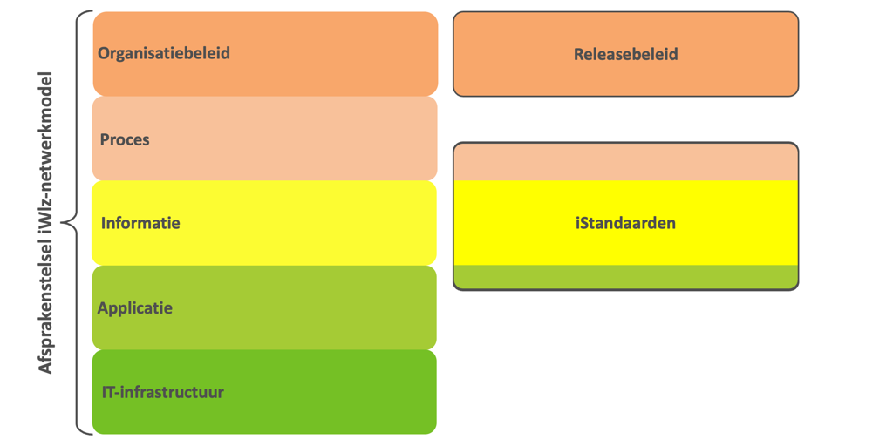

## 1. Governance en convenant

Zorginstituut Nederland heeft de taak om het beheer en de verdere ontwikkeling van de iStandaarden te verzorgen, waaronder het informatiemodel en het releasebeleid van iWlz. Met de invoering van het iWlz-netwerkmodel is hier het beheer van afsprakenstelsel iWlz-netwerkmodel aan toegevoegd.

Om de samenwerking tussen de ketenpartners te garanderen en de governance van de daarvoor benodigde afspraken te regelen, is het [Convenant samenwerking ketenpartijen iWlz](https://www.istandaarden.nl/algemeen/governance) opgesteld. Via aanvullende afspraken op het convenant wordt de governance van het onderhavige Afsprakenstelsel iWlz-netwerkmodel geborgd.

De [Aanvullende Afspraken](https://www.istandaarden.nl/algemeen/governance) geven gedetailleerd aan welke wijzigingen van toepassing zijn op het convenant door de invoering van het iWlz-netwerkmodel.

!!! warning 
    De nieuwe Aanvullende afspraken zijn nog in het proces van publicatie. Zodra deze officieel beschikbaar zijn, wordt hier een link toegevoegd.

Zorginstituut Nederland beheert het _Afsprakenstelsel iWlz-netwerkmodel_. Dit afsprakenstelsel beschrijft de afspraken, architectuur en technische specificaties die nodig zijn om het iWlz-netwerkmodel te implementeren en beheren. Het is aanvullend op andere publicaties die het zorginstituut verzorgt over informatieuitwiseling in het kader van de Wlz, zoals het _Releasebeleid_ en _iStandaarden_.

De governance van de publicaties Afsprakenstelsel iWlz-netwerkmodel, Releasebeleid en iStandaarden is beschreven en geborgd in het Convenant (inclusief aanvullende afspraken). Dit is weergegeven in de onderstaande figuur.

  
figuur 1. Relatie tussen Convenant, Afsprakenstelsel, Releasebeleid en iStandaarden

Het Afsprakenstelsel iWlz-netwerkmodel is opgebouwd aan de hand van het vijf-lagen model van Nictiz. In het onderstaande figuur is weergegeven hoe het Releasebeleid en de iStandaarden zich tot deze lagen verhouden.

figuur 2: Relatie vijf-lagen model Afsprakenstelsel, Releasebeleid en iStandaarden

## 2. Samenhang afsprakenstelsel en Twiin als LVS

Het Ministerie van Volksgezondheid, Welzijn en Sport (VWS) heeft het [Twiin Afsprakenstelsel](https://www.twiin.nl/afsprakenstelsel/landelijk-vertrouwensstelsel) gekozen als centrale plek voor de vastlegging van geharmoniseerde en gestandaardiseerde vertrouwensafspraken in de zorg.

In het Twiin als LVS afsprakenstelsel worden de technische, organisatorische en juridische afspraken vastgelegd die nodig zijn voor een betrouwbare gegevensuitwisseling en databeschikbaarheid in de zorg.

Het afsprakenstelsel bevat geharmoniseerde afspraken die door alle zorgaanbieders en leveranciers kunnen worden toegepast. Andere afsprakenstelsels kunnen naar het Twiin Afsprakenstelsel verwijzen, zonder de inhoud zelf te hoeven beheren of onderhouden.

Twiin is generiek van aard en vormt een overkoepelend raamwerk dat voortdurend in ontwikkeling is. Wij werken samen met Twiin aan de harmonisatie van verschillende afsprakenstelsels. Waar mogelijk verwijzen we in dit afsprakenstelsel naar de generieke afspraken binnen Twiin als LVS. Waar nodig lichten we aanvullend toe hoe deze afspraken specifiek toegepast worden in het kader van het iWlz-netwerkmodel.

---
