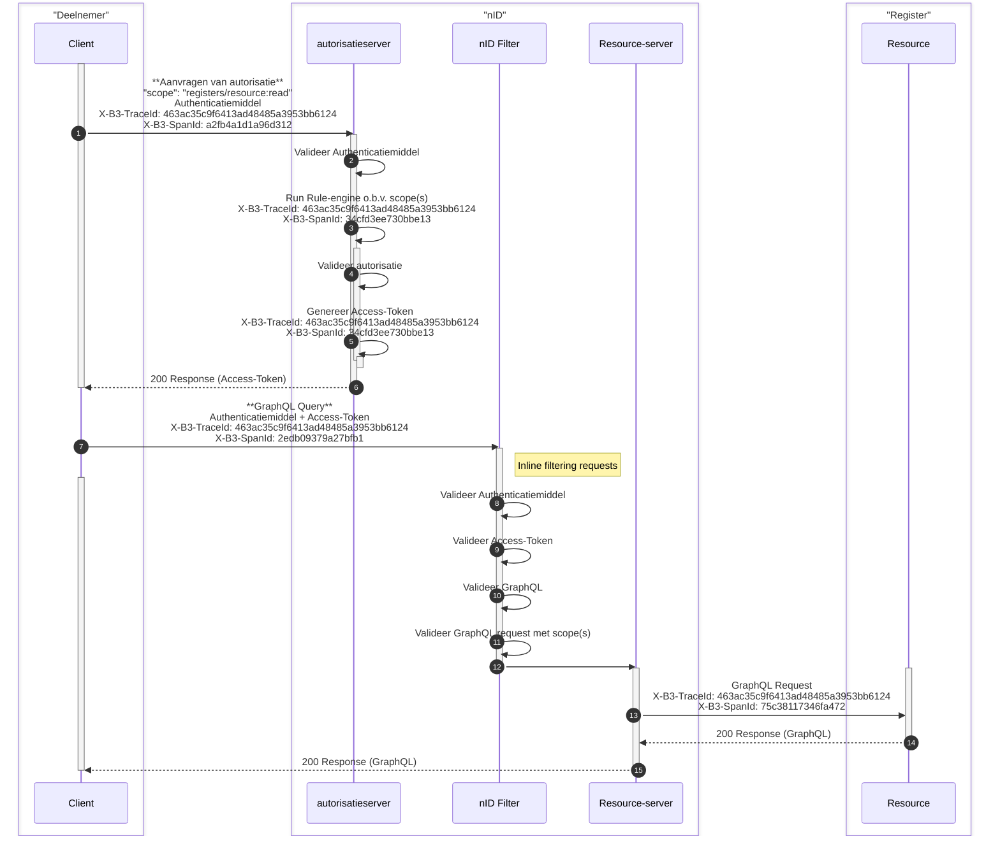

# Logging

!!! info "Versie: *17-12-2025* | Status: *Definitief*"

## 1. Inleiding

Binnen het iWlz-netwerkmodel is gestandaardiseerde tracelogging verplicht. Het doel hiervan is om transacties en gebeurtenissen in de keten end-to-end te kunnen volgen en analyseren. Hiermee kan sneller worden vastgesteld waar een fout optreedt, hoe een verzoek zich door het netwerk beweegt en welke partijen betrokken zijn.

## 2. TraceId en SpanId

Elke ketenverwerking krijgt een unieke **TraceId** toegewezen. Deze wordt bij het starten van een nieuw verzoek gegenereerd en doorgegeven aan alle opvolgende diensten. Alle logregels die bij hetzelfde verzoek horen, zijn daardoor aan elkaar te koppelen.

Voor iedere afzonderlijke verwerkingsstap binnen een keten wordt aanvullend een unieke **SpanId** gebruikt. Hiermee wordt inzichtelijk welke bewerkingen onderdeel uitmaken van dezelfde keten en kan de verwerking stap voor stap gevolgd worden.

## 3. Technische afspraken

### 3.1 Standaardisatie van TraceId- en SpanId-generatie via OpenTelemetry

Om de kans op botsingen in een gedistribueerde omgeving te minimaliseren, moeten zowel `TraceId`- als `SpanId`-waarden worden gegenereerd met een mechanisme dat voldoet aan de eisen van randomness en voldoende entropie.

Alle partijen dienen gebruik te maken van dezelfde library voor het genereren van deze identifiers. Om consistentie te waarborgen gebruiken alle partijen de [OpenTelemetry SDK](https://opentelemetry.io/docs/) voor het genereren van `TraceId`- als `SpanId`-waarden. Voor vrijwel alle gangbare programmeertalen zijn OpenTelemetry-implementaties beschikbaar.

In de praktijk kan bijvoorbeeld gebruik worden gemaakt van de volgende compliant libraries:

- `@opentelemetry/api` (JavaScript/Node.js)
- `io.opentelemetry:opentelemetry-api` (Java)
- `opentelemetry-api` (Python)

Hiermee wordt gegarandeerd dat alle gegenereerde `TraceId`- en `SpanId`-waarden voldoen aan de juiste lengte, entropie en formatvereisten.

Voor elke ontvangen request wordt een nieuwe `SpanId` gegenereerd. Indien een service bestaat uit meerdere verwerkingsstappen (zoals authenticatie, validatie of routering), mag hiervoor per stap ook een aparte `SpanId` worden aangemaakt.

### 3.2 Toevoegen aan requests

Zowel de `TraceId` als de `SpanId` worden toegevoegd aan de headers van elk verzoek dat binnen het netwerkmodel naar een andere dienst wordt verstuurd.

Gebruik hiervoor de volgende headers, conform de [B3 Propagation-standaard](https://github.com/openzipkin/b3-propagation):

- `X-B3-TraceId` – een unieke ID voor het volledige ketenverzoek.
- `X-B3-SpanId` – een unieke ID voor de huidige verwerkingsstap.

!!! warning "Let op:"
    
    HTTP-headers zijn niet hoofdlettergevoelig. Conform de B3-standaard wordt aanbevolen de headers te noteren als `X-B3-TraceId` en `X-B3-SpanId` (in kebab-case met hoofdletters).

### 3.3 Randvoorwaarden voor TraceId

Een `TraceId` moet:

- Exact 16 bytes groot zijn, wat overeenkomt met 32 hexadecimale tekens (lowercase).
- Niet uitsluitend uit nullen bestaan (bijv. `0000000000000000` is ongeldig).
- Uniek zijn. TraceIds dienen gegenereerd te worden met behulp van een UUID-generator of via de OpenTelemetry SDK om duplicaten binnen een trace te voorkomen.

**Voorbeeld van een geldig TraceID:**

`X-B3-TraceId: 463ac35c9f6413ad48485a3953bb6124`

### 3.4 Randvoorwaarden voor SpanId

Een `SpanId` moet:

- Exact 8 bytes groot zijn, wat overeenkomt met 16 hexadecimale tekens (lowercase).
- Niet uitsluitend uit nullen bestaan (bijv. `0000000000000000` is ongeldig).
- Uniek zijn. SpanIds worden gegenereerd met behulp van de OpenTelemetry SDK, zodat duplicaten binnen een trace worden voorkomen.

**Voorbeeld van een geldig SpanId:**

`X-B3-SpanId: 0020000000000001`

### 3.5 Validatie van TraceId

Bij binnenkomst wordt gecontroleerd of een `TraceId` aanwezig is. Indien aanwezig, wordt deze gebruikt voor verdere verwerking.

### 3.6 Voorbeeldimplementatie van tracelogging (niet-normatief)

Onderstaande flow toont een mogelijke implementatie van traceerbaarheid binnen een ketenverzoek. De flow omvat zowel het aanvragen van autorisatie als het uitvoeren van een gegevensopvraag (GraphQL) en laat zien hoe `TraceId` en `SpanId` zich door de verschillende onderdelen van het netwerkmodel verspreiden.
Dit voorbeeld is afkomstig uit een specifieke context en dient ter illustratie van de werking; de exacte inrichting kan verschillen per ketenpartner of toepassing

