## **1. Inleiding**

Dit artikel beschrijft op hoofdlijnen de doelarchitectuur die wordt gehanteerd voor de realisatie van het iWlz-netwerkmodel. Allereerst wordt stilgestaan bij het primaire zorgadministratieve proces in de iWlz. Vervolgens wordt uitgelegd uit welke bouwstenen het iWlz-netwerkmodel is opgebouwd. Daarna wordt de inhoud van iedere bouwsteen toegelicht en wordt aangegeven welke deelnemers hierbij betrokken zijn. Vervolgens wordt stapsgewijs toegelicht hoe [gegevensuitwisseling](./architectuur) in het iWlz-netwerkmodel plaatsvindt.

De gedetailleerde uitwerking van de doelarchitectuur is terug te vinden in overige artikelen van het Afsprakenstelsel iWlz-netwerkmodel. De artikelen op de onderliggende lagen Informatie, Applicatie en IT-infrastructuur sluiten aan op de actuele en in ontwikkeling zijnde implementatiestappen van het iWlz-netwerkmodel. Vanuit dit artikel wordt naar deze artikelen verwezen indien van toepassing.

## 2. Primaire zorgadministratieve proces

iWlz staat voor de informatievoorziening van de Wlz. De Wlz kent per cliënt een proces waarin de client zich oriënteert, een legitimatie verkrijgt en vervolgens wordt bemiddeld naar één of meerdere zorgaanbieders waar de cliënt een zorgtraject start. Dit proces start in enkele stappen het langdurige zorgtraject van de cliënt. Het proces heeft zowel het karakter van een zorgproces als het gaat om het beoordelen van de situatie en de wensen van de cliënt en het vinden van de juiste aanbieder, als van een administratief proces dat is gericht op de legitieme levering en financiering van langdurige zorg. Daarom noemen we dit proces _het primaire zorgadministratieve proces van de langdurige zorg_. In dit proces worden verschillende functies onderscheiden, zoals het oriënteren, indiceren, bemiddelen en leveren van zorg. Onderstaand figuur geeft een geabstraheerde weergave van het proces.

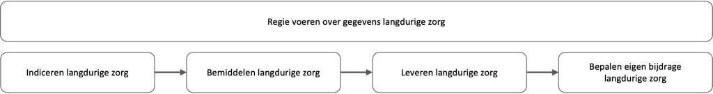
figuur 1. Primaire zorgadministratieve proces van de langdurige zorg

Met de uitvoering van deze functies wordt de cliënt op basis van de situatie en de wensen van de cliënt naar een zorgtraject geleid en start tevens de administratieve afhandeling. De functies zijn verdeeld over verschillende partijen.

In het iWlz-netwerkmodel gaan de partijen gegevens in het proces anders uitwisselen. In plaats van het versturen van berichten, wisselen deelnemers aan het iWlz-netwerkmodel gegevens uit door middel van het beschikbaar stellen van bronnen met de originele gegevens. Het is de bedoeling dat hiermee straks ook de informatiepositie van de cliënt verbetert. Gegevens uit bron kunnen dan aan de cliënt via een PGO beschikbaar worden gemaakt, zodat de client de gegevens in het netwerk kan raadplegen. Er ontstaan in latere fases ook nog andere toepassingsmogelijkheden van de gegevens. Onderstaand figuur geeft een geabstraheerde weergave van het proces iWlz en de verschillende betrokken partijen.

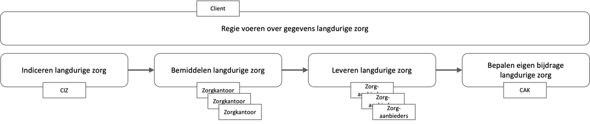
figuur 2. Een weergave van het iWlz proces en de betrokken partijen.

Het op een veilige en betrouwbare manier beschikbaar stellen van bronnen stelt eisen aan de architectuur van het netwerkmodel. Deze worden geborgd in de bouwstenen die basis vormen van de architectuur. In de volgende paragraaf worden de bouwstenen toegelicht.

## 3. Bouwstenen

Dit artikel licht op functioneel niveau de architectuur van het iWlz-netwerkmodel toe. Dit gebeurt door de benodigde bouwstenen en hun onderlinge relaties te beschrijven. De bouwstenen zijn:

- [Registers met hun bronhouders en afnemers](./architectuur#4-registers-met-hun-bronhouders-en-afnemers)
- [Vertrouwen tussen deelnemers aan het iWlz-netwerkmodel](./architectuur#42-vertrouwen-tussen-deelnemers-aan-het-iwlz-netwerkmodel)
- [Vindbaarheid van deelnemers aan het iWlz-netwerkmodel](./architectuur#5-vindbaarheid-van-cliënten-en-deelnemers-in-het-iwlz-netwerk)
- [Beheer van het iWlz-netwerkmodel](./architectuur#6-ondersteunende-rollen-van-het-iwlz-netwerkmodel)

Iedere bouwsteen bestaat uit een aantal met elkaar samenhangende systeemrollen. Onderstaande figuur geeft de bouwstenen en rollen in het iWlz-netwerkmodel weer.

Overzicht bouwstenen en systeemrollen.png openen

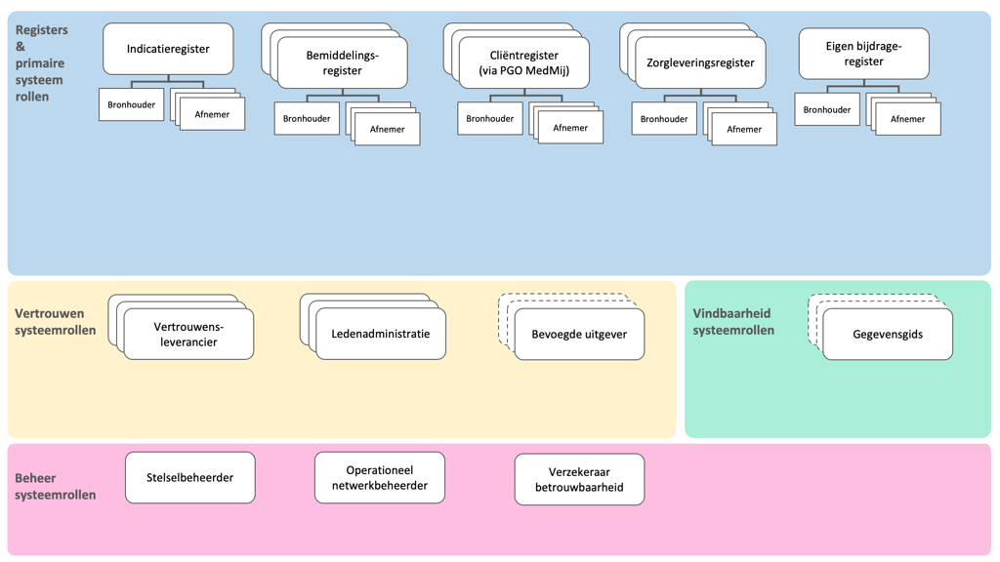
figuur 3. Overzicht bouwstenen en systeemrollen

## 4. Registers met hun bronhouders en afnemers

De basisgedachte van het iWlz netwerkmodel is dat de deelnemers rechtstreeks toegang krijgen tot de gegevens terwijl de data bij de bron blijft, conform het principe [_Eenmalig vastleggen en hergebruik gegevens_](https://wlz.atlassian.net/wiki/spaces/IWLZAS/pages/23069717/Achtergrond+toelichting#2.-Outcomedoelen-Informatieberaad-Zorg) van het Informatieberaad Zorg en de ambitie in plateau 2 van de Nationale visie en Strategie op het Gezondheidsinformatiestelsel. De communicatie vindt plaats op basis van het raadplegen van bronnen die registers worden genoemd. Een deelnemer die brongegevens beheert (bronhouder), biedt deze aan andere deelnemers (afnemers) aan. De data is beschikbaar via koppelvlakken en niet alleen via patronen van uitwisseling. De databeschikbaarheid gaat zelfs later verder dan alleen het WLZ-domein, omdat het netwerkmodel wordt verbreed naar het sociaal domein. Ook ontstaan er mogelijkheden voor secundair gebruik van de data.

De bronhouder zorgt er voor dat de gegevens alleen toegankelijk zijn voor afnemers die daarvoor een grondslag hebben. Om het verlenen van toegang tot de gegevens goed te kunnen waarborgen, worden de volgende stappen doorlopen:

- De afnemer dient te beschikken over (digitaal) verifieerbare attesten (digitale verklaringen) die de rechtmatigheid van de afnemer weergeven. Een _bevoegde uitgever_ kan deze verklaringen aan de afnemer verstrekken.
- De afnemer verzoekt de bronhouder (eventueel via diens dienstverlener) om toegang tot de gegevens. Hij overlegt daarbij de benodigde attesten. Als de toegang kan worden verkregen, gegeven de verifieerbare attesten die de afnemer overlegt, dan verstrekt de bronhouder (of zijn dienstverlener namens hem) een toegangsbewijs (access code).
- Met behulp van het toegangsbewijs kan de afnemer bij de bronhouder toegang tot de data verkrijgen. De bronhouder controleert de geldigheid van het toegangsbewijs en past het toegangsbeleid toe (vastgelegd in “policies”).

Bovenstaande interacties en de bouwstenen die daar voor nodig zijn worden in hoofdstuk 7 uitgewerkt. In de huidige fase werkt het netwerkmodel nog niet met verifiable credentials (VC) voor de bovengenoemde attesten. Conceptueel volgt het netwerk echter wel deze systematiek, zodat er later naar doorontwikkeld kan worden. Nu worden de attesten uitgegeven door VECOZO en gerelateerd aan het VECOZO certificaat. VECOZO slaat de attesten intern op zodat zij in het autorisatieproces gebruikt kunnen worden.

In het onderstaande figuur wordt getoond welke registers deel uitmaken van het iWlz-netwerkmodel. Van het indicatieregister en het eigen bijdrageregister is er elk maar één bronhouder die de gegevens van het register vastlegt. Dit is anders bij de andere registers. Bij die registers zijn er telkens meerdere bronhouders die soortgelijke gegevens beheren en beschikbaar stellen. Dus conceptueel gezien zijn deze registers opgebouwd uit losse bronnen met soortgelijke gegevens die gedeeld worden door meerdere bronhouders die een soortgelijke taak in het ketenproces hebben.

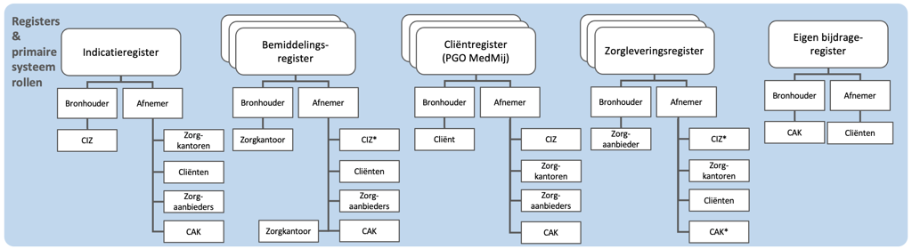
figuur 4. Register en primaire systeemrollen

Iedere bronhouder biedt zijn brongegevens in beginsel aan meerdere afnemers aan. Iedere deelnemer aan het iWlz-netwerkmodel kan tegelijkertijd bronhouder van het ene register en afnemer van een ander register zijn. Wanneer meerdere bronhouders dezelfde soort gegevens delen ontstaat er logisch gezien één integraal register met de gegevens van die soort. We spreken zo van één bemiddelingsregister en één zorgleveringsregister. Binnen zo’n register zijn de gegevens van de verschillende bronhouders logische gescheiden. Zo spreken we van één bemiddelingsregister dat bestaat uit de verzameling van logische gescheiden bemiddelingsregisters per concessiehouder.

### 4.1 Invulling

In onderstaande figuur wordt per register toegelicht door welke deelnemers de rollen bronhouder en afnemer worden ingevuld in het iWlz-netwerkmodel.

Invulling primaire systeemrollen.png openen

figuur 5. Invulling primaire systeemrollen per register
\*alleen voor cliëntcontactgegevens

Het cliëntregister is een bijzonder geval. Cliëntgegevens worden bij alle deelnemers beheerd en beschikbaar gesteld vanuit hun register. Later doet de cliënt via een PGO volwaardig mee. De uitwisseling blijft dan niet beperkt tot het delen van de cliëntgegevens aan andere deelnemers. De cliënt kan in zijn PGO ook gegevens uit de andere registers in zijn PGO verzamelen.

### 4.2 Vertrouwen tussen deelnemers aan het iWlz-netwerkmodel

Om gegevens binnen het iWlz-netwerkmodel veilig uit te wisselen, moeten bronhouders en afnemers elkaar kunnen vertrouwen. Zij moeten erop kunnen vertrouwen dat bij uitwisseling van gegevens:

- de identiteit van een andere deelnemer eenduidig kan worden vastgesteld;
- dat die identiteit kan worden geverifieerd (authenticatie);
- dat eenduidig kan worden bepaald voor welke gegevens een afnemer geautoriseerd is;
- dat alleen die gegevens uitgewisseld worden waarvoor een grondslag tot het verlenen van toegang bestaat;
- nagegaan kan worden wie toegang heeft gehad tot welke gegevens (logging).

Om dit benodigde vertrouwen te creëren dient invulling te worden gegeven aan het [Trust-over-IP model](https://trustoverip.org/toip-model/) en is een aantal rollen nodig. Dit zijn de zogenaamde vertrouwensrollen: _vertrouwensleverancier_, _ledenadministratie_ en _bevoegde uitgever_. Deze rollen worden hieronder toegelicht.

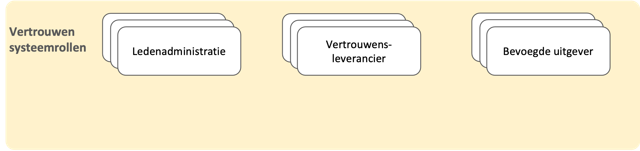
figuur 6. Vertrouwen systeemrollen

### 4.3 Vertrouwensleverancier

In het iWlz-netwerkmodel communiceren deelnemers digitaal met elkaar. Dit is alleen mogelijk als alle deelnemers ook beschikken over een controleerbare digitale identiteit. De vertrouwensleverancier zorgt ervoor dat iedere deelnemer beschikt over een digitale identiteit die door andere deelnemers kan worden gecontroleerd. Dit doet de vertrouwensleverancier door het beheren van de identiteit en de publieke sleutels. Binnen het iWlz-netwerkmodel kan op termijn sprake zijn van 1 of meerdere vertrouwensleveranciers. Vooruitlopend op de landelijke ontwikkelingen maakt de iWlz hiervoor nog gebruik van het VECOZO nummer en het bijbehorende VECOZO systeemcertificaat. VECOZO is niet alleen vertrouwensleverancier, maar tevens bevoegde uitgever van het attest van deelnemersschap aan de iWlz (zie 4.5.). Tevens wordt in een groeipad de interoperabiliteit met Nuts gerealiseerd zodat later ook Nuts als vertrouwensleverancier kan worden toegepast.

### 4.4 Ledenadministratie

De deelnemers aan het iWlz-netwerkmodel moeten andere deelnemers kunnen herkennen. Om hiervoor te zorgen zijn registraties nodig waarin de rollen en kenmerken van deelnemers te controleren zijn. Voorbeelden hiervan zijn de registraties van zorgaanbieders inclusief rollen en kenmerken in het Landelijk Register Zorgaanbieders (LRZa) en het AGB-register van Vektis. Een ander voorbeeld is de registratie van zorgkantoren in het UZOVI-register. Het beheren van een registratie van leden is de verantwoordelijkheid van de rol ledenadministratie. Binnen het iWlz-netwerkmodel is sprake van meerdere ledenadministraties.

Een ledenadministratie kan ook verklaringen (attesten of claims) uitgeven over de kenmerken van organisaties die kunnen deelnemen aan het iWlz-netwerkmodel (zoals postcodegebied en rol). Dit is nu nog niet het geval, maar mogelijk in de toekomst.

Nu gebruikt VECOZO de ledenadministraties van Vektiz en UZOVI bij het toekennen van het attest van deelnemerschap aan de iWlz. VECOZO controleert de deelnemers bij aanmelding voor het VECOZO-certificaat onder meer ten opzichte van deze ledenadministraties. VECOZO legt hun kenmerken en rollen als attesten in de administratie vast onder het VECOZO-nummer. Deze worden later geraadpleegd bij het toekennen van toegang tot de gegevens. VECOZO is dus niet zelf de ledenadministratie (dat zijn de administraties die VECOZO gebruikt), maar de bevoegde uitgever.

### 4.5 Bevoegde uitgever

In het iWlz-netwerkmodel kunnen afnemers alleen gegevens raadplegen die voor hen relevant zijn en waarvoor een grondslag bestaat. Welke gegevens een afnemer kan raadplegen is afhankelijk van verschillende kenmerken van de deelnemer, zoals de rol van een deelnemer in het iWlz-proces, en de relatie van een deelnemer tot een cliënt.

Om vast te stellen of een afnemer deelnemer is en gegevens mag raadplegen, overlegt hij (digitaal) verifieerbare attesten die de rechtmatigheid van de afnemer weergeven. Deze worden uitgegeven door bevoegde uitgevers. In eerste instantie ligt de rol om kenmerken van organisaties die kunnen deelnemen aan het iWlz-netwerkmodel te beoordelen en toe te kennen aan de deelnemer bij VECOZO. Zo treedt VECOZO op als bevoegde uitgever via de attesten die VECOZO registreert in haar ledenadminstratie. Het VECOZO nummer uit het VECOZO certificaat wordt gebruikt om de deelnemer te identificeren.

In de toekomst zullen ook andere deelnemers zoals bv de genoemde ledenadministraties verifieerbare attesten uit kunnen delen aan andere deelnemers. Hiervoor gebruiken zij brongegevens van henzelf en mogelijk van andere deelnemers in het netwerk. We gaan dan over op de systematiek van Verifiable Credentials (VCs).

### 4.6 Invulling

In onderstaande figuur wordt toegelicht door welke deelnemers de rollen ledenadministratie, vertrouwensleverancier en bevoegde uitgever worden ingevuld in het iWlz-netwerkmodel.

Invulling vertrouwen systeemrollen.png openen

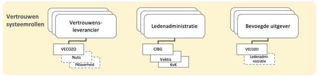
figuur 7. Invulling vertrouwen systeemrollen

## 5. Vindbaarheid van cliënten en deelnemers in het iWlz-netwerk

Vanuit het perspectief van een afnemer is een van de eerste stappen het bepalen waar (bij welke deelnemer, op welk technisch adres en met welke diensten) in het iWlz-netwerkmodel de gevraagde informatie is te vinden. Er zijn lokalisatievoorzieningen en adresboeken nodig om deze vragen te beantwoorden. Voor beide aspecten zullen landelijk generieke functies worden ontwikkeld en daar zal iWlz bij aansluiten.

In een lokalisatievoorziening staat welke bronhouders welk type gegevens van welke cliënten aanbieden. Ook kunnen lokalisatievoorzieningen een index omvatten waarin cliënten gezocht kunnen worden. Lokalisatievoorzieningen kunnen niet zonder meer gebruikt worden zonder een grondslag voor het gebruik van de persoongegevens van degene die er in wordt opgezocht. Binnen Dizra heet een aanbieder van een lokalisatievoorziening een gegevensgids.

In een adresboek staat via welke (technische) adressen van de bronhouders deze gegevens af te nemen zijn. Dit is een aspect van de juiste adressering. Op deze manier is het mogelijk dat een afnemer een gegevensverzoek op het juiste adres van de bronhouder kan doen.

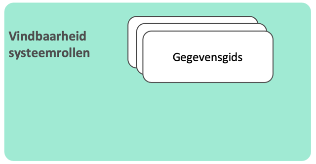
figuur 8. Vindbaarheid systeemrollen

Voor het vinden van de juiste adresgegevens van een deelnemer is een [tijdelijk adresboek](https://github.com/iStandaarden/iWlz-adresboek-public) beschikbaar. Hiermee wordt voorzien in de adresseringsvoorzieningen die nodig zijn en waarin de de beschikbare brongegevens (registers) en gegevensdiensten van de deelnemers te controleren zijn. Naar de toekomst toe is het de bedoeling gebruik te maken van Zorg-AB.

Binnen de opzet van de iWlz zijn de partijen en rollen bij de deelnemers bekend of weten de deelnemers op grond van het verloop van het Wlz-proces welke deelnemers beschikken over gegevens van cliënten. Hierdoor zijn lokalisatievoorzieningen in eerste instantie nog niet nodig. Voor de toekomstige nieuwe toepassingen zullen deze echter wel gewenst zijn. Zodra deze uitgekristalliseerd zijn zal het netwerkmodel zich gaan baseren op de gemeenschappelijke voorzieningen en gebruik maken van de generieke functies voor adressering en lokalisatie.

## 6. Ondersteunende rollen van het iWlz-netwerkmodel

In de voorgaande paragrafen is toegelicht welke rollen en voorzieningen in het iWlz-netwerkmodel nodig zijn om ervoor te zorgen dat deelnemers elkaar kunnen vertrouwen en dat gegevens vindbaar zijn. Deze rollen hebben allen een actieve rol bij alle transacties binnen het iWlz-netwerkmodel.

In deze paragraaf worden de rollen toegelicht die zijn gericht op ondersteunende rollen van het iWlz-netwerkmodel. Deze rollen zijn (in lijn met Dizra): _stelselbeheerder, verzekeraar betrouwbaarheid_ en _operationeel netwerkbeheerder_.

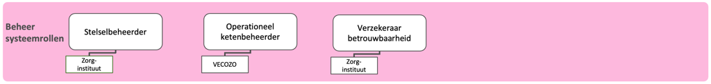
figuur 9. Beheer systeemrollen

### 6.1 Stelselbeheerder

De rol stelselbeheerder komt uit Dizra en deze speelt een rol binnen de besturing van het iWlz-netwerkmodel. De stelselbeheerder organiseert en stuurt diverse activiteiten die nodig zijn om het stelsel te laten werken. Ook heeft de stelselbeheerder een rol in het tot stand brengen van vertrouwen in het ecosysteem.

De rol stelselbeheerder sluit nauw aan op de rollen Stelselhouder en Stelselautorisator die in lijn met NEN 7522 liggen bij het Zorginstituut en bij de Stuurgroep iWlz. Het stelselbeheer van het netwerkmodel zoals Dizra bedoelt, staat los van het beheer en onderhoud van het afsprakenstelsel zelf, dat ook bij het Zorginstituut ligt. Deze rol heet conform NEN 7522 functioneel en technische beheerder van het stelsel. Deze rollen, die ook al in het estafettemodel gelden, staan toegelicht in het artikel “Rollen en deelnemer”.

De Dizra-rol Stelselbeheer, die dus de facto bij het Zorginstituut en de Stuurgroep iWlz ligt, gegeven hun rollen als Stelselhouder en Stelselautorisator, kent een aantal essentiële rollen toe aan deelnemers van het iWlz-netwerkmodel. Deze rollen worden niet in NEN 7522 onderscheiden, maar wel in Dizra:

- Ledenadministratie
- Vertrouwensleverancier
- Gegevensgids
- Operationeel netwerkbeheerder (DIZRA: “Operationeel ketenbeheerder”)
- Verzekeraar betrouwbaarheid

Onderstaande figuur geeft dit schematisch weer. In de figuur is ook te zien dat op basis van informatie uit de _ledenadministraties_ per deelnemer duidelijk wordt van welk _register_ deze deelnemer bronhouder is. Een voorbeeld hiervan is dat een deelnemer, die op basis van een van de ledenadministraties de rol Zorgaanbieder heeft, bronhouder is van een Zorgleveringregister. Daarnaast is te zien dat de _verzekeraar betrouwbaarheid_ de rol _bevoegde uitgever_ aan deelnemers toekent.

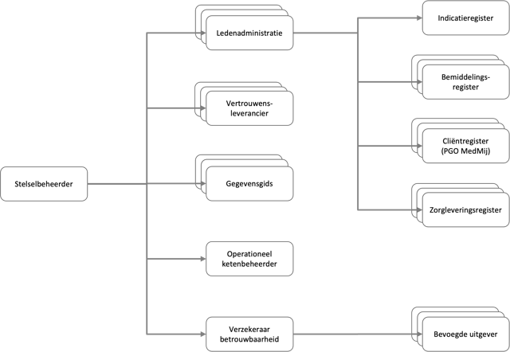
figuur 10. Toekennen rollen binnen het iWlz-netwerkmodel

### 6.2 Verzekeraar betrouwbaarheid

Een verzekeraar betrouwbaarheid maakt inzichtelijk welke attesten mogen worden uitgegeven door welke deelnemers. Deelnemers die attesten mogen uitgeven worden bevoegde uitgevers genoemd. Binnen het iWlz-netwerkmodel is sprake van één verzekeraar betrouwbaarheid. De rollen Stelselbeheerder en Verzekeraar betrouwbaarheid worden beide door het Zorginstituut ingevuld.

Er is voorshands één bevoegde uitgever. Dat is het VECOZO via het VECOZO certificaat en de daaraan gekoppelde attesten.

### 6.3 Operationeel netwerkbeheerder

De operationeel netwerkbeheerder (in DIZRA: “Operationeel ketenbeheerder“) heeft als taak het dagelijks beschikbaar stellen van het netwerk volgens de afspraken. De operationeel netwerkbeheerder monitort de gegevensuitwisseling in het iWlz-netwerkmodel, zorgt voor het herstel als het netwerk niet goed blijkt te functioneren, is belast met het uitvoeren van afgesproken handelingen zoals het leveren van rapportages, afschriften en voorlichting, en biedt een gemeenschappelijke helpdesk voor de deelnemers van het iWlz-netwerkmodel aan.

De nadere invulling van de operationeel netwerkbeheerder is terug te vinden in de [Serviceafspraken](./serviceafspraken). Binnen het iWlz-netwerkmodel is sprake van één operationeel netwerkbeheerder (VECOZO).

### 6.4 Invulling

In onderstaande figuur wordt toegelicht door welke deelnemers de rollen stelselbeheerder, operationeel netwerkbeheerder en verzekeraar betrouwbaarheid worden ingevuld in het iWlz-netwerkmodel.

figuur 11. Invulling beheer systeemrollen

## 7. Bouwstenen in relatie tot het iWlz proces

Zoals eerder toegelicht worden in het proces van de iWlz verschillende functies onderscheiden die zijn verdeeld over verschillende deelnemers. Iedere deelnemer houdt op basis van zijn functie in het proces één van de eerder genoemde registers bij. Zo voert de deelnemer CIZ de functie indiceren uit en zorgt dat het indicatieregister up-to-date is.

Iedere deelnemer heeft voor het uitvoeren van zijn functie in het administratieve proces gegevens van andere deelnemers nodig. Deze gegevens kan een deelnemer raadplegen in de registers van de andere deelnemers, mits hij daarvoor een geldig toegangsbewijs heeft en er een grondslag voor raadpleging van de gegevens van de cliënt is.

> N.B.: De grondslagen voor de uitwisseling van gegevens in het administratief proces iWlz zijn beschreven in de artikelen [Randvoorwaarden](./randvoorwaarden) en [Ontwerpkeuzes](./ontwerpkeuzes).

In de voorgaande paragrafen is beschreven welke bouwstenen en systeemrollen nodig zijn voor het veilig en betrouwbaar raadplegen van registers in het kader van het administratief proces iWlz. Onderstaand figuur geeft voor het iWlz-netwerkmodel een overzicht van de bouwstenen, systeemrollen en de invulling daarvan door deelnemers.

figuur 12. Overzicht bouwstenen, systeemrollen en deelnemers
\*alleen voor cliëntcontactgegevens

In de volgende paragraaf wordt het iWlz-netwerkmodel stapsgewijs uitgelegd aan de hand van één gegevensuitwisseling: het raadplegen van een register.

## 8. Stapsgewijze uitleg gegevensuitwisseling

In deze paragraaf wordt stapsgewijs toegelicht hoe gegevensuitwisseling in het iWlz-netwerkmodel plaatsvindt. Hierbij spelen de bouwstenen een hoofdrol. Als voorbeeld wordt het raadplegen van gegevens door een afnemer bij een bronhouder uitgewerkt. Het doel van deze paragraaf is om de basisprincipes uit te leggen. Naast het raadplegen van gegevens zijn in het afsprakenstelsel ook andere diensten (zoals abonneren, notificeren en melden) uitgewerkt.

Op de [Applicatie](../applicatie)-laag van het afsprakenstelsel iWlz-netwerkmodel wordt hier uitputtend op ingegaan.

> 📝
> **Precondities**
>
> - Afnemer (deelnemer A) en bronhouder (deelnemer B) hebben beide het onboarding-proces doorlopen.
> - Afnemer en bronhouder bezitten beide een sleutelpaar dat door een vertrouwensleverancier is uitgegeven. Hiermee kan de digitale identiteit van afnemer en bronhouder worden geverifieerd.
> - Afnemer (deelnemer A) en bronhouder (deelnemer B) zijn beide geregistreerd in een ledenadministratie. Deze _ledenadministratie_ heeft verklaringen over de kenmerken van deelnemer A en deelnemer B uitgegeven.
> - De te raadplegen gegevens zijn door de bronhouder en gegevensgids vindbaar gemaakt.

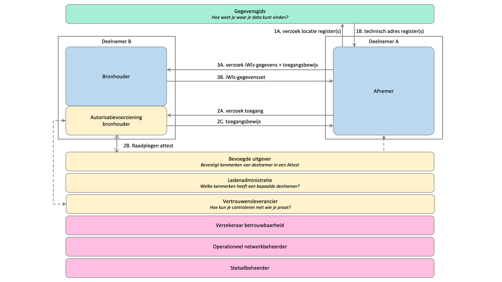
figuur 13. Transactie tussen afnemer en bronhouder

Hieronder worden de stappen waaruit het proces van raadplegen is opgebouwd functioneel toegelicht.

| **#** | **Stap** | **Functionele toelichting** |
| --- | --- | --- |
| 1A | Verzoek locatie register(s) | Voordat deelnemer A (_afnemer_) gegevens kan raadplegen, dient de afnemer te weten wat de locatie (welke deelnemer, welk technisch adres) van de gegevens is. Hiervoor stuurt deelnemer A een verzoek naar de gegevensgids. |
| 1B | Technisch adres register(s) | De _gegevensgids_ beantwoordt het verzoek met een technisch adres van het register waarin de gegevens zijn te vinden. N.B.: Het kan ook zijn dat er meerdere technische adressen worden gestuurd. Dit komt bijvoorbeeld voor als delen van informatie beschikbaar zijn bij verschillende bronhouders. Dit is overigens niet van toepassing voor de eerste implemenatiestap Indicatieregister. |
| 2A | Verzoek toegang | Een _afnemer_ kan alleen gegevens bij een register afnemen wanneer hij daarvoor de juiste toegangsrechten heeft. In deze stap stuurt de afnemer (deelnemer A) een verzoek tot toegang naar de bronhouder (deelnemer B). Deelnemer B (_bronhouder_) ontvangt het verzoek tot toegang met daarbij het VECOZO certificaat van deelnemer A. NID verifieert namens Deelnemer B de geldigheid van het certificaat. |
| 2B | Raadplegen attest | Toegang is afhankelijk van verschillende kenmerken van een _afnemer_ (zoals deelnemerschap en de rol in het iWlz-proces). Technisch verifieerbare verklaringen over deze kenmerken zijn (o.a. tijdens de onboarding) uitgegeven aan deelnemers. De technisch verifieerbare verklaringen worden ‘attesten’ of ‘claims’ genoemd. Bij het verzoek om toegang moet deelnemer A over de relevante attesten beschikken. Voor nu zijn deze attesten bij VECOZO als bevoegde uitgever intern vastgelegd en aan het VECOZO certificaat gerelateerd._In de toekomst zullen bevoegde uitgevers deze attesten als ondertekende Verifiable Credential verstrekken aan de deelnemer, gekoppeld aan het DID van deze deelnemer. Deelnemers presenteren de juiste credentials bij het verzoek om toegang. De bronhouder controleert de credentials met behulp van de digitale handtekeningen in de registratie bij de vertrouwensleverancier._ |
| 2C | Toegangsbewijs | Deelnemer B bepaalt vervolgens op basis van de gevalideerde kenmerken van deelnemer A uit het attest, het voor iWlz afgesproken toegangsbeleid. Dit omvat ook de scope: de voor de deelnemer relevante brongegevens in het netwerk. Wanneer het verzoek tot toegang wordt gehonoreerd, verstrekt deelnemer B aan deelnemer A een toegangsbewijs (access token) en de juiste toegangsrechten waarmee toegang kan worden verkregen tot de gegevens.De behandelrelatie met de cliënt wordt nog niet in deze fase van het proces getoetst. Dit wordt getoetst aan de bron en niet nu bij het beoordelen van het deelnemersschap. |
| 3A | Verzoek iWlz-gegevens | Deelnemer A (_afnemer_) raadpleegt iWlz-gegevens bij deelnemer B (_bronhouder_) door een gegevensverzoek naar deelnemer B te sturen. Hierbij stuurt deelnemer A het in stap 2B verkregen toegangsbewijs mee. |
| 3B | iWlz-gegevensset | Deelnemer B (_bronhouder_) ontvangt het gegevensverzoek met daarbij het toegangsbewijs en de scope van deelnemer A (_afnemer_).Deelnemer B valideert eerst de geldigheid van het toegangsbewijs en bepaalt vervolgens op basis van de toegangsrechten (de scope) van deelnemer A en de identificerende gegevens van de gevraagde gegevensset of toegang tot de gegevens kan worden gegeven. Het afgesproken toegangsbeleid ligt vast in specifieke toegangsregels (“policies”) die op het gegevensverzoek van deelnemer A worden toegepast. Om vast te stellen of er een grondslag is voor toegang tot de gegevens van de opgevraagde cliënt, worden de identificerende gegevens gebruikt om de relevante brongegevens te raadplegen. De gegevensset die Deelnemer A verzoekt mag de toegekende toegangsrechten (de scope) van deelnemer A niet te buiten gaan. |

## 9. Voorbeeld gegevensuitwisseling - raadplegen indicatieregister

In deze paragraaf wordt gegevensuitwisseling in het iWlz-netwerkmodel toegelicht aan de hand van een voorbeeld. In dit voorbeeld wordt het indicatieregister geraadpleegd door een zorgkantoor. Het doel van deze paragraaf is om de basisprincipes uit te leggen. Naast het raadplegen van gegevens zijn in het afsprakenstelsel ook andere diensten (zoals abonneren) uitgewerkt.

In dit voorbeeld worden de rollen op de volgende manier ingevuld:

- Deelnemer A (_afnemer_): een zorgkantoor
  - Deelnemer A heeft een VECOZO certificaat met een VECOZO aansluitnummer. Via dit nummer is voor het zorgkantoor een attest geregistreerd intern bij VECOZO (_bevoegde uitgever_). Dit attest bepaalt het deelnemersschap van het zorgkantoor aan de iWlz en de rol als de afnemer. Hierdoor ligt ook de scope vast.
- Deelnemer B (_bronhouder_): CIZ
  - CIZ in de rol _bronhouder_ neemt een dienst af van VECOZO voor het beoordelen van de toegang tot de gegevens en het verstrekken van het toegangsbewijs. VECOZO is voor deze context verwerker van CIZ.
  - CIZ neemt een dienst af van VECOZO voor het toepassen van de autorisatieregels, het evalueren van de policies en het vaststellen van de grondslag. VECOZO is voor deze context verwerker van CIZ.
- Gegevensgids: VECOZO
  - Voor het raadplegen van indicatiegegevens door een zorgkantoor zijn geen lokalisatievoorzieningen nodig. Indicatiegegevens liggen namelijk altijd bij CIZ vast.
  - De technische adressen die nodig zijn voor het raadplegen van het indicatieregister zijn opgenomen in een tijdelijke adresseringsvoorziening, de endpoints worden in een aparte lijst bijgehouden. [GitHub - iStandaarden/iWlz-adresboek-public: Tijdelijk alternatief voor ZorgAB aansluiting](https://github.com/iStandaarden/iWlz-adresboek).
- Vertrouwensleverancier: VECOZO
- Ledenadministratie: VECOZO na raadpleging LRZa en AGB.
- Verzekeraar betrouwbaarheid: Zorginstituut (heeft VECOZO aangewezen als bevoegde uitgever)
- Operationeel netwerkbeheerder: VECOZO
- Stelselbeheerder: Zorginstituut

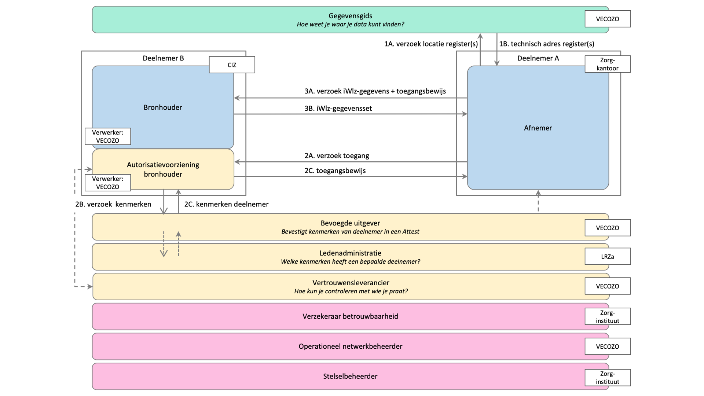
figuur 14. Voorbeeld transactie - raadplegen Indicatieregister

## 10. Besturing

De inrichting van de ontwikkeling en het beheer van het iWlz-netwerkmodel is ook onderdeel van het afsprakenstelsel iWlz-netwerkmodel. De hiervoor benodigde rollen zijn op basis van [NEN 7522:2021 nl](https://www.nen.nl/nen-7522-2021-nl-283706) uitgewerkt in het artikel [Rollen en deelnemers](./rollen_deelnemers)Voorvertoning.

---
