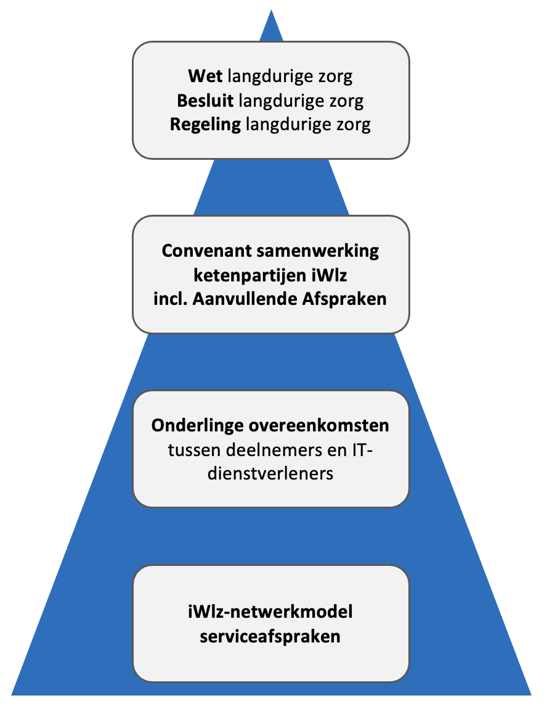

## 1. Inleiding

De serviceafspraken beschrijven het niveau van dienstverlening binnen het iWlz-netwerkmodel. Dit artikel bevat de algemene serviceafspraken die gelden voor alle deelnemers. Daarnaast zijn er drie onderliggende onderdelen waarin specifieke afspraken per doelgroep zijn vastgelegd voor respectievelijk de operationele netwerkbeheerder, bronhouders en afnemers:

- [Operationeel netwerkbeheer serviceafspraken](./operationeel_netwerkbeheer)
- [Bronhoudersdeel serviceafspraken](./bronhoudersdeel)
- [Afnemersdeel serviceafspraken](./afnemersdeel)

## 2. Over de iWlz-netwerkmodel serviceafspraken

### 2.1 Doel

De serviceafspraken zijn opgesteld om afspraken vast te leggen over de dienstverlening binnen het iWlz-netwerkmodel. Ze richten zich op beschikbaarheid, toegankelijkheid en afhandeling van meldingen. De serviceafspraken gelden voor alle deelnemers.

### 2.2 Positie van de serviceafspraken

De basis voor de iWlz-netwerkmodel serviceafspraken wordt gevormd door wet- en regelgeving, te weten de _Wet langdurige zorg_ (op grond van artikel 9.1.2 lid 7 a t/m d) en de nadere uitwerking in het [_Besluit langdurige zorg_](https://wetten.overheid.nl/BWBR0035948/2022-01-01) en de [_Regeling langdurige zorg_](https://wetten.overheid.nl/BWBR0036014/2022-07-01/). Deze juridische basis is uitgebreider beschreven in de artikelen [Randvoorwaarden](../randvoorwaarden) en [Ontwerpkeuzes](../ontwerpkeuzes) en wordt hier kort samengevat om de context en relevante verwijzingen direct zichtbaar te maken.

Hierop voortbouwend geldt een overeenkomst tussen de deelnemers aan het iWlz-netwerkmodel, te weten het [_Convenant samenwerking ketenpartijen iWlz_](https://www.istandaarden.nl/services/file/get?key=XDh_Z1NWnWd9qjLfPpL2hxn303Z8I9xxXNKt18Q9uD0sh6lhBP-vPYFziYY-RWLnRW0h9snDSPCtfpFca6BXK1GzBtss_kaDr4sKaztAVgRvYLnXLvNLhS4icuQnRww5yNFThzVdveXrgjpwUCshoYd-ZHbA0Q7KrGdMxo4) en de [_Aanvullende Afspraken_](https://www.istandaarden.nl/algemeen/governance), waarin partijen zich commiteren aan het Afsprakenstelsel iWlz-netwerkmodel.

> ⚠️
> Nieuwe Aanvullende Afspraken zijn nog in het proces van publicatie. Zodra deze officieel beschikbaar zijn, wordt hier een link toegevoegd.

Een verbijzondering van het convenant is de overeenkomst die deelnemers aan het iWlz-netwerkmodel hebben met hun IT-dienstverleners. Deelnemers worden geadviseerd om (een verwijzing naar) de _iWlz-netwerkmodel serviceafspraken_ hierin op te nemen voor zover van toepassing.

Individuele deelnemers sluiten binnen de kaders van de _iWlz-netwerkmodel serviceafspraken_ zogenaamde _onderlinge overeenkomsten_ af met hun IT-dienstverleners indien van toepassing. Hierdoor kan een IT-dienstverlener een verwerker van een deelnemer worden.

In het onderstaande figuur is de juridische hiërarchie van afspraken gerelateerd aan IT-dienstverlening schematisch weergegeven.

figuur 1. Juridische positie iWlz-netwerkmodel serviceafspraken

> ℹ️
> De serviceafspraken beschrijven de overkoepelende structuur en afspraken. Details en werkinstructies zijn vastgelegd in onderlinge contracten en procedures tussen partijen.

N.B. Als in documentatie aangaande iWlz-netwerkmodel serviceafspraken onverhoopt tegenstrijdigheden voorkomen dan geldt de hiërarchisch hoger gelegen documentatie.

### 2.3 Overlegorganen

Binnen het iWlz-netwerkmodel bestaan meerdere overlegorganen die verantwoordelijk zijn voor besluitvorming, afstemming en doorontwikkeling. De onderstaande tabel geeft de overlegvormen weer zoals deze zijn genoemd in het [Convenant](https://www.istandaarden.nl/algemeen/governance) en die zijn ingericht ten behoeve van het Actieprogramma.

| Column 1 | Column 2 |
| --- | --- |
| **Soort overleg** | **Stuurgroep iWlz** |
| Aard | Strategisch/tactisch (besluitvormend) |
| Deelnemers | Eén vertegenwoordiger van elk van de volgende organisaties: Zorgthuisnl, Actiz, CIZ, CAK, ZN, de Nederlandse ggz, Valente, VGN, Vereniging van organisaties voor ICT in de zorg (OIZ). VWS en Nza zijn toehoorder. Zorginstituut Nederland is voorzitter. |
| Frequentie | Maandelijks |
| Doel | <ul><li>Signaleert en bespreekt onderwerpen die relevant zijn voor het iWlz-netwerkmodel.</li><li>Formuleert een gemeenschappelijke visie op de jaarlijkse iWlz-releases.</li><li>Neemt besluiten over de inhoud van de releases.</li><li>Neemt besluiten over het plan van aanpak van projecten die betrekking hebben op de iWlz.</li><li>Bewaakt de voortgang van projecten.</li><li>Bespreekt en beoordeelt projectevaluaties.</li><li>Bespreekt geëscaleerde incidenten vanuit deelnemers (bijvoorbeeld bij nalatigheid).</li><li>Bespreekt periodiek rapportages over monitoring op strategisch niveau.</li></ul> |
| Voorzitterschap | Zorginstituut Nederland |
| **Soort overleg** | **Functionele Klankbordgroep iWlz (Klankbordgroep iWlz)** |
| Aard | Operationeel |
| Deelnemers | Inhoudsdeskundigen van alle iWlz-ketenpartijen: het CIZ, de zorgkantoren, de zorgaanbieders, het CAK én Zorginstituut Nederland. Zij participeren in de Klankbordgroep spreken namens de eigen organisatie en niet namens de branche waarvan hun organisatie deel uit maakt. |
| Frequentie | Twee keer per jaar |
| Doel | <ul><li>Dient als klankbord voor het Zorginstituut Nederland bij verbeteringen en de correctie toepassing van de standaarden in de actuele informatie-uitwisseling.</li><li>Adviseert het Zorginstituut Nederland over mogelijke oplossingsrichtingen en de technische uitvoering.</li><li>Doet voorstellen voor de inhoud van de iWlz-releases.</li></ul> |
| Voorzitterschap | Zorginstituut Nederland |
| **Soort overleg** | **Technische Klankbordgroep iWlz (Technisch afstemmingsoverleg)** |
| Aard | Operationeel |
| Deelnemers | Softwareleveranciers/IT-dienstverleners van deelnemers aan het iWlz-netwerkmodel |
| Frequentie | Tweewekelijks |
| Doel | <ul><li>Performance netwerkmodel beoordelen (bewaken van het niveau van ICT-dienstverlening).</li><li>Knelpunten en wijzigingen in de dienstverlening signaleren.</li><li>Denkt mee over voorstellen voor technische verbeteringen.</li><li>Dient als klankbord voor het Zorginstituut Nederland bij verbeteringen en de correctie toepassing van de standaarden die de technische implementatie bij partijen raken.</li></ul>|
| Voorzitterschap | Zorginstituut Nederland |
| **Soort overleg** | **Referentiegroep iWlz** |
| Aard | Operationeel/tactisch |
| Deelnemers | Inhoudsdeskundigen van alle ketenpartijen: het CIZ, ZN, zorgkantoren, de brancheorganisaties van het zorgaanbod, zorgaanbieders, het CAK, de SVB, Zorginstituut Nederland én het Ministerie van VWS. Daarnaast zijn ook de softwareleveranciers betrokken. Alle deelnemers aan de Referentiegroep spreken namens de eigen organisatie en niet als belangenbehartiger namens de branche waarvan hun organisatie deel uit maakt. |
| Frequentie | De Referentiegroep komt met name bijeen voorafgaand aan de formulering van de concept specificaties van een release. De frequentie en timing is per releasecyclus verschillend. |
| Doel | <ul><li>Bespreekt met materiedeskundigen van stakeholders de impact van gewenste beleids- en proceswijzigingen voor de informatie-uitwisseling.</li><li>Adviseert Zorginstituut Nederland met informatie voor de opstelling van de functionele specificaties voor de volgende release.</li><li>Wordt indien noodzakelijk uitgebreid met technische deskundigheid om ook input te leveren voor de technische specificaties.</li></ul> |
| Voorzitterschap | Zorginstituut Nederland |
| **Soort overleg** | **Koplopersoverleg** |
| Aard | Tactisch |
| Deelnemers | Ketenpartijen die als eerste aansluiten op een register (early adopters). |
| Frequentie | Wekelijks |
| Doel | <ul><li>Bepaalt de omvang van de impact voor de organisatie.</li><li>Doet voorstellen voor de technische inhoud van de iWlz-releases.</li><li>Informeert elkaar over de voortgang van lopende werkzaamheden en implementaties.</li><li>Signaleert tijdig knelpunten en afhankelijkheden die de release kunnen beïnvloeden.</li><li>Draagt bij aan de afstemming tussen functionele en technische keuzes, zodat releases uitvoerbaar en haalbaar zijn voor alle betrokken partijen.</li></ul> |
| Voorzitterschap | Zorginstituut Nederland |
| **Soort overleg** | **Werkgroep Bezorg** |
| Aard | Operationeel |
| Deelnemers | Inhoudsdeskundigen van alle ketenpartijen: het CIZ, ZN, zorgkantoren, de brancheorganisaties van het zorgaanbod, zorgaanbieders, het CAK en Zorginstituut Nederland. Daarnaast zijn ook de softwareleveranciers betrokken. Alle deelnemers aan de werkgroep bezorg spreken namens de eigen organisatie en niet als belangenbehartiger namens de branche waarvan hun organisatie deel uit maakt |
| Frequentie | Maandelijks |
| Doel | <ul><li>Bespreekt de functionele aspecten van nieuwe registers.</li><li>Adviseert over de inrichting en toepassing van registers in het iWlz-netwerkmodel aan Zorginstituut Nederland.</li><li>Draagt bij aan de afstemming zodat registers aansluiten op bestaande processen en afspraken.</li></ul> |
| Voorzitterschap | Zorginstituut Nederland |

### 2.4 Geldigheid en ontwikkeling

De iWlz-netwerkmodel serviceafspraken zijn van kracht vanaf het moment dat een deelnemer zich aansluit bij het iWlz-netwerkmodel. De serviceafspraken worden jaarlijks geëvalueerd en indien nodig bijgewerkt. Indien een deelnemer buiten deze reguliere evaluatie om een wijziging wil aanbrengen, wordt dit voorgelegd aan de Stuurgroep iWlz voor besluitvorming.

## 3. Algemene bepalingen

### 3.1 Informatieplicht en geheimhouding

De deelnemers aan het iWlz-netwerkmodel moeten elkaar tijdig informatie geven en meewerken om de serviceafspraken uit te kunnen voeren.

Alle informatie over partijen, doelen en bedrijfsprocessen die in het kader van de serviceafspraken beschikbaar komt, moet geheim worden gehouden. De informatie mag alleen gebruikt worden voor de doeleinden waarvoor deze is aangevraagd en mag niet gedeeld worden met derden zonder toestemming, tenzij het juridisch verplicht is (bijvoorbeeld voor audits of toezicht).

### 3.2 Kosten en verdeling

Tenzij vooraf uitdrukkelijk anders wordt overeengekomen, dragen partijen elk zelf de kosten die voor hen aan de uitvoering van de iWlz-netwerkmodel serviceafspraken zijn verbonden. Dit is conform de Wet Langdurige Zorg (Artikel 9.1.2).

### 3.3 Geschillen en escalatie

Geschillen tussen partijen betreffende de iWlz-netwerkmodel serviceafspraken en de uitvoering hiervan worden te allen tijde afgehandeld conform de gemaakte afspraken tussen partijen. De escalatieprocedure betreft escalatie in de volgende gevallen:

| **Geval** | **Escalatie** |
| --- | --- |
| **Productieverstorend incident:** overschrijding of dreiging van overschrijding van een oplostijd van incident. | <ul><li>In principe: Operationeel netwerkbeheerder</li><li>Bij overstijgende netwerkproblemen: Stelselbeheerder (Zorginstituut Nederland)</li></ul> |
| **Beveiligingsincident:** als het beveiligingsincident bij een deelnemer betrekking heeft op het iWlz-netwerk en ook andere partijen kan raken, dan dient de Security Officer van de deelnemer een afweging te maken over het informeren/betrekken van de andere partijen. | <ul><li>Security Officer (SO)</li></ul> |
| **Datalek:** bij (het vermoeden van) een datalek dient eerst bepaalt te worden of er sprake is van een meldingsplicht en/of andere partijen betrokken zijn (zie paragraaf Datalekken), dan dient de Functionaris Gegevensbescherming van de deelnemer een afweging te maken over het informeren/betrekken van de andere partijen. | <ul><li>Functionaris Gegevensbescherming (FG)</li><li>indien meldingsplicht: Autoriteit Persoonsgegevens (AP)</li></ul> |
| **Afwijking functionele standaard (niet productieverstorend):** niet of verkeerd gebruik van afgesproken functionele standaard (standaarden die de inhoud/het proces raken). | <ul><li>Functionele klankbordgroep iWlz</li></ul> |
| **Afwijking technische standaard (niet productieverstorend):** niet of verkeerd gebruik van afgesproken technische standaard (standaarden die de technische implementatie raken). | <ul><li>Technische klankbordgroep iWlz</li></ul> |
| **Niet naleven afsprakenstelsel of structureel niet halen van prestatieafspraken:** indien deelnemers zich niet houden aan de in het Afsprakenstelsel iWlz-netwerkmodel gemaakte afspraken, bijvoorbeeld door structureel niet te voldoen aan overeengekomen prestatieafspraken over beschikbaarheid of capaciteit, dan wordt dit door de partij die dit constateert gemeld aan de stelselbeheerder. | <ul><li>Stelselbeheerder (Zorginstituut Nederland)</li></ul> |

Voor de gevallen waarin in de tabel de Functionele klankbordgroep iWlz of de Technische klankbordgroep iWlz als escalatiepartij is genoemd, richten de betrokken partijen hun escalatie aan de voorzitter van de betreffende klankbordgroep. Indien het onderwerp binnen de klankbordgroep niet kan worden opgelost of besluitvorming op hoger niveau vereist, escaleert de voorzitter naar de Stuurgroep iWlz en borgt de communicatie en terugkoppeling naar de klankbordgroep, contactmomenten vinden zo spoedig mogelijk plaats.

In de overige gevallen behandelt de in de kolom ‘Escalatie’ genoemde partij het geschil of incident binnen het eigen mandaat. Indien het onderwerp niet kan worden opgelost of besluitvorming op iWlz-netwerkniveau vereist, legt deze partij het onderwerp, zo nodig via de stelselbeheerder, ter besluitvorming voor aan de Stuurgroep iWlz.

### 3.4 Datalekken

Binnen het iWlz-netwerkmodel zijn duidelijke afspraken gemaakt over de omgang met datalekken. Er worden drie scenario’s onderscheiden, elk met eigen verantwoordelijkheden en meldingsafspraken, voor zover sprake is van een meldingsplicht. De Functionaris Gegevensbescherming (FG) van de deelnemer is verantwoordelijk voor het onderzoeken of er sprake is van een meldingsplicht of dat er gegevens zijn gelekt die aan een persoon zijn te relateren.

**Scenario 1: lek bij een deelnemer**
Wanneer een deelnemer zelf een datalek veroorzaakt, is deze partij zelf verwerkingsverantwoordelijke en daarmee verantwoordelijk voor het indien nodig melden van het datalek bij de Autoriteit Persoonsgegevens (AP). In dit geval is er geen verplichting om andere deelnemers van het iWlz-netwerkmodel te informeren.

_Voorbeeld:_ een zorgaanbieder lekt een indicatie.

**Scenario 2: lek door foutieve autorisatie**
Wanneer een afnemer ten onrechte gegevens heeft ontvangen door een foutief afgegeven autorisatie, meldt de afnemer dit bij de partij die de autorisatie heeft verstrekt. Deze partij meldt het vervolgens bij de bronhouder, die verantwoordelijk is voor de melding aan de AP. Daarnaast zal doormiddel van het incidentenbeheerproces een oplossing van het probleem ingang worden gezet.

_Voorbeeld:_ een zorgaanbieder ontvangt door een foutieve autorisatie van een zorgkantoor toegang tot een indicatie uit het CIZ-register. De zorgaanbieder meldt dit bij het zorgkantoor, dat op zijn beurt het CIZ informeert. Het CIZ is verantwoordelijk indien nodig het datalek bij de AP melden.

**Scenario 3: fout in logica van het netwerkmodel**
Wanneer een fout in de technische of logische werking van het netwerkmodel ertoe leidt dat ongeautoriseerde data wordt verstrekt, ligt de verantwoordelijkheid van de foutopsporing in het netwerk initieel bij de Operationeel Netwerkbeheerder (voor zover scenario 1 of 2 niet van toepassing zijn). Afhankelijk waar in het netwerk het datalek is ontstaan zal de verantwoordelijke partij(en) van de gegevens melding doen bij de AP.

_Voorbeeld:_ door een fout in de update van een policy kan een zorgkantoor toegang krijgen tot indicaties van cliënten van andere zorgkantoren. In dit geval meldt VECOZO (als Operationeel Netwerkbeheerder) dit bij de betrokken zorgkantoren die vervolgens indien nodig te melden aan de AP.

**Algemene afspraken bij datalekken**
Indien een datalek gevolgen kan hebben voor andere partijen binnen het iWlz-netwerkmodel, geldt dat partijen elkaar tijdig en volgens vaste afspraken informeren:

- De partij die het datalek ontdekt, informeert de andere betrokken partijen zo spoedig mogelijk. Deze meldplicht houdt in dat bedrijven, overheden en andere organisaties die persoonsgegevens verwerken datalekken onverwijld moeten melden aan de Autoriteit Persoonsgegevens (AP), en in bepaalde gevallen ook aan de betrokkene(n). In dit laatste geval is de betrokkene degene van wie persoonsgegevens zijn gelekt.
- Communicatie vindt plaats via de Functionaris Gegevensbescherming (FG) van de partij die het datalek heeft ontdekt per e-mail.
- Bij incidenten met hoge impact vindt daarnaast ook telefonisch contact plaats.
- Partijen ondersteunen elkaar, waar nodig en redelijk, bij het doen van meldingen en stemmen af over de inhoud daarvan.
- Elke partij levert bij toelating tot het netwerk een vast FG-adres aan (bij voorkeur geen persoongebonden e-mailadres maar een functioneel adres, zoals [_fg@organisatie.nl_](mailto:fg@organisatie.nl)). Deze adressen worden centraal beheerd en opgenomen in het adresboek (voorlopig het tijdelijk adresboek). Deelnemers dienen te borgen dat dit gegeven altijd actueel is.

**Toelichting**
De wettelijke meldplicht (melding bij de Autoriteit Persoonsgegevens en/of betrokkenen binnen 72 uur, conform AVG art. 33) blijft altijd de verantwoordelijkheid van elke afzonderlijke partij en is vastgelegd in **Randvoorwaarde R05 AVG**.

### 3.5 Minimale openingstijden servicedesks

Bronhouders, afnemers en operationeel netwerkbeheerder hebben allen servicedesks voor het signaleren en oplossen van problemen. De minimale openingstijden van deze servicedesks zijn in de onderstaande tabel weergegeven.

| **Dagen** | **Minimale openingstijden servicedesks** | **Bijzonderheden** |
| --- | --- | --- |
| Maandag t/m donderdag | van 09:00 tot 17:00 uur |  |
| Vrijdag | van 09:00 tot 15:30 uur |  |
| Zaterdag en zondag | gesloten |  |
| Feestdagen | gesloten | Nieuwjaarsdag Goede vrijdag Pasen Koningsdag Bevrijdingsdag Hemelvaartsdag Pinksteren Kerstmis |

### 3.6 Dienstverleningsvenster

Tijdens het dienstverleningsvenster is het iWlz-netwerk operationeel conform de minimaal te realiseren Beschikbaarheid (zie [Operationeel netwerkbeheer_Beschikbaarheid](./operationeel_netwerkbeheer#32-beschikbaarheid) en [Bronhoudersdeel_Continuïteitsbeheer bronhouder](./bronhoudersdeel#44-continuïteitsbeheer_bronhouders)).

| **Dagen** | **Dienstverleningsvenster** | **Bijzonderheden** |
| --- | --- | --- |
| Maandag t/m vrijdag | van 09:00 tot 17:00 uur | Feestdagen vallen NIET onder de dienstverleningsvenster: Nieuwjaarsdag Goede vrijdag Pasen Koningsdag Bevrijdingsdag Hemelvaartsdag Pinksteren Kerstmis |

### 3.7 Onderhoudsvenster

Gepland onderhoud aan productieomgevingen – uitgevoerd door één of meerdere partijen en betrekking hebbend op (onderdelen van) de diensten – vindt plaats buiten de in paragraaf 3.6 genoemde dienstverleningsvenster, tenzij dit geen gevolgen heeft voor de beschikbaarheid of op voorhand aangekondigd en goedgekeurd.

In de onderstaande tabel is het onderhoudsvenster weergegeven. Het onderhoudsvenster geeft aan op welke momenten deelnemers gepland onderhoud mogen uitvoeren. Dit betekent niet dat tijdens het onderhoudsvenster in het algemeen sprake mag zijn van onbeschikbaarheid.

| **Dagen** | **Onderhoudsvenster** | **Bijzonderheden** |
| --- | --- | --- |
| Maandag t/m vrijdag | van 17:00 tot 09:00 uur | - |
| Zaterdag en zondag | gehele dag | - |

### 3.8 Logische toegangsbeveiliging

Iedere partij (operationeel netwerkbeheerder, bronhouder en afnemer) is verantwoordelijk voor de logische toegangsbeveiliging van de eigen systemen die op het iWlz-netwerk aansluiten.

Dit onderdeel wordt niet verder gespecificeerd; partijen borgen dit binnen hun eigen informatiebeveiligingskaders.

### 3.9 Configuratiebeheer

Iedere partij (operationeel netwerkbeheerder, bronhouder en afnemer) is verantwoordelijk voor het configuratiebeheer van de eigen systemen die op het iWlz-netwerk aansluiten.

Dit onderdeel wordt verder niet gespecificeerd; partijen borgen dit binnen de eigen beheerprocessen.

### 3.10 Logging

Iedere partij (operationeel netwerkbeheerder, bronhouder en afnemer) is verantwoordelijk voor logging en monitoring van de eigen systemen die op het iWlz-netwerk aansluiten. Logging en monitoring worden ingericht conform de wettelijke en normatieve kaders die op de betreffende partij van toepassing zijn.

Dit onderdeel wordt niet verder gespecificeerd; partijen borgen dit binnen hun eigen beheer- en beveiligingsprocessen.

**Aanvullende bepaling voor incidentonderzoek**
Wanneer dit noodzakelijk is voor het onderzoeken van een ketenbreed incident of voor het waarborgen van de integriteit van het iWlz-netwerkmodel, verstrekken partijen (bronhouders, afnemers en de operationeel netwerkbeheerder) op verzoek relevante log- en monitoringsinformatie aan de operationeel netwerkbeheerder.
Deze informatieverstrekking vindt plaats binnen de grenzen van wet- en regelgeving en het eigen beveiligingskader.

### 3.11 Berekening beschikbaarheid

Beschikbaarheid is de periode dat een dienst volledig beschikbaar is binnen het iWlz-netwerk en geldt voor Operationeel netwerkbeheerder en Bronhouders. De beschikbaarheidspercentages zijn gespecificeerd in de onderliggende paragrafen [Operationeel netwerkbeheer_Beschikbaarheid](./operationeel_netwerkbeheer#32-beschikbaarheid) en [Bronhoudersdeel_Continuïteitsbeheer bronhouder](./bronhoudersdeel#44-continuïteitsbeheer_bronhouders).

De Beschikbaarheid wordt als volgt berekend:

`Beschikbaarheid = ((B – D) / B) x 100%`

> ℹ️
> Waarbij;
> B = totaal aantal minuten binnen het dienstverleningsvenster per maand waarin diensten beschikbaar moet zijn.
> D = _aantal niet-beschikbare minuten_ van een dienst binnen het dienstverleningsvenster per maand.
>
> Onder _aantal niet-beschikbare minuten_ wordt verstaan: het aantal minuten dat de dienst gedurende één minuut aansluitend niet-beschikbaar is ondanks meerdere (minimaal 3) connectiepogingen of gedeeltelijk of uitzonderlijk vertraagd beschikbaar is. In dat geval is er sprake van een incident.

## 4. Monitoring in het iWlz Netwerkmodel

Met het oog op het bevorderen van de betrouwbaarheid, transparantie en lerend vermogen binnen het iWlz Netwerkmodel, wordt monitoring stapsgewijs ingericht. Monitoring maakt het functioneren van het netwerk inzichtelijk en stelt partijen in staat om tijdig bij te sturen waar nodig.

### 4.1 Doel

- Operationeel inzicht bieden voor tijdige detectie en sturing bij verstoringen.
- Beleidsmatig inzicht bieden in trends, volumes en stabiliteit van het netwerk.
- Samenwerking en interoperabiliteit binnen het iWlz-netwerk versterken, niet het toezicht op individuele organisaties.

### 4.2 Uitgangspunt

Monitoring is een ondersteunend instrument voor de betrokken [systeemrollen](../rollen_deelnemers#5-systeemrollen) en beheerrollen. De gegevens uit monitoring worden nadrukkelijk niet gebruikt voor toezicht op individuele organisaties, maar dienen om samenwerking, verbetering en interoperabiliteit binnen het iWlz-Netwerk te versterken.

Bij de uitwerking van de monitoring blijven proportionaliteit, nut voor betrokken partijen en bescherming van persoonsgegevens leidende uitgangspunten.

Naarmate monitoring verder wordt ingericht, wordt het afsprakenstelsel verrijkt met de elementen en technische inrichting rondom monitoring.

### 4.3 Startpunt

De monitoring zal initieel vanuit de rol van de operationeel netwerkbeheerder worden ingericht, die verantwoordelijk is voor het technische beheer en de continuïteit van het netwerk. Omdat de operationeel netwerkbeheerder al meerdere onderdelen monitort, is het logisch daarmee te starten. Parallel wordt de informatiebehoefte van partijen in kaart gebracht.

### 4.4 Inrichting

Op basis van concrete informatiebehoeften van deelnemende partijen of netwerkbrede serviceafspraken worden RFC’s vastgesteld in het Technisch Afstemmingsoverleg (TAO), waarbij per RFC nut, proportionaliteit, dataminimalisatie, hergebruik van bestaande bronnen, retentie en verwachte beheerlast expliciet worden onderbouwd. Zo voorkomen we dat onnodige gegevens worden gemonitord of dat monitoring tot onnodige overhead leidt. Nieuwe RFC’s houden rekening met de reeds beschikbare traceId uit RFC022 en maken, waar mogelijk, gebruik van deze identificatie voor correlatie.

### 4.5 Typen monitoring

Monitoring ondersteunt twee doelen. Onderstaand het bijbehorende product per doel.

| **Doel** | **Product** | **Wat laat het zien** | **Voorbeelden** |
| --- | --- | --- | --- |
| Operationeel sturen | Dashboards (realtime) | Beschikbaarheid, performance, foutmeldingen, systeem/netwerk | Uptime, latency, error rates, incidentfeed |
| Beleid & beheer | Rapportages (periodiek) | Trends, volumes, stabiliteit, herkomst verstoringen | Maandrapport storingen, volume per ketenonderdeel, trendanalyse |
