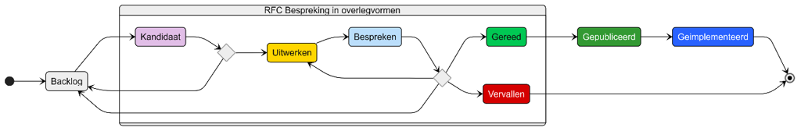

## 1. Inleiding

Voor de doorontwikkeling van het iWlz-netwerkmodel is een proces ingericht waarmee **bevindingen** en **wijzigingsverzoeken (RFC’s)** kunnen worden ingediend en beheerd.

- Een **bevinding** betreft een signaal of constatering, bijvoorbeeld een fout, onduidelijkheid of verbetering die wenselijk is.
- Een **wijzigingsverzoek (RFC)** is een voorstel om het afsprakenstelsel of het netwerkmodel inhoudelijk aan te passen of uit te breiden.

In de volgende hoofdstukken wordt het onderscheid verder toegelicht en is beschreven hoe bevindingen en wijzigingsverzoeken worden behandeld.

## 2. Bevinding

Een **bevinding** is een vaststelling van een situatie in het informatiemodel (in ontwikkeling of lopend) of in een implementatie die niet juist is en direct correctie behoeft om misverstanden te voorkomen.

Bevindingen zijn in GitHub herkenbaar aan een label _Bevinding_ en een uniek nummer dat altijd begint met de letter **B** (afgeleid van het issue-nummer). Een bevinding is direct van toepassing en leidend boven de gepubliceerde beschrijving in het informatiemodel of de huidige implementatie.

Bevindingen worden gekoppeld aan de release waarop ze van toepassing zijn en bij eerste gelegenheid gecorrigeerd.

## 3. Wijzigingsverzoek (RFC)

Een **wijzigingsverzoek** (RFC) is een gedocumenteerd voorstel voor een wijziging dat wordt beoordeeld en, na goedkeuring, gepland en geïmplementeerd.

Daarbij wordt onderscheid gemaakt tussen functionele en technische wijzigingsverzoeken.

- **Functionele wijzigingsverzoeken** hebben betrekking op wijzigingen in bestaande onderdelen van het afsprakenstelsel of informatiemodel. Deze worden ook wel aangeduid als _Request for Change_.
Deze worden beheerd via:
🔗 [iWlz\_RequestForChange (GitHub)](https://github.com/iStandaarden/iWlz_RequestForChange)
- **Technische wijzigingsverzoeken** hebben betrekking op de ontwikkeling van nieuwe onderdelen die nog moeten worden geïmplementeerd. Deze worden ook wel aangeduid als _Request for Comment_.
Deze worden beheerd via:
🔗 [iWlz-RequestForComment (GitHub)](https://github.com/iStandaarden/iWlz-RequestForComment)

Beide processen zijn openbaar en bieden ketenpartijen de mogelijkheid om input te leveren, bij te dragen aan kwaliteitsverbetering en wijzigingen te volgen via GitHub.

Wijzigingsverzoeken zijn herkenbaar in GitHub aan een label _Verbetering_ en een uniek nummer (jaar + issue-nummer). Een wijzigingsverzoek is pas van kracht nadat de inhoud is goedgekeurd en gepubliceerd, waarna het kan worden geïmplementeerd.

Wijzigingsverzoeken worden gekoppeld aan de release waarvoor ze gelden.

### 3.1 RFC-proces

Het RFC-proces beschrijft de stappen die een wijzigingsverzoek doorloopt vanaf indiening tot implementatie of afwijzing.

Figuur 1. Schematische weergave RFC-proces

#### 3.1.1 Labels en stadia:

| **Label** | **Toelichting** |
| :--- | :--- |
| **Backlog** | Verzameling van wijzigingsverzoeken voor toekomstige releases. Nieuwe verzoeken komen hier binnen. |
| **Kandidaat** | Relevante verzoeken worden voorgedragen voor opname in een volgende release. |
| **Uitwerken** | Het verzoek wordt verder uitgewerkt en geanalyseerd. |
| **Bespreken** | Het verzoek staat geagendeerd voor overleg. Inhoud is tijdelijk ‘bevroren’ totdat de review is afgerond. |
| **Gereed** | De inhoud is akkoord en een oplossingsrichting is gekozen. |
| **Vervallen** | Het verzoek is niet langer relevant en wordt afgesloten. |
| **Gepubliceerd** | Het verzoek is verwerkt in het informatiemodel of een andere specificatie. |
| **Geïmplementeerd** | Het verzoek is daadwerkelijk in productie genomen. |

### 3.2 RFC-Overlegstructuur

Wijzigingsverzoeken worden besproken in de reguliere overlegstructuur. Afhankelijk van de fase van de versie en het type onderwerp vindt behandeling plaats in één van de onderstaande overleggroepen

#### 3.2.1 Overzicht overlegstructuur

| **Fase van versie** | **Type onderwerp** | **Overleggroep** |
| :--- | :--- | :--- |
| In ontwikkeling | Functioneel/technisch | Werkgroep Bezorg |
| Gereleased | Functioneel/technisch | Referentiegroep |
| Ongeacht fase | Technisch | Technisch Afstemmingsoverleg (TEG) |
| Ongeacht fase | Besluitvorming release | Stuurgroep |
